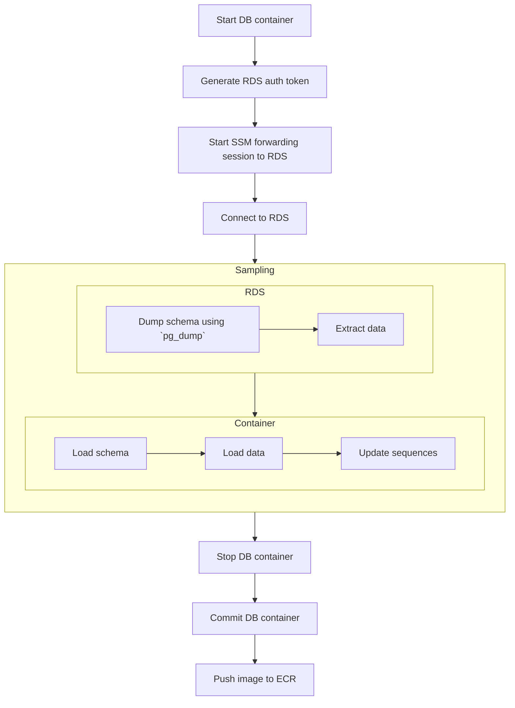
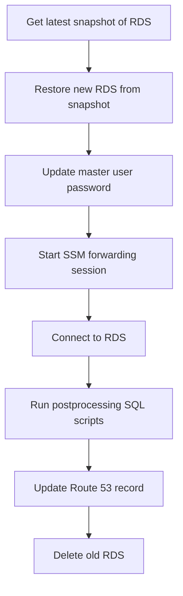

현재 일터에서는 Postgres 데이터베이스를 이용하고 있습니다. 기능 개발, 버그 수정 등 개발 전반에서 다양한 데이터를 필요로 하기에 데이터를 추출하기 위해 `pg_dump`와 `pg_restore`를 이용하고 있었지만 데이터가 점차 쌓이면서 추출과 적재에 소요되는 시간이 계속 늘어가고 있었고, 개인정보 보호 및 보안 강화에 대한 요구 사항도 늘어만 갔습니다. 점점 체계적인 데이터 추출 방법을 고안할 필요가 점점 늘어만 가고 있었기에 이번에 개발팀이 데이터를 안전하게 추출하고 쉽게 이용할 수 있도록 하는 방법을 찾아보게 되었습니다.

## 🔎 데이터 추출 방법

| 방법                    | 사용성 | 속도                  | 선택적 데이터 추출 | 비용                       | 유지보수성                              |
| ----------------------- | ------ | --------------------- | ------------------ | -------------------------- | --------------------------------------- |
| `pg_dump`, `pg_restore` | 좋음   | DB 크기 비례          | O (테이블 단위)    | 낮음                       | 좋음 (관리 쉬움)                        |
| 무작위 데이터 생성기    | 나쁨   | 빠름 (DB 연결 불필요) | X                  | 낮음                       | 낮음 (모든 데이터 정합성, 요건 관리)    |
| 데이터 샘플링           | 보통   | 느림 (네트워크 의존)  | O                  | 낮음                       | 보통 (스키마 변경에 따른 SQL 관리 필요) |
| 데이터베이스 로테이션   | 좋음   | 보통                  | X                  | 높음 (운영 DB 복제본 운용) | 좋음 (스키마 변경에 큰 영향 받지 않음)  |

### 💻 `pg_dump`, `pg_restore`

이미 사용하고 있었던 `pg_dump`와 `pg_restore`는 유용하지만 이미 상당한 시간이 소요되고 있었고 민감한 개인정보 사본이 가능한 많은 곳에 떠돌아다니는 것은 최소화하고자 가장 먼저 제외했습니다.

또한 격리된 네트워크 내 데이터베이스에 접근하기 위해 SSH 터널링을 이용해야 했고 키 및 설정 관리 등이 복잡했으며 SSH 대신 AWS SSM Session Manager를 이용하도록 네트워크 구성을 전체적으로 개편하면서 데이터 전송 속도가 크게 느려졌기에 더 이상 쓸 수 없는 지경에 이르렀습니다.

### 🔤 무작위 데이터 생성기

[factory_boy](https://github.com/FactoryBoy/factory_boy), [Faker](https://github.com/joke2k/faker)를 이용하면 원하는 데이터를 쉽고 빠르게 생성할 수 있습니다. 하지만 서비스 특성상 수치적인 정합성이 중요하고 현실과의 괴리(결함을 포함하여)를 최소화하는 무작위 데이터셋을 생성하고 관리하는 것은 쉽지 않습니다. 테스트를 위해서는 계속 이용하지만 범용적으로 이용할 수 있는 데이터셋을 구성하기에는 부적합하다고 판단하여 제외했습니다.

### 🧪 데이터 샘플링

SQL 스크립트를 작성하여 필요한 데이터를 추출하는 가장 직관적인 방법입니다. 쉘 스크립트를 이용할 수도 있지만 안정적인 구현과 유지보수 및 관리 편의를 위해 개발팀 주 언어인 Python을 이용하기로 했습니다.

### 🔁 데이터베이스 로테이션

개발 데이터베이스를 운영 환경의 데이터베이스 스냅샷으로부터 재생성하는 방법입니다. AWS DMS (Database Migration Service)와 같은 대안도 있었지만 현재 데이터베이스 크기를 감안했을 때 이 방법이 더 쉽고 저렴할 것이라는 조언을 받아 DMS는 추후 데이터베이스가 훨씬 더 커졌을 때 시도하기로 하였습니다.

## 🪣 S3를 이용한 데이터 샘플링

처음 시도했던 방식은 AWS RDS for Postgres를 위한 공식 `aws_s3` 확장 프로그램[^rds-s3-export] [^rds-s3-import]을 이용하는 것입니다. IAM 역할, S3 버켓 ACL, RDS 설정 정도만 구성해주면 바로 이용할 수 있습니다.

[^rds-s3-export]:
    [Exporting data from an RDS for PostgreSQL DB instance to Amazon S3
    ](https://docs.aws.amazon.com/AmazonRDS/latest/UserGuide/postgresql-s3-export.html)

[^rds-s3-import]:
    [Importing data from Amazon S3 into an RDS for PostgreSQL DB instance
    ](https://docs.aws.amazon.com/AmazonRDS/latest/UserGuide/USER_PostgreSQL.S3Import.html)

장점은 AWS에서 제공하는 확장 프로그램 `aws_s3`을 이용하므로 복잡한 설정이나 구성이 필요하지 않다는 것입니다. 또한 저렴한 S3에 데이터셋을 저장해두고 공유하거나 재사용할 수 있습니다.

단점은 1) S3 버켓, 추출된 데이터를 저장하고 불러오기 위한 경로와 파일 이름의 규칙 등 균일화된 추출 및 적재 방식을 정의하고 관리하기 위한 함수와 프로시저를 관리할 필요가 있다는 것이며, 2) PL/pgSQL 자체가 친숙하지 않으면 사용 및 관리가 어렵다는 점입니다. 개발팀은 고급 SQL과 친숙하지 않았고 3) `aws_s3` 확장 프로그램은 오픈 소스가 아니어서 오픈 소스 레플리카인 [chimpler/postgres-aws-s3](https://github.com/chimpler/postgres-aws-s3)를 이용해야 했습니다. 이는 로컬 환경의 데이터베이스 구성을 복잡하게 만들었습니다.

구성 후에는 사용성과 실용성이 떨어져 거의 사용하지 않았고 결국 다른 방법을 찾아야 했습니다. 다만 Postgres 확장 프로그램을 이용해보는 것은 처음이었는지라 흥미로웠고 버리기엔 아까워서 잠시 개인 시간에 짬을 내어 구성을 재현([^postgres-examples])해 남겨두었습니다. S3 대신 MinIO를 이용하지만 사용 방식에 큰 차이는 없습니다.

[^postgres-examples]: [lasuillard/postgres-examples](https://github.com/lasuillard/postgres-examples)

## 🐳 GitHub Actions + ECR을 이용한 데이터 샘플링

앞선 방식의 가장 큰 문제는 구성이 복잡하다고 사용성이 너무 떨어진다는 점입니다. 그래서 생각한 방법은 데이터가 적재된 데이터베이스 이미지를 생성하고 이를 공유하여 이용할 수 있게 한다면 비교적 쉽게 이용할 수 있을 것이라고 판단했습니다. 데이터베이스 컨테이너를 생성해서 연결하기만 하면 되니까요. 그리고 이 작업을 GitHub Actions를 이용해 워크플로로 정의해두고 언제든지 실행할 수 있게끔 하면 될 것입니다. 하지만 실제 구성에는 여러 문제가 있었습니다.

-   네트워크 문제

    `aws_s3` 확장을 쓸 때에는 데이터가 S3를 경유하였기에 네트워크를 크게 신경쓸 필요가 없었습니다. 하지만 데이터베이스와 직접 연결을 맺고 쿼리를 수행하는 방법으로 변경하면서 RDS에 접속하기 위한 방법을 찾아야 했습니다. 개발팀은 내부 리소스에 접근하기 위해 SSM Session Manager를 이용하고 있었고, 이 방법을 그대로 사용하기로 했습니다. 하지만 Session Manager의 낮은 네트워크 대역폭으로 데이터를 추출하는 데 상당한 시간이 소요되었습니다.

    하지만 Python 스크립트를 이용해 필요한 선택적 데이터만을 추출할 것이니 그 용량이 방대하지는 않을 것이고, 디버깅 및 테스트를 위한 데이터셋 등 한정적인 용도로 이용할 것이어서 속도를 크게 신경쓰지는 않기로 했습니다. 필요하다면 `aws_s3` 확장을 활용하여 속도를 크게 개선할 수 있을 테니까요.

-   보안 문제

    데이터베이스 인증 정보를 비롯, 그 어떤 인증 정보도 반복적으로 노출될 기회는 줄여야 합니다. 샘플링 작업을 위해 마스터 계정을 이용하는 대신 최소 권한의 읽기 전용 계정을 할당하고 IAM 기반 RDS 인증[^rds-iam-auth]을 이용해 임시 인증 정보를 발급하여 이용하기로 했습니다.

    [^rds-iam-auth]: [IAM database authentication for MariaDB, MySQL, and PostgreSQL](https://docs.aws.amazon.com/AmazonRDS/latest/UserGuide/UsingWithRDS.IAMDBAuth.html)

-   데이터 추출 및 적재

    데이터베이스 스키마는 `pg_dump`를 이용할 수 있었고, 목적 데이터 또한 추출에는 큰 문제가 없었지만 추출된 데이터를 다시 적재하는 데에 골머리를 많이 썩였습니다.

    -   외래 키 제약 조건

        달리 언급하지는 않았지만 `aws_s3` 확장을 이용할 때에도 동일하게 발생했던 문제입니다. 데이터 적재 시 다양한 제약 조건(대표적으로 외래 키)으로 인해 문제가 발생했습니다. 이전 방법에서는 의존성에 맞추어 데이터 적재 순서를 조절했지만 이는 여간 귀찮은 일이 아니었습니다. 추가적인 조사 후 `session_replication_role` 설정 파라미터를 이용해서 제약 조건을 무시하고 데이터를 적재할 수 있다는 것을 알게 되었습니다.

    -   시퀀스 문제

        `COPY`를 이용해 데이터를 적재할 경우 관련된 시퀀스가 갱신되지 않는 문제가 있었습니다. 갱신되지 않은 시퀀스로 인해 로컬 서버 동작 중 새로운 객체가 생성될 때 문제를 일으켰습니다.

        `pg_dump`를 이용해 데이터를 추출하면 실행 가능한 `INSERT` SQL문을 뽑아낼 수 있어서 문제가 발생하지 않았지만 이번 데이터 추출 방식에서는 `COPY` 명령어를 이용하고 있었습니다. 이 문제는 데이터를 적재한 뒤 시퀀스를 일괄 갱신[^postgres-fix-seq]하는 것으로 해결하였습니다.

        [^postgres-fix-seq]: [Fixing Sequences - PostgreSQL wiki](https://wiki.postgresql.org/wiki/Fixing_Sequences)

-   적재 후 데이터베이스 이미지 생성

    데이터베이스 컨테이너를 실행한 뒤 스키마 초기화 및 데이터 적재, 시퀀스 갱신 후 데이터베이스 이미지를 커밋하는 것으로 충분하리라 생각했지만, 예상치 못한 문제가 있었습니다.

    -   볼륨에 저장된 데이터는 커밋 시 이미지에 포함되지 않음

        Postgres 컨테이너의 데이터 볼륨(`/var/lib/postgresql/data`)은 이미지에 포함되지 않아 컨테이너 실행 후 데이터가 비어있는 문제가 있었습니다. 데이터 위치(`PGDATA`)를 다른 곳으로 지정(`/data`)하여 해결하였습니다. 개발 및 테스트 목적으로만 이용할 것이기 때문에 컨테이너의 데이터 볼륨에는 크게 신경쓸 필요가 없기 때문입니다.

    -   `docker image commit` 시 이미지로부터 컨테이너를 실행하면 Redo 작업이 실행됨

        이미지로부터 컨테이너를 시작하면 Redo 작업이 실행되는 문제가 있었습니다. 데이터 자체에 큰 문제는 없었지만 이 작업으로 인해 컨테이너 시작이 느려졌다. 문제 원인을 조금 더 확인해 본 결과 데이터베이스 이미지를 커밋하기 전 정상적으로 중단시키지 않았기 때문이었으며 이미지를 커밋하기 전 컨테이너를 정상적으로 중지(`docker container stop`)시키는 것으로 해결되었습니다.

구성된 워크플로는 다음과 같았습니다.

이로써 일부 사옹자와 연관된 모든 데이터를 선택적으로 추출한다는 일차적인 목표는 달성할 수 있었습니다. 하지만 이와 연관된 인프라 구성, 워크플로 스크립트 관리 부담이 늘었고 무엇보다 일반적인 개발 시나리오에서 부분적인 샘플링 데이터만을 필요로 하는 경우가 현재로서는 잘 없었습니다.

그렇게 반쪽짜리 성공을 뒤로 하고 다음 대안을 시도하기로 했습니다.

## ↪️ 데이터베이스 로테이션

앞선 방식은 범용 개발 환경을 위해 데이터를 준비하는 용도로는 적합하지 않았기에 결국 운영 데이터베이스 사본을 직접 이용하는 것이 가장 바람직하다는 결론에 도달했습니다. 샘플링은 추후 복잡한 테스트 시나리오를 위한 데이터셋을 준비하기 위해 쓰기로 했습니다.

AWS RDS는 정해진 시간에 스냅샷을 생성합니다. 그리고 이 스냅샷으로부터 데이터베이스를 복원할 수 있습니다. 데이터 용량에 따라 복원에 소요되는 시간은 다르지만 간단한 실험을 통해 확인해보니 생각보다 그리 오래 걸리지 않았으며 현재 데이터베이스 크기, 데이터 증가 추세 등 여러 부분을 검토했을 때 생각할 수 있는 최선이라고 결론을 내렸습니다.

추가로 다음과 같은 사항들을 고려했습니다.

1. 비용 문제

    운영 환경과 동일한 성능, 구성 및 크기의 데이터베이스를 개발 환경을 위해 유지한다는 것은 다소 부담스러운 선택지일 수 있습니다. 다만 현재 데이터베이스 규모와 데이터 증가 추세를 감안했을 때 한동안 큰 부담이 되지 않을 것이라고 보았다.

2. 설정 재현 및 기존 데이터베이스 교체 방법

    새로운 데이터베이스를 생성하고, 이 데이터베이스로 모든 연결을 다시 맺게끔 하여야 합니다. 서버에서 데이터베이스 연결이 가능하도록 네트워크 및 보안 그룹 구성 또한 유지해야 합니다. 현재 네트워크 설정은 자주 바뀌고 있지 않으며 개발 환경이니 장기간의 다운타임도 허용할 수 있고, 즉각적으로 오류 경보를 받을 수 있기 때문에 너무 복잡하게 생각하지 않기로 했습니다.

    데이터베이스 교체는 도메인 레코드(Route 53)를 이용하여 비교적 쉽게 해결할 수 있습니다. 먼저 새 복제본을 만든 뒤 작업이 모두 성공적으로 완료되면 도메인 레코드를 갱신, 기존 데이터베이스는 삭제하면 됩니다.

    처리가 더 어려운 것은 리소스 상태 추적이었는데, Terraform과 같은 IaC를 이용하지 않았기 때문입니다. 대신 정해진 접두사(e.g. `app-dev-`)를 가진 RDS들을 로테이션 대상으로 처리하게끔 하였으며 실수나 버그로 하여금 다른 RDS에 위험한 동작을 수행하지 않도록 IAM에서 해당 접두사를 가진 RDS에만 위험 동작을 수행할 수 있게끔 극히 제한적인 권한만을 부여했습니다.

3. 민감한 정보의 처리

    개발 환경은 비교적 보안이 취약해지기 쉽습니다. 개발 편의를 위해 일부 보안 기능을 끈다던가 하는 일도 비일비재합니다. 민감 정보의 유출을 원천 차단할 수 있게끔 마스킹하거나 스크러빙하는 후처리 또한 구현하기로 했습니다.

    - 마스터 계정을 포함한 개인 데이터베이스 계정 또한 복제된다는 문제가 있습니다. 마스터 계정 비밀번호는 RDS 복원 직후 강제로 새 비밀번호를 설정하고, 시스템 및 필요한 일부 서비스 계정(샘플링)을 제외한 모든 계정은 비밀번호를 제거하여 로그인할 수 없게 처리했습니다. 물론 최선의 방법은 비밀번호 대신 임시 인증 토큰([generate-db-auth-token](https://docs.aws.amazon.com/cli/latest/reference/rds/generate-db-auth-token.html))을 사용하는 것입니다.

    - 개발 중 사용자에게 실수로 문자메시지나 이메일이 발송된다거나 하는 불상사 또한 방지하고 싶었기에 이러한 정보는 난수 처리, 삭제, 회사 이메일 / 전화번호 등으로 대체하도록 했습니다.

4. 자동화

    이러한 작업은 그 빈도가 잦지 않다면 사람이 직접 처리할 수 있습니다. 하지만 이런 (귀찮고 지루한) 작업을 반복하다 보면 실수할 가능성이 높습니다. 더군다나 인프라 구성 요소와 관련된 요소가 많다면 실수할 가능성이 더 높아집니다. 그래서 GitHub Actions 워크플로를 작성하여 BE 개발자 누구나 원하는 때에 실행할 수 있도록 만들었습니다.

실제로 구현해보니 그 구성과 구현이 그리 어렵지는 않았습니다. 다른 작업들에 비하면 훨씬 간단하고 결과물도 만족스러웠습니다. 도메인 변경 전후로 일시적인 다운타임이 발생하기는 하지만 개발 환경이라 신경쓸 필요는 없는 수준이었지만 아무래도 가장 큰 단점은 비용인데 데이터베이스 인스턴스 타입이 바뀌면서 비용 증가를 쉽게 확인할 수 있었기 때문입니다. 하지만 개발팀의 생산성과 편의성을 개선하는 효과가 더욱 컸다고 생각합니다.

## 🤔 정리하며

앞서 이야기한 방식들은 모두 장단점이 있고 사용 목적 또한 달라 무엇이 최선이다 말할 수는 없는 것 같습니다. 샘플링은 데이터베이스 규모가 충분히 커서 일부 데이터만을 추출하는 체계적인 과정이 필요할 경우 유용할 것으로 보이는 반면, 로테이션은 데이터베이스가 작아 데이터를 동기화할 때 유용한 듯 합니다.
