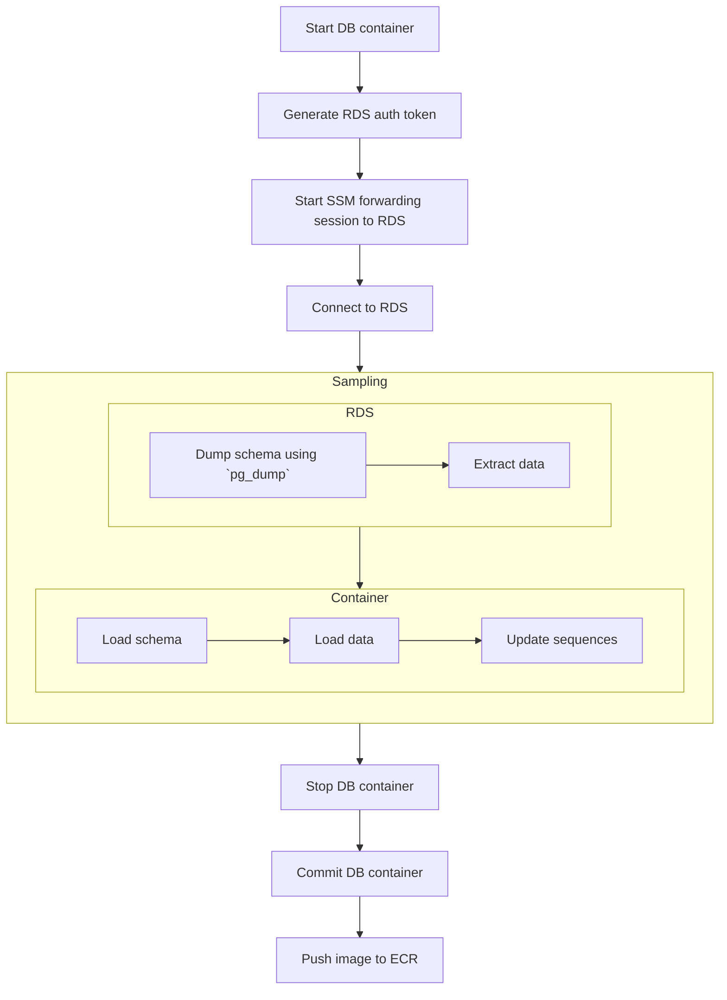
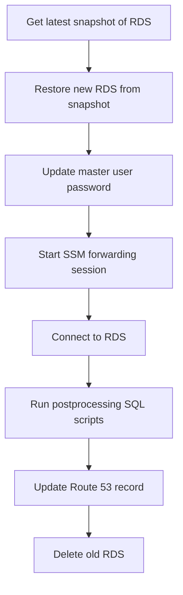

개발을 하는 데 있어 필수적인 것은 무엇일까? 개발을 위한 환경, 애플리케이션이 배포될 인프라 등 꼽으라면 끝도 없겠지만 최근에 그 필요성을 뼈저리게 실감하게 된 것은 바로 데이터였다.

데이터는 언제 필요할까? **모든 곳**이라고 해도 결코 과언이 아닐 것이다. 새로운 기능의 구현, 버그 수정, 테스트 등, 데이터를 필요로 하지 않는 곳이 없다. 하지만 이를 위해 운영 DB에 차곡차곡 쌓인 데이터를 잘, 안전하게 추출하는 것은 또 다른 난관이 아닐 수 없다.

현재 사내에서는 Postgres 데이터베이스를 이용하고 있다. 데이터를 추출하는 가장 쉬운 방법은 `pg_dump`와 `pg_restore`를 이용하는 것이다. 하지만 데이터는 계속 쌓이기만 할 것이고, 점점 소요되는 시간은 길어질 것이다. 또한 사용자의 개인정보 보호 및 보안과 관련된 고려 사항도 있었다. 체계적인 데이터 추출 방법을 고안할 필요가 점점 늘어만 갔다.

그리하여 사내 개발팀이 데이터를 안전하게 추출하고 접근할 수 있도록 하는 방법을 조사하고 구현하기에 이르렀다.

## 🔎 데이터 추출 방법

| 방법                    | 사용성 | 속도                                                  | 복잡도 | 유지보수성                              |
| ----------------------- | ------ | ----------------------------------------------------- | ------ | --------------------------------------- |
| `pg_dump`, `pg_restore` | 좋음   | DB 용량 비례 (테이블 내 일부 데이터 선택적 추출 불가) | 낮음   | 좋음                                    |
| 무작위 데이터 생성기    | 나쁨   | 빠름 (네트워크 불필요)                                | 높음   | 낮음 (모든 데이터 정합성, 요건 관리)    |
| 데이터 샘플링           | 보통   | 보통 (네트워크 의존)                                  | 보통   | 보통 (스키마 변경에 따른 SQL 관리 필요) |
| 데이터베이스 로테이션   | 좋음   | 보통                                                  | 보통   | 좋음 (스키마 변경에 큰 영향 받지 않음)  |

-   기존에 사용하던 `pg_dump`와 `pg_restore`는 유용하지만 이미 지금 데이터베이스 규모에서도 긴 시간이 소요되고 있었다. 또한 민감한 개인정보 사본이 가능한 많은 곳에 떠돌아다니는 것은 최소화하고 싶었기에 제외했다.

-   데이터 생성의 경우 [factory_boy](https://github.com/FactoryBoy/factory_boy), [Faker](https://github.com/joke2k/faker)를 이용하면 원하는 데이터를 쉽고 빠르게 생성할 수 있다. 하지만 서비스 특성상 수치적인 정합성이 중요하고 그러한 정합성을 모두 지키는 무작위 데이터셋을 생성하고 관리하는 것은 쉽지 않았다. 테스트를 위해서는 계속 이용하지만 개발을 위한 범용적인 데이터셋을 구성하기에는 부적합하다고 판단하여 제외했다.

Database Migration Service (DMS)와 같은 대안도 있었지만, 현재 데이터베이스 규모를 감안했을 때 로테이션이 더 쉽고 저렴할 것이라는 조언을 받았기에 제외했다. 그렇게 남은 후보군은 데이터 샘플링과 데이터베이스 로테이션이 되었고, 샘플링을 먼저 시도하게 되었다.

## 🪣 S3를 이용한 데이터 샘플링

처음 시도했던 방식은 AWS RDS for Postgres를 위한 공식 `aws_s3` 확장 프로그램[^rds-s3-export] [^rds-s3-import]을 이용하는 것이었다. IAM, S3, RDS 설정 정도만 변경해주면 이용할 수 있다.

[^rds-s3-export]:
    [Exporting data from an RDS for PostgreSQL DB instance to Amazon S3
    ](https://docs.aws.amazon.com/AmazonRDS/latest/UserGuide/postgresql-s3-export.html)

[^rds-s3-import]:
    [Importing data from Amazon S3 into an RDS for PostgreSQL DB instance
    ](https://docs.aws.amazon.com/AmazonRDS/latest/UserGuide/USER_PostgreSQL.S3Import.html)

장점은 AWS에서 제공하는 확장 프로그램 `aws_s3`을 이용하므로 복잡한 설정이나 구성이 필요하지 않다는 것이다. 또 S3에 데이터셋을 저장해두고 공유하거나 재사용할 수 있다는 것이다.

단점은 S3 버켓 이름, 경로와 파일 이름의 규칙 등 균일화된 추출 및 적재 방식을 정의하고 관리하기 위한 함수와 프로시저를 관리할 필요가 있다는 것이며, 복잡하다는 것이다. 또한 `aws_s3` 확장 프로그램은 오픈 소스가 아니며 따로 설치할 수 없다. 따라서 이에 대한 레플리카인 [chimpler/postgres-aws-s3](https://github.com/chimpler/postgres-aws-s3)를 이용해야 했고, 로컬 환경의 데이터베이스 구성이 복잡해졌다.

실제 구성 후에는 실용성이 떨어져 거의 사용하지 않았고 결국 다른 방법을 찾아야 했다. 하지만 Postgres 확장 프로그램을 이용해보는 것은 처음이었는지라 흥미로웠고 버리기엔 아까워서 잠시 개인 시간에 짬을 내어 구성을 재현해보았다[^postgres-examples]. S3 대신 MinIO를 이용하지만 사용 방식에 별 차이는 없다. 하지만 실제 이용을 추천하고 싶지는 않은데, 코드를 보면 짐작할 수 있겠지만 비공식 `aws_s3` 확장은 `plpython3u` 확장 프로그램을 통해 Python 스크립트를 실행하는 것에 불과하다. S3에서 데이터를 불러오고(`aws s3 cp`) 이 데이터를 적재(`COPY`)하는 SQL을 실행하는 쉘 스크립트를 작성하여 관리하는 편이 더 나을 것이다.

[^postgres-examples]: [lasuillard/postgres-examples](https://github.com/lasuillard/postgres-examples)

## 🐳 GitHub Actions + ECR을 이용한 데이터 샘플링

앞서 이야기한 S3와 `aws_s3` 확장을 이용하는 방식의 가장 큰 문제는 구성이 복잡하다고 사용성이 너무 떨어진다는 것이었다. 그래서 생각한 방법은 데이터가 적재된 데이터베이스 이미지를 생성하고, 이를 공유하여 이용할 수 있게 한다면 비교적 쉽게 이용할 수 있을 것이라고 판단했다.

그리고 이 작업을 GitHub Actions를 이용해 워크플로로 정의해두고 언제든지 실행할 수 있게끔 하면, 필요 시 워크플로만 실행하고 기다린 뒤에 ECR에서 이미지만 다운로드해 이용하면 될 것 같았다. 하지만 이내 곧 여러 문제와 마주하게 되었다.

-   네트워크 문제

    `aws_s3` 확장을 쓸 때에는 S3를 경유하였기에 네트워크를 크게 신경쓸 필요가 없었다. 하지만 데이터베이스와 직접 연결을 맺고 쿼리를 수행하는 방법으로 변경하면서 RDS에 접속하기 위한 설정이 필요해졌다. 개발팀은 내부 리소스에 접근하기 위해 SSM Session Manager를 이용하고 있었고, 이 방법을 그대로 다시 이용해야 했다. 하지만 Session Manager는 트래픽 속도에 제한이 걸려 있는 듯 했고 적은 양의 데이터도 추출하는 데 상당한 시간이 소요되었다.

    하지만 일부 사용자 데이터만을 추출하는 것이고, 버그 추적이나 테스트를 위한 데이터셋 등 제한된 용도로 이용할 것이었기에 당장은 속도를 크게 신경쓰지 않기로 했다.

-   보안 문제

    데이터베이스 인증 정보를 비롯, 그 어떤 인증 정보도 반복적으로 노출될 기회는 줄여야 한다. 마스터 계정을 이용하는 대신 IAM 기반 RDS 인증[^rds-iam-auth]을 이용해 임시 인증 정보를 발급하여 이용하기로 했다. 또한 샘플링할 계정은 최소 권한만을 제공해서 원치 않는 위험한 동작이 수행될 가능성을 최소화했다.

    [^rds-iam-auth]: [IAM database authentication for MariaDB, MySQL, and PostgreSQL](https://docs.aws.amazon.com/AmazonRDS/latest/UserGuide/UsingWithRDS.IAMDBAuth.html)

-   데이터 적재

    데이터 추출에는 큰 문제가 없지만 추출된 데이터를 다시 적재하는 데에 골머리를 많이 썩였다.

    -   외래 키 제약 조건

        `aws_s3` 확장을 이용할 때에도 동일하게 발생했던 문제로, 테이블 간 의존성으로 인해 데이터 적재 시 FK 제약 조건으로 인해 문제가 발생했다. `session_replication_role` 설정 파라미터를 이용해서 제약 조건을 무시하고 데이터를 적재할 수 있었다.

    -   시퀀스 문제

        `COPY`를 이용해 데이터를 적재할 경우 관련된 시퀀스가 갱신되지 않는 문제가 있었고, 데이터를 적재한 뒤 시퀀스를 일괄 갱신[^postgres-fix-seq]하게 하여 해결하였다.

        [^postgres-fix-seq]: [Fixing Sequences - PostgreSQL wiki](https://wiki.postgresql.org/wiki/Fixing_Sequences)

-   적재 후 데이터베이스 이미지 생성

    데이터베이스 컨테이너를 실행한 뒤 스키마 초기화 및 데이터 적재, 시퀀스 갱신 후 데이터베이스 이미지를 커밋하는 것으로 완성..일 줄 알았으나 사소한 문제들이 존재했다.

    -   볼륨에 저장된 데이터는 커밋 시 이미지에 포함되지 않음

        Postgres 이미지의 데이터 볼륨(`/var/lib/postgresql/data`)은 이미지에 포함되지 않아 이미지에 샘플링된 데이터가 비어있는 문제가 있었으며 단순히 데이터 위치(`PGDATA`)를 다른 곳으로 지정(`/data`)하는 것으로 해결하였다. 개발 및 테스트 목적으로만 이용할 것이기 때문에 데이터 보존은 중요하지 않았기 때문이다.

    -   `docker image commit` 시 이미지로부터 컨테이너를 실행하면 Redo 작업이 실행됨

        컨테이너를 정지하지 않고 커밋된 이미지로부터 컨테이너를 시작하면 Redo 작업이 실행되는 문제가 있었다. 데이터 자체에 문제는 없었지만 부가적인 초기화 작업으로 인해 컨테이너 시작이 느려졌다. 이미지를 커밋하기 전 컨테이너를 정상적으로 종료하는 것으로 해결되었다.

대략적인 흐름은 다음과 같다.

원하는 주요 목표, 일부 사용자와 연관된 모든 데이터를 선택적으로 추출한다는 목표는 달성할 수 있었지만 전반적인 인프라 구성 복잡도 증가 및 유지보수성이 떨어지는 문제는 어쩔 수 없었다. 앞서 S3를 이용한 샘플링 방법을 혼용하면 SSM Session Manager의 전송 속도 문제를 비롯해 여러 문제를 더 해결할 수 있겠지만, 현재 샘플링 자체의 필요성이 높지 않기에 다음을 기약하기로 했다.

## ↪️ 데이터베이스 로테이션

부분 데이터 샘플링은 범용 개발 환경을 위해 데이터를 준비하는 용도로는 적합하지 않았다. 결국 운영 데이터베이스 사본을 직접 이용하는 것이 가장 바람직하다는 결론에 도달했다. 샘플링은 추후 복잡한 테스트 시나리오를 위한 데이터셋을 준비하기 위한 용도로 쓰기로 했다.

AWS RDS는 정해진 유지보수 시간에 스냅샷을 생성한다. 그리고 이 스냅샷으로부터 데이터베이스를 복원할 수 있다. 데이터 용량에 따라 복원에 소요되는 시간은 다르지만 현재 규모, 데이터 증가 추세, 실제로 시험삼아 복원을 해보았더니 생각보다 그리 오래 걸리지 않았고 지금으로서는 합리적이라는 결론에 도달했다.

추가로 다음과 같은 사항들을 고려하였다.

1. 비용 문제

    운영 환경과 동일한 성능, 구성 및 크기의 데이터베이스를 개발 환경을 위해 유지한다는 것은 다소 부담스러운 선택지일 수 있다.

2. 기존 데이터베이스의 대체 방법

    새로운 데이터베이스를 생성하고, 이 데이터베이스로 모든 연결을 다시 맺게끔 하여야 한다. 연결이 가능하도록 네트워크 및 보안 그룹 구성 또한 신경써야 한다.

    도메인 레코드(Route 53)를 이용하여 비교적 쉽게 해결할 수 있었다. 블루/그린 배포 방식과 비슷하다. 처리가 더 어려운 것은 기존/신규 데이터베이스의 구분과 추적 방법이었는데, 정해진 접두사(e.g. `app-dev-202406`)를 가진 RDS들을 로테이션 대상으로 처리하게끔 하였다.

3. 민감한 정보의 처리

    개발 환경은 비교적 보안이 취약해지기 쉬운 곳이다. 개발 편의를 위해 일부 보안 기능을 끈다던가 하는 일이 잦다. 민감 정보의 유출을 원천 차단할 수 있게끔 마스킹하거나 스크러빙하는 후처리 스크립트 실행이 필요하다.

    - 마스터 계정을 포함한 개인 데이터베이스 계정 또한 복제된다는 문제가 있다. 마스터 계정 비밀번호는 복원 후 강제로 새 비밀번호를 설정하고, 시스템 및 알려진 서비스 계정(샘플링) 외 개인 할당된 계정은 모두 비밀번호를 제거하여 로그인할 수 없게 처리하였다.

    - 또한 개발 환경으로 추출된 데이터(사용자 전화번호, 이메일 등)를 이용하다 실수로 문자메시지나 이메일이 발송된다거나 하는 불상사 또한 개발자가 원치 않는 상황이다. 이러한 전화번호는 난수 처리하거나, 지워버리거나, 회사 이메일 / 전화번호 등으로 대체한다던가 할 수 있다.

4. 자동화

    이러한 작업은 그 빈도가 잦지 않다면 수동으로 실행할 수 있다. 하지만 매번 수동으로 실행하다 보면 무언가를 빼먹거나 실수할 여지도 분명 있으며, 그 작업을 수행할 수 있는 사람이 부재한 경우 문제가 될 수 있다. 더군다나 인프라 구성 요소와 관련된 요소가 많다면 실수할 가능성이 더 높아진다.

실제로 구현해보니 그 구성과 구현이 그리 어렵지는 않았다. 다른 작업들에 비하면 훨씬 간단하고 결과물도 만족스러웠다. 도메인 레코드의 TTL로 인해 일시적인 다운타임이 발생하기는 하지만 개발 환경이라 신경쓸 필요는 없는 수준이었다.

가장 큰 문제는 아무래도 비용일 것이다. 비용 증가가 바로 와닿을 정도였기 때문이다. 하지만 개발팀의 생산성과 편의성을 개선함으로써 얻게 되는 이득이 훨씬 컸다고 생각한다.

## 🤔 정리하며

앞서 이야기한 두 방식(샘플링, 로테이션)은 서로 장단점이 있고 사용 목적 또한 달라 서로를 완전히 대체할 수는 없을 것으로 보인다. 샘플링은 데이터베이스 규모가 충분히 커서 일부 데이터만을 추출하는 체계적인 과정이 필요할 경우 유용할 것으로 보이는 반면, 로테이션은 데이터베이스가 작아 운영 환경과의 간극을 줄이기 위해 수시로 동기화할 때 유용할 것으로 보인다. 만약 데이터베이스 규모가 충분히 커지면 AWS DMS를 알아보아야 할 것 같다.

샘플링은 Airflow를, 로테이션은 Terraform을 이용했을 때 더 잘 만들 수 있지 않을까 하는 생각이 든다. 기회가 된다면 언젠가 다뤄보려고 한다.
