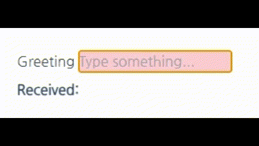
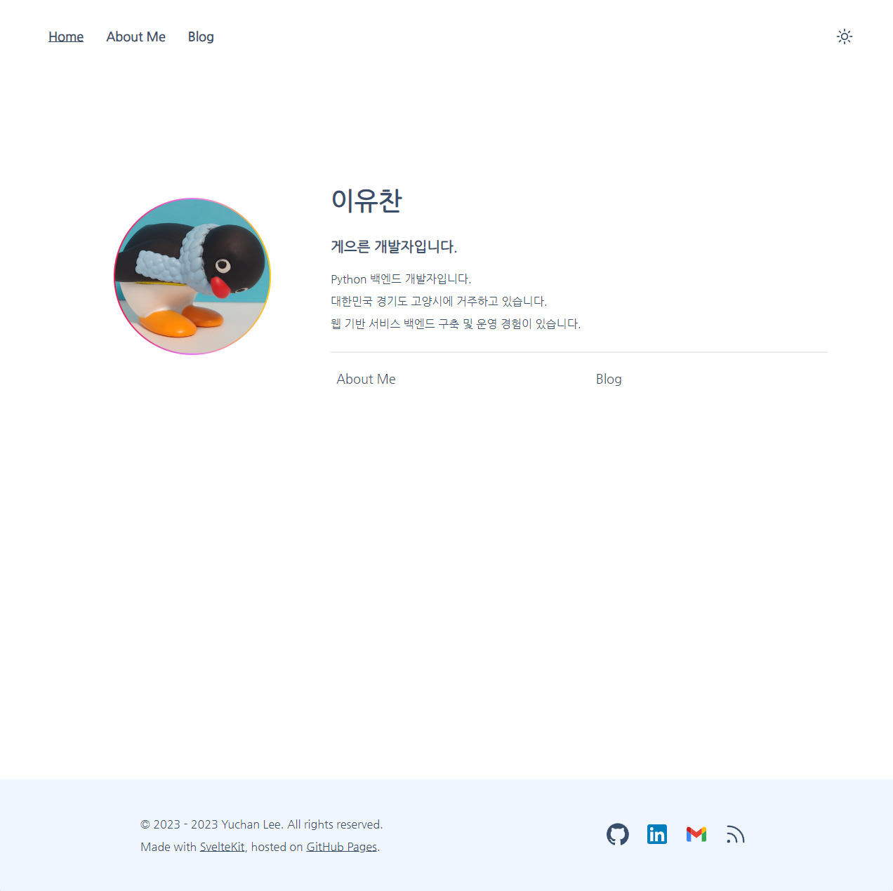
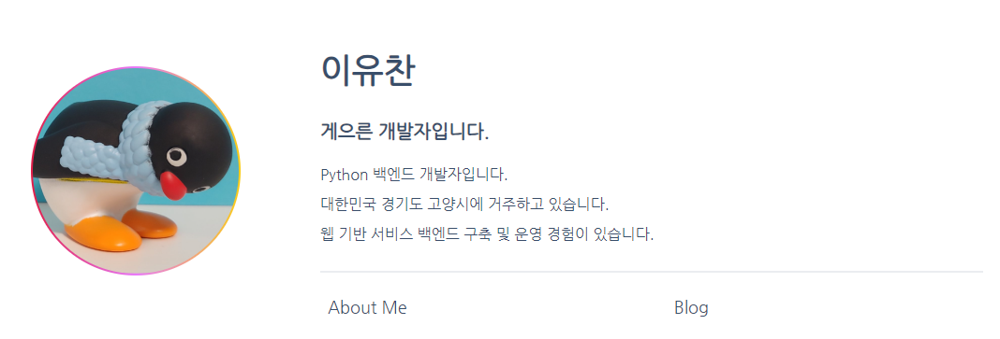
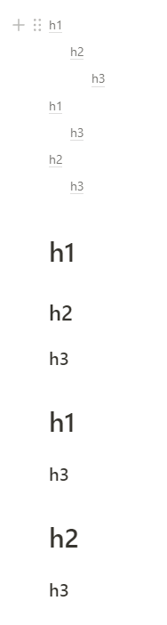
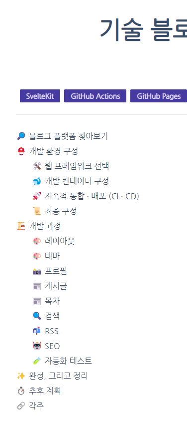
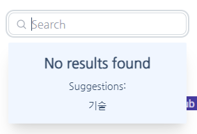
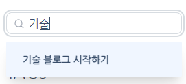
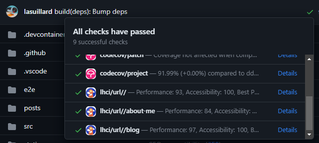
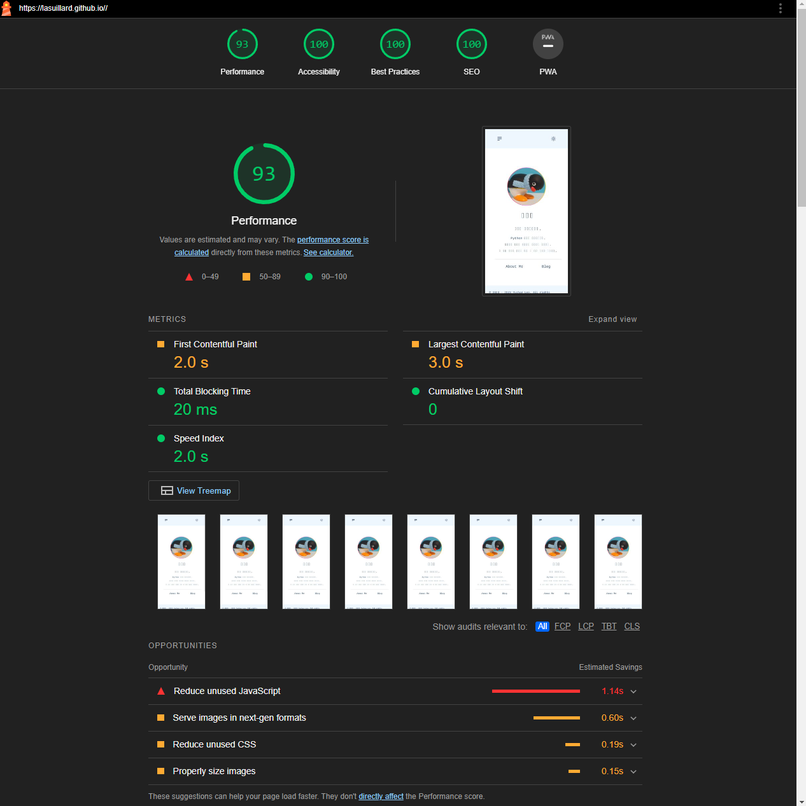
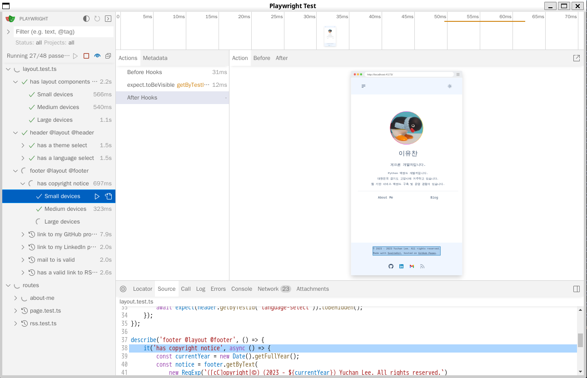

지금껏 개인 블로그를 운영한 적이 없었습니다. 경력을 시작한 지 얼마 되지도 않았고, 남과 나눌 수 있는 정도의 지식이나 경험을 가지고 있지 않았으며 무엇보다 필요성을 느끼지 못했기 때문이었습니다.

하지만 이번에 다니던 직장을 퇴사하고 시간이 좀 생겼고, 이직을 준비하며 차일피일 미루던 기술 블로그를 시작하기로 다짐했습니다.

블로그를 통해 무엇을 얻을 수 있을까? 생각해 본 것으로는,

- **지식 저장 및 공유를 통한 피드백**

  공개된 글을 작성하게 되면 책임감 있고 정제된 글을 작성하는 데 도움이 될 것이라고 생각했습니다. 신중한 단어 선택이나 가독성을 염두에 둔 구조화된 문서 작성 능력을 기를 수 있지 않을까 기대했습니다.

- **학습 효과**

  글을 작성하며 경험을 복기하고 정리하면서 다시 복습하는 효과를 기대할 수 있을 것입니다.

- **자기 PR**

  아직까지 제대로 된 경력 기술이나 포트폴리오가 없었고 지금 진행중인 여러 개인 프로젝트의 진척과 경험을 기록해두면 언젠가 도움이 될 것입니다.

블로그를 시작하기로 다짐했으니 어디서 어떻게 호스팅 할지 조사해보았습니다.

## 🔎 블로그 플랫폼 찾아보기

선택할 수 있는 많은 블로그 플랫폼이 있고 각자의 장단점이 있습니다. 지금껏 블로그에서 글을 보기만 했지 작성한 적은 없으니, 비용, 편의성, 개인화, 수익 창출을 주요 비교 척도로 삼았습니다.

| 블로그 플랫폼 | 비용          | 편의성 | 개인화 | 수익 창출 |
| ------------- | ------------- | ------ | ------ | --------- |
| WordPress     | (제한적) 무료 | 좋음   | O      | O         |
| Medium        | 무료          | 보통   | X      | X[^1]     |
| GitHub Pages  | 무료          | 낮음   | O      | O         |
| Velog         | 무료          | 좋음   | △      | O         |

[^1]: [미디엄 수익 창출을 위한 파트너 프로그램 등록 불가능(?)](https://lacryma.medium.com/%EB%AF%B8%EB%94%94%EC%97%84-%EC%88%98%EC%9D%B5-%EC%B0%BD%EC%B6%9C%EC%9D%84-%EC%9C%84%ED%95%9C-%ED%8C%8C%ED%8A%B8%EB%84%88-%ED%94%84%EB%A1%9C%EA%B7%B8%EB%9E%A8-%EB%93%B1%EB%A1%9D-%EB%B6%88%EA%B0%80%EB%8A%A5-5b2436976aa6)

- GitHub Pages의 경우 정적 웹 사이트를 무료로 배포할 수 있습니다.
- Tistory와 Blogger는 더 나은 대체재(Velog, WordPress)가 있다고 생각되어 제외했습니다.
- 언젠가는 다국어 블로그로 발전시키고 싶기에 이용자가 국내 일부에 크게 제한된 일부 플랫폼(네이버 블로그 등) 또한 제외했습니다.

최종 발탁된 플랫폼은 GitHub Pages로, 직접 정적 웹 사이트를 개발 및 배포하는 것입니다. 원하는 기능을 구현하는 데 제약이 거의 없다는 점이 가장 큰 이유였습니다.

대신 모든 기능을 직접 구현해야 한다는 문제가 있습니다. 하지만 최근 사이드 프로젝트를 통해 프론트엔드 기술을 접할 기회가 있었고, 이로 인해 다소 흥미도 생겼기에 배움의 기회로 삼기로 했습니다.

하지만 정적 웹 사이트로 배포될 경우 서버가 필요한 일부 기능(조회수, 댓글 등)을 구현하는 데 다소 제약이 따를 수 있습니다. 그러나 필수적인 기능도 아니고, 결코 불가능한 것도 아니어서 크게 신경 쓰지 않기로 했습니다.

### 🛠️ 웹 프레임워크 선택

백엔드 개발자로서 프론트엔드 개발을 주도적으로 맡은 적은 없습니다. 학부생 시절 [Express.js](https://expressjs.com/) 및 [Vue 2](https://vuejs.org/), [Nuxt.js](https://nuxt.com/)를 이용해 팀 프로젝트를 수행한 적은 있었지만 졸업 이후로는 프론트엔드 개발을 한 적이 없습니다.

하지만 여러 아이디어를 구체화하고 싶어서 사이드 프로젝트를 시작하다 보면 언젠가는 사용자 인터페이스가 필요하기 마련입니다. 어느 날 우연히 [Svelte](https://svelte.dev/)를 접하게 되었는데, Svelte의 문법과 구조가 간결하고 정돈되었으며 직관적이라는 인상을 받았습니다. 관련 생태계 또한 활발하고 폭발적으로 성장하고 있었습니다.

그렇게 선택한 웹 프레임워크는 Svelte 위에 만들어진 [SvelteKit](https://kit.svelte.dev/)입니다. 대략적인 SvelteKit의 특징은 다음과 같습니다.

- 다양한 렌더링 옵션

  SvelteKit의 기본 렌더링 동작은 서버에서 HTML을 먼저 렌더링(SSR)한 후 클라이언트에서 하이드레이션(Hydration) 프로세스를 통해 이벤트 리스너와 반응형 상태를 결합합니다.

  전통적인 웹 서버(SSR 또는 SSG)를 구현할 수도 있고, SPA(CSR)를 구현할 수도 있습니다. SSR, CSR 모두 이용하는 혼합 렌더링 웹 서비스를 구현하는 것 또한 가능합니다. 일부 페이지는 프리렌더링(Pre-rendering) 되도록 하여 성능 향상을 꾀할 수도 있습니다.

- 반응성

  변수를 선언하고 사용하는 것으로 쉽게 반응성을 구현할 수 있습니다. 반응성을 구현하는 데에는 복잡한 함수 호출이나 까다로운 제약이 존재하지 않습니다.

  다음은 반응성을 보여주는 간단한 예시(Tailwind CSS 포함)입니다.

  ```html
  <script lang="ts">
  	let value = '';
  	$: reply = 'Received:' + value;
  </script>

  <div>
  	<form>
  		<label for="greet">Greeting</label>
  		<input id="greet" type="text" placeholder="Type something..." bind:value />
  	</form>

  	<p>{reply}</p>
  </div>

  <style lang="postcss">
  	input {
  		@apply bg-rose-200;
  	}
  	p {
  		@apply mt-2 font-extrabold;
  	}
  </style>
  ```

  

- [상태 관리](https://kit.svelte.dev/docs/state-management)

  내장된 저장소를 이용하여 쉽게 상태를 관리할 수 있습니다. 저장소에 대한 반응성을 구현하는 것 또한 쉽습니다.

- [파일 경로 기반 라우팅](https://kit.svelte.dev/docs/routing)

  파일 시스템 구조가 실제 웹 페이지의 구조에 반영됩니다. 학부생 시절 처음 Nuxt.js를 접했을 때에도 개념으로 새로운 것은 아닙니다. 여기에 더해 레이아웃, 동적인 라우팅 파라미터 구성, 파라미터 검증 등 고급 라우팅 기능을 제공하므로 라우팅에 대해 더 많은 제어가 가능합니다.

- [어댑터](https://kit.svelte.dev/docs/adapters)

  어댑터를 통해 Cloudflare, Netlify, Vercel 등 다양한 플랫폼에 추가 설정 없이(Zero-config) 쉽고 빠르게 배포할 수 있습니다. 원한다면 Node 서버를 구성하거나 정적 웹 사이트로 빌드할 수 있는 어댑터 또한 존재합니다.

### 🐋 개발 환경 구성

개발 환경은 [개발 컨테이너(Dev Container)](https://code.visualstudio.com/docs/devcontainers/containers)를 기반으로 구축하기로 했습니다.

- **환경 격리 및 재현성**: 로컬 머신에 Node.js 버전이나 의존 도구를 직접 설치하지 않고도 동일한 개발 환경을 컨테이너로 격리하여 쉽게 재구성(Disposable)할 수 있습니다.
- **IDE 설정 코드화**: 프로젝트에 필요한 VS Code 확장 프로그램이나 설정을 `.devcontainer/devcontainer.json`으로 관리하여 로컬(WSL)이나 원격(Codespaces) 환경 어디서든 동일한 환경을 즉시 불러올 수 있습니다.
- **한계**: GUI 디스플레이가 없거나 아키텍처(ARM/x86) 차이에 따른 세부 설정(예: Playwright 테스트 실행 환경) 등 Docker에 대한 기본적인 이해가 다소 필요합니다.

### 🚀 CI/CD

블로그를 배포하기 위해 GitHub Actions를 활용하기로 했습니다. Actions는 공개된 코드 저장소에 대해서는 기본적으로 무료이며 비공개 개인 저장소에 대해서도 [계정당 기본 2,000분/월의 할당량이 제공](https://docs.github.com/en/billing/concepts/product-billing/github-actions)됩니다.

GitHub Pages를 이용하여 블로그를 호스팅하기로 한 만큼, 코드 저장소와 CI, 이슈 트래커 모두 GitHub을 이용하면 굳이 여러 사이트를 돌아다니지 않아도 필요한 모든 작업을 수행할 수 있습니다.

### 📜 최종 구성

대부분의 기초 코드(주로 설정 파일)는 기존에 구성해두었던 사이드 프로젝트 중 가장 비슷한 성격(정적 웹 개발)의 프로젝트에서 가져왔습니다.

- **언어**: TypeScript (Node 20.x)
- **웹 프레임워크**: [SvelteKit](https://kit.svelte.dev/) 1.x
- **CSS 디자인**: [Tailwind CSS](https://tailwindcss.com/) + [DaisyUI](https://daisyui.com/)
- **단위 테스트**: [Vitest](https://vitest.dev/)
- **E2E 테스트**: [Playwright](https://playwright.dev/)
- **개발 환경 구성**: VS Code + Dev Container
- **CI/CD**: GitHub Actions
- **작업 관리**: GitHub Issues / Projects

## 🏗️ 개발 과정

[SvelteKit을 이용하여 정적 블로그를 만드는 좋은 글](https://joshcollinsworth.com/blog/build-static-sveltekit-markdown-blog)을 찾을 수 있었습니다. 사실상 대부분의 기능은 이 글을 따라가는 것으로 충분할 정도였습니다.

별도 리팩토링 시간을 갖기보다는 수시로 코드를 검토하고 개선하며 진행했습니다. 새로운 라이브러리를 도입하거나, 구조를 뜯어고치기도 했습니다. 그 과정에서 다음과 같은 좋은 라이브러리들을 알게 되었습니다.

- [date-fns](https://date-fns.org/): 시간과 관련된 지리(로케일) 설정, 서식 지정 등을 위해 사용했습니다.
- [zod](https://zod.dev/): 마크다운 파일 상단의 프론트매터(Frontmatter) 메타데이터 스키마 검증 및 타입 추론을 위해 사용했습니다.

### 🎨 레이아웃

테스트 코드 작성 다음으로 전체 개발 기간 중 대부분을 차지했으며 가장 많이 바뀐 부분이 레이아웃입니다. 디자인 경험이 크게 부족하다는 것을 느꼈습니다.

디자인 경험이 거의 없기에 기초적인 레이아웃을 구상하는 데에도 꽤 애를 먹었습니다. 처음에는 대략적인 틀을 잡아보며 이것저것 시도하다가, 중간부터는 다른 블로그를 많이 참고했습니다.

주로 레이아웃을 참고했고, 시각 효과가 있는 요소는 내부 CSS를 뜯어보며 구현 방법을 찾아보았습니다.



- **상단 바 (Header)**

  너무 많은 요소가 노출되지 않도록 했습니다. 헤더는 가장 눈에 잘 띄는 요소 중 하나여서 반응성에 가장 신경을 썼습니다. 처음에는 스티키(Sticky) 헤더로 만들었다가 앵커(#)를 따라 스크롤이 이동했을 때 요소를 가리는 문제가 있어 나중에 되돌리기도 했습니다.

  요소를 가리는 문제는 `scroll-padding-top` CSS를 이용하여 해결할 수 있지만 치웠을 때 보기가 더 좋아서 헤더를 치우기로 결정했습니다.

- **측면 메뉴 바 (Sidebar)**

  처음엔 프로필을 비롯한 다양한 기능을 사이드바에 넣어두었다가 블로그보다는 대시보드같은 느낌이 들어 제거했습니다.

- **하단 바 (Footer)**

  당장은 넣을만한 것이 없어서 간단하게 만들어 두었습니다. 언젠가 사이트맵을 비롯해 여러 링크를 더 넣게 될 것 같습니다.

그렇게 기초적인 레이아웃을 작업했지만 결국 단순한 게 제일이었다고 생각합니다. 초기 디자인을 대시보드를 참고하여 만들어서인지 블로그와 어울리지 않았습니다.

각종 시각 효과(트랜지션 등)는 CSS에 대해 한번 정리한 후에 제대로 작업하기로 했습니다. 어설프게 적용했다간 더 촌스러워질 것이 눈에 선했습니다.

### 🎨 테마

다양한 테마를 지원할 수 있도록 구현했습니다. 지금은 DaisyUI에서 제공하는 테마를 이용하고 있으나, 추후 직접 테마를 만들어보는 것도 괜찮을 것 같습니다.

- CSS 미디어 쿼리를 이용하여 사용자 선호 테마(Light / Dark)를 감지
- 브라우저 로컬 스토리지를 통해 이전 결정을 기억
- 실제로 테마 변경이 반영되게끔 HTML 요소(`data-theme`)를 변경하는 등, 호환성 레이어를 제공

추후 DaisyUI가 아닌 다른 컴포넌트 라이브러리를 사용하더라도 테마 관련 코드만 조금 변경해주면 되도록 했습니다.

### 📸 프로필

프로필을 갱신할 때 마다 매번 웹 페이지를 다시 빌드하고 싶지는 않아서 Gravatar와 동기화하고자 했습니다. [Gravatar API](https://docs.gravatar.com/)를 이용했습니다.



GET HTTP 메소드를 이용하므로 쉽고 단순하며 공개된 정보에 접근하는 것이니 인증이 필요하지 않습니다. 지금 당장은 프로필 이미지만 동기화하고 있지만 API를 통해 JSON 객체로 표현된 프로필 정보를 가져오는 것 또한 가능하므로 추후에는 Gravatar 프로필 내용까지 동기화할 계획입니다.

### 📰 게시글

마크다운(`.md`) 파일을 직접 블로그 게시글로 사용하고자 했습니다. 각 마크다운 파일에 제목, 작성일자를 비롯한 다양한 메타데이터를 프론트 매터(Front Matter)로 저장해두고 페이지 렌더링에 이용하는 방법입니다.

처음엔 [타 블로그 글](https://joshcollinsworth.com/blog/build-static-sveltekit-markdown-blog)을 따라 [mdsvex](https://github.com/pngwn/MDsveX)를 이용해서 구현했지만 그 후에 [rehype](https://unifiedjs.com/)를 이용하여 직접 파이프라인을 구축했습니다. 구현을 변경하게 된 이유는 다음과 같습니다.

- **에디터(VS Code) 미리보기와의 동기화**

  글 초안(Draft)을 작성할 때 VS Code의 기본 마크다운 미리보기로 실시간 확인하고 싶었습니다. 마크다운 내에 Svelte 문법이나 커스텀 컴포넌트를 사용하면 로컬 개발 서버를 켜서 브라우저로만 확인해야 하는 불편함이 있었습니다.

- **개발 도구(Lint / Format) 지원의 한계**

  마크다운 파일 내에 임베드된 코드 블록에 대해 Prettier 자동 포매팅이나 ESLint/TypeScript의 온전한 피드백을 받기 어려웠습니다.

- **유연한 마크다운 제어**

  mdsvex의 자체적인 문법 제약을 신경 쓰지 않고, 순수 마크다운을 AST로 변환하는 unified/rehype 생태계 플러그인을 직접 조합하여 어디서든 일관되게 렌더링하도록 컴포넌트를 구성하고 싶었습니다.

### 📑 목차

목차를 직접 관리하는 건 끔찍한 일이기에 게시글에 자동으로 목차를 생성하고자 했습니다. 다행히 이를 위해 사용 또는 참고할 수 있는 패키지가 존재합니다.

- [https://github.com/janosh/svelte-toc](https://github.com/janosh/svelte-toc)
- [https://github.com/remarkjs/remark-toc](https://github.com/remarkjs/remark-toc)

하지만 패키지를 이용하는 대신 직접 구현하기로 했습니다. 목차를 자유롭게 배치하고 싶었고 구현이 그리 복잡하지는 않을 것이라고 생각했기 때문입니다.

목차를 구현하기 위해 헤딩(`h1` ~ `h6`)에 대한 들여쓰기를 어떻게 처리하는지 Notion을 참고했습니다.



헤딩 태그에 따라 들여쓰기 크기가 정해진 것이 아니라 중첩된 목록처럼 스타일이 적용됩니다. 태그마다 절댓값을 주면 구현이 쉽고 편하겠지만 범용성을 위해 조금 더 시간을 할애하기로 했습니다.

이를 위해 헤딩 태그 이름(`h1` ~ `h6`)의 숫자 크기를 비교 키로 사용하여, 선형으로 추출된 헤딩 목록을 재귀적으로 부모-자식 트리 구조로 변환하는 알고리즘과 컴포넌트를 구현([/src/lib/toc.ts](https://github.com/lasuillard/lasuillard.github.io/blob/9ec91330ebae92e8fd4632a36d971870dddb4c2d/src/lib/toc.ts), [/src/components/content/Toc.svelte](https://github.com/lasuillard/lasuillard.github.io/blob/9ec91330ebae92e8fd4632a36d971870dddb4c2d/src/components/content/Toc.svelte))했습니다.

알고리즘에 대한 공부가 게을렀던 탓인지 결코 어려운 문제가 아님에도 불구하고, 구현을 위해 생각보다 오랜 시간 머리를 싸매야 했습니다.



내용이 많아졌을 때 가독성을 해치는 경우가 있어 추후 목차를 열고 닫을 수 있게끔 할 생각입니다.

### 🔍 검색

기본적인 게시글 검색 기능을 구현하고 싶어 [MiniSearch](https://github.com/lucaong/minisearch) 패키지를 이용했습니다. 구성과 사용 모두 간단합니다.





당장은 제목과 태그만 인덱싱하고 있는데 언젠가는 내용에 대한 인덱싱 또한 추가하고 싶습니다.

### 📬 RSS

요즘은 어떤 블로그를 방문해도 RSS 피드를 쉽게 찾아볼 수 있습니다. 그래서 SvelteKit의 엔드포인트(`+server.ts`)를 활용해 게시글 목록을 XML 피드로 생성하여 [RSS 피드를 제공하는 기능을 구현](https://www.davidwparker.com/posts/how-to-make-an-rss-feed-in-sveltekit)했습니다.

### 🤖 SEO

구슬이 서 말이라도 꿰어야 보배라고, 글을 아무리 많이 쓰더라도 읽히지 않으면 소용이 없습니다. 하지만 SEO에 관해서는 문외한인지라 당장은 Lighthouse CI를 추가하는 것으로 일단락했습니다. 기본적인 SEO 체크를 수행하고, 추후 개선할 수 있는 부분을 확인할 수 있습니다.

#### 🚦 Lighthouse CI 구성

먼저 [Lighthouse CI](https://github.com/apps/lighthouse-ci) GitHub 앱을 설치하고, 다음의 CI 작업(Job)을 추가합니다.

```yaml
lighthouse:
  name: Lighthouse
  needs: deploy
  runs-on: ubuntu-latest
  timeout-minutes: 30
  steps:
    - name: Checkout
      uses: actions/checkout@v4

    - name: Run Lighthouse CI
      uses: treosh/lighthouse-ci-action@v10
      env:
        LHCI_GITHUB_APP_TOKEN: ${{ secrets.LHCI_GITHUB_APP_TOKEN }}
      with:
        runs: 3
        configPath: ./.lighthouserc.json
        budgetPath: ./budget.json
        urls: |
          ${{ needs.deploy.outputs.page_url }}/
          ${{ needs.deploy.outputs.page_url }}/about-me
          ${{ needs.deploy.outputs.page_url }}/blog
        temporaryPublicStorage: true
```

매 배포 후 Lighthouse 리포트가 생성됩니다.



Details를 누르면 Google Cloud의 Temporary Public Storage에 저장된 LHCI 리포트를 볼 수 있습니다.



### 🧪 자동화 테스트

프론트엔드 테스트에 대해서는 많은 지식이나 경험이 없는지라 크게 헤맸습니다. 전체 개발 소요 기간의 절반은 테스트를 작성하느라 보내지 않았을까 싶을 정도였습니다.

요구사항이 명확히 정의되지 않았고 프레임워크와 테스트 API에 대한 지식이 없는 상태에서 테스트를 먼저 작성하는 건 쉽지 않은 일이었습니다. 그래서 기능을 먼저 구현한 뒤 테스트를 작성하는 식으로 진행했습니다.

하지만 테스트를 계속 작성하다 보니, 나중에는 기능을 구상하면서 요구사항을 머릿속으로 먼저 정리하고 어느 정도 테스트를 미리 작성할 수 있게 되었습니다.



종단 간 테스트를 위해 사용한 Playwright의 UI는 꽤 편리했습니다. 개발 컨테이너 환경은 기본적으로 GUI 디스플레이가 없지만, Playwright UI는 X Display를 지원하므로 호스트 환경(WSL 등)에서 X Server를 띄우거나 noVNC 브라우저 환경을 구성한 뒤 `DISPLAY` 환경 변수만 지정해주면 GUI 모드로 원활하게 테스트를 수행할 수 있습니다.

## ⏱️ 추후 계획

일단은 동작하는 결과물을 빠르게 내보이는 것을 목적으로 삼은 만큼 복잡하거나 어려운 기능, 당장 적용할 수 없을 것으로 보이는 기능은 나중으로 미뤘습니다.

- **I18n**

  라우팅부터 시작해서 영향 범위가 너무 커서 당초 예상보다 큰 시간과 노력이 필요한 기능인지라 일단은 보류하기로 했습니다. 충분한 지식이 있었다면 개발 초기부터 완전한 구성을 했겠지만... 일단은 동작하는 기초적인 블로그를 만들고자 했습니다.

- **Gravatar 프로필 동기화**

  Gravatar를 프로필 정보 원천으로 삼으려고 합니다. Gravatar는 여러 언어에 대한 프로필도 지원하므로 I18n과 같이 작업하게 될 것 같습니다.

- **댓글**

  당장 필수적이진 않아서 보류했지만 높은 우선순위를 두고 있는지라 조만간 추가하려고 합니다. [utterances](https://utteranc.es/)를 이용하게 될 것으로 예상하지만 GitHub를 작업 관리를 위한 이슈 트래커로 이용하고 있어서 다른 방법을 찾을지도 모르겠습니다.

- **CSS 컴포넌트 프레임워크 변경**

  DaisyUI는 사용하기 쉬웠고 기본 제공되는 테마도 많지만 컴포넌트 수도 적고 전체적인 디자인이 지향점과 다소 어긋나는 부분이 있었습니다.

- **자원 관리**

  첫 글을 작성하면서 이미지 자원을 관리하는 데 많은 애로사항을 느꼈습니다. 파일 경로가 달라 IDE의 마크다운 미리보기와 연동이 되지 않았고, 내용(`/posts`)과 이미지 자원(`/static`)이 서로 다른 경로에 존재하게 되어 불편했습니다.

  당장은 rehype 플러그인을 작성해 임시로 처리하고 있는데, 앞으로 더 나은 방법을 모색해야 할 것 같습니다.

- **Google Analytics**

  필요보다는 흥미 본위에 의한 것으로, 그냥 넣어보고 싶은 기능입니다. 언젠가 트래픽이 많아진다면 사이트 개선을 위한 유의미한 정보를 제공해 줄지도 모르겠습니다.

  GA API를 이용하면 페이지 조회 관련 데이터 또한 얻을 수 있는 것으로 보이는데 이를 활용하면 조회수 또한 구현할 수 있지 않을까 싶습니다.

- **Google AdSense**

  언젠가는 광고도 넣었으면 합니다. 잠깐 확인해보니 [어느 정도 컨텐츠가 쌓여야 심사를 통과할 수 있다](https://support.google.com/adsense/answer/9724?hl=en)는 모양이라 어느 정도 글이 쌓이게 되면 광고를 추가하게 될 것 같습니다.

## 💭 마치며

약 한달여간의 우여곡절 끝에 블로그를 완성했습니다. 소스 코드는 [GitHub](https://github.com/lasuillard/lasuillard.github.io)에 공개되어 있습니다.

예상보다 괜찮은 완성품이 나온 것 같아서 흡족하지만 부족한 점이 차고 넘칩니다. 아직 채워진 내용도 별로 없어서 허전합니다. 하지만 글과 내용을 하나 둘 채우고 필요한 기능들을 하나 둘 넣어가며 발전시켜 나가려고 합니다.

첫 글을 올리고 나면 당분간 미뤄두었던 사이드 프로젝트에도 시간을 좀 할애할 예정이라, 다음 올라올 글이 무엇일지, 어떤 주제일지 모르겠습니다.
