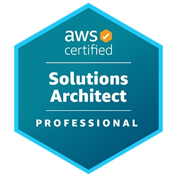
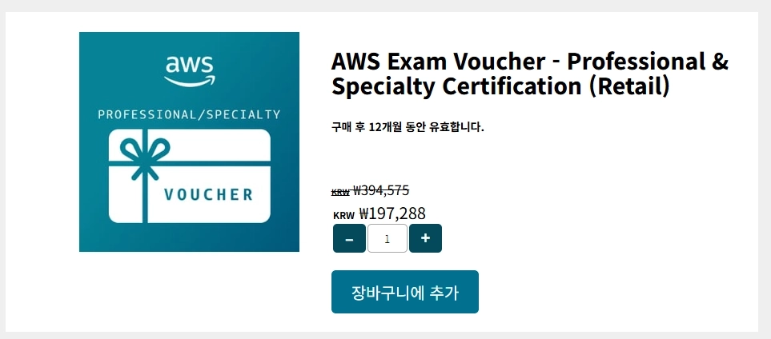
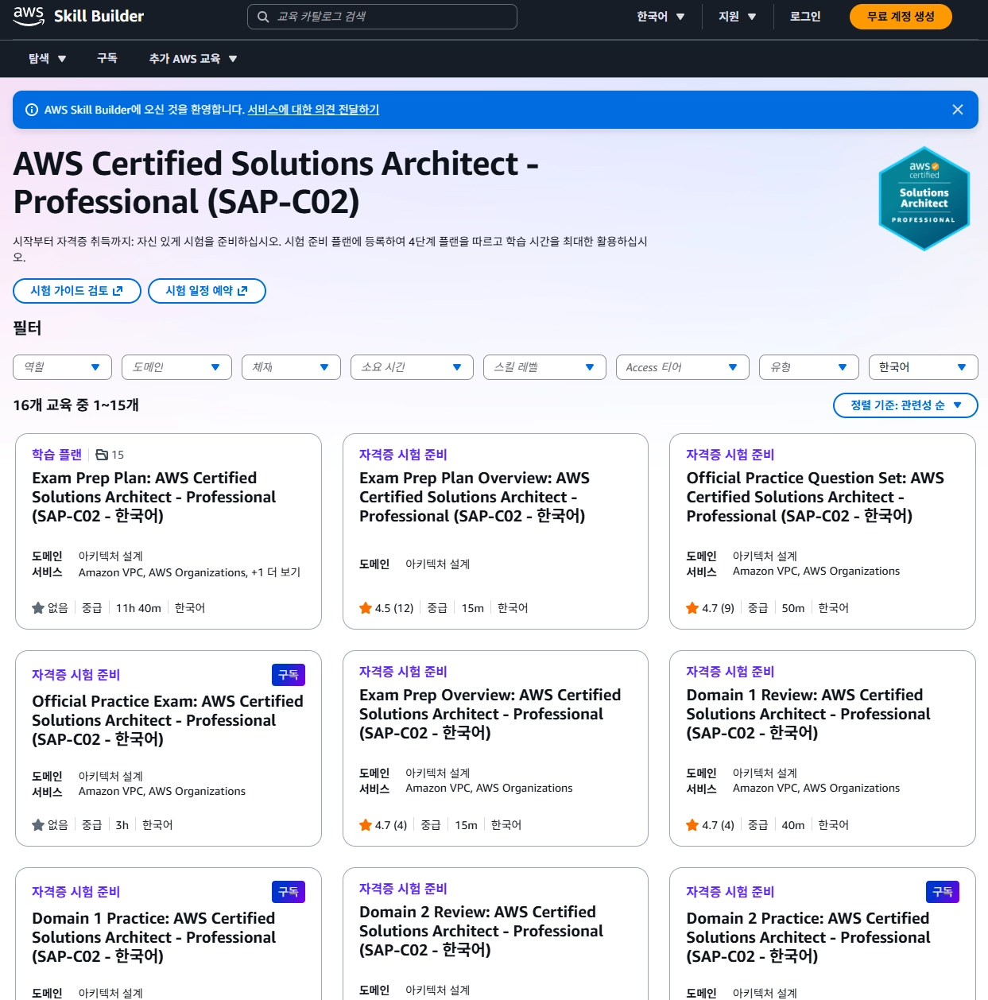
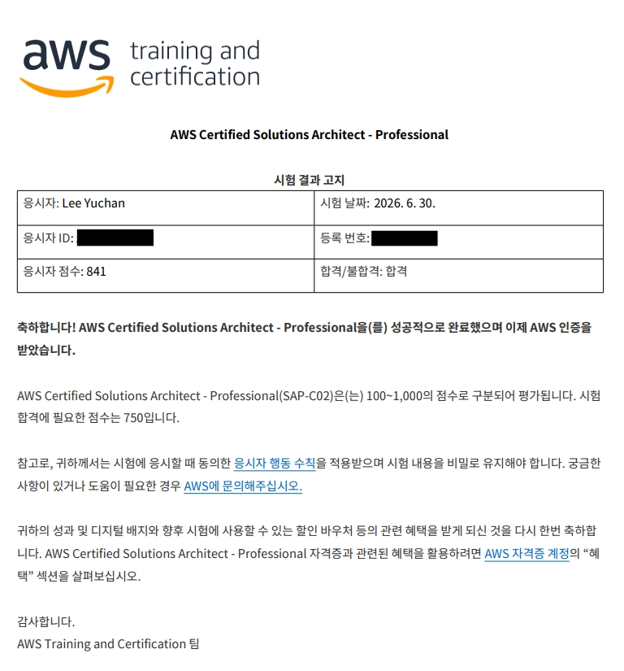

최근 클라우드 엔지니어링 직무 전환을 준비하고 있습니다. AWS에 대해 배울 겸, 이직에 활용하기 위해 AWS 자격증을 준비하기로 결정했습니다.

시험 접수부터 합격 후 자격증 수령까지 2개월의 짧은 기록과 경험, 그리고 자잘한 팁에 대해 공유합니다.

## 🎓 AWS 자격증이란?

AWS 환경에서 시스템을 설계, 구현 및 관리하는 기술과 능력을 검증하는 공식 프로그램입니다. 그 중에서도 Solutions Architect는 AWS 서비스 전반에 걸쳐 비용 및 성능 최적화 솔루션을 설계하는 능력을 검증하는 데 중점을 둡니다.

저는 AWS Certified Solutions Architect - Professional (SAP-C02)에 응시했습니다. AWS는 2년 이상의 AWS 실무 경험을 권장하고 있습니다.

저는 Associate 자격 없이 바로 Professional 시험에 응시했습니다. 이전 직장에서 1년 반 동안 AWS 인프라 운영을 제가 도맡다시피 했어서 '괜찮지 않을까?' 싶었는데, 생각보다 훨씬 어려웠습니다.

## 📋 시험 접수하기

AWS는 시험 관리를 [Pearson](https://www.pearsonvue.com/us/en/test-takers.html)에 위탁하고 있습니다. SAP-C02의 응시료는 300 USD, 현재 환율로는 한화 약 47만원에 달합니다. 하지만 시험 응시료는 실시간 환율이 아니라 AWS에서 정하는 [응시료](https://aws.amazon.com/ko/certification/policies/before-testing/#Exam_pricing)(수수료 제외, 2026-07-01 기준 394,575 KRW)를 따릅니다. Pearson이나 Udemy와 같은 교육 기관에서 바우처를 판매하는 것을 심심찮게 볼 수 있으니, 할인 혜택을 꼭 챙기시길 바랍니다.

시험 접수 시 꼭 챙겨야 할 혜택을 정리하면 다음과 같습니다.

### 🎟️ 할인 바우처

저는 Pearson에서 판매하는 바우처를 구매하여 응시하였기에 50% 할인을 받을 수 있었습니다. 표기 금액은 수수료 제외 금액이며 수수료를 포함해 최종 결제된 금액은 26년 5월 7일 기준 221,833원입니다.

주의하실 사항은 바우처가 어떤 유형의 시험에 적용되는지 확인하셔야 합니다. 보통 Foundational / Associate / Professional, Specialty로 나뉘어 있습니다. Foundational 바우처는 Associate 시험을 응시하는 데 사용할 수 없습니다.

### ⏱️ ESL (English as a Second Language)

영어가 모국어가 아닌 수험자는 ESL을 요청하여 30분의 추가 시험 시간을 받을 수 있습니다. 답안을 검토할 수 있는 귀중한 시간이니 꼭 신청하시길 바랍니다.

온라인 응시도 가능하지만 저는 오프라인 시험장에 방문하여 응시하기로 했습니다. 발생할 수 있는 여러 문제(소음, 인터넷 연결 등)에 대해 신경을 덜 쓰고 싶었고, 적절한 긴장감과 잘 통제된 환경을 원했습니다.

여담이지만 바우처 구매가 실패하는 문제가 있었습니다. 해외원화결제(DCC) 때문이었고 DCC를 잠시 끄고 결제하여 해결되었지만 이로 인한 환전 수수료가 발생했습니다. 그래도 실시간 환율로 직접 결제하는 것보다는 훨씬 저렴합니다.

## 📝 시험 준비하기

저는 시험을 위해 Udemy에서 [Stephane Maarek의 강의](https://www.udemy.com/course/aws-solutions-architect-professional/) 1개와 실전 모의고사 2개([Stephane Maarek](https://www.udemy.com/course/practice-exam-aws-certified-solutions-architect-professional/), [Jon Bonso](https://www.udemy.com/course/aws-solutions-architect-professional-practice-exams-sap-c02/) 각 1개)를 구매했습니다. 기간은 2개월, 하루 2\~3시간 정도 강의를 듣다가 마지막 2\~3주에 모의고사와 오답 풀이를 중점으로 진행했습니다.

모의고사는 실제 시험보다 어려운 편입니다. 일단 Stephane Maarek의 모의고사는 정말 어렵습니다. [AWS 공식 샘플 시험 문항](https://d1.awsstatic.com/ko_KR/training-and-certification/docs-sa-pro/AWS-Certified-Solutions-Architect-Professional_Sample-Questions.pdf)과 비교했을 때 지문이 장황한 데다, 선택지가 요구하는 지식이 굉장히 지엽적입니다.

구체적인 수치를 토대로 정답을 고르도록 하는 문제가 많습니다. Jon Bonso의 모의고사도 실제 시험보다 지문이 장황한 편입니다. 제 개인적인 체감으로는 공식 샘플 문제와 실제 시험의 분위기가 꽤 비슷했습니다.

모의고사 결과는,

| 모의고사                                                     | 테스트 회차           | 결과 (맞은 개수 / 총 개수) | 정답률 (%) |
| ------------------------------------------------------------ | --------------------- | -------------------------- | ---------- |
| Practice Exam AWS Certified Solutions Architect Professional | Mini Practice Test #1 | 18 / 30                    | 60%        |
|                                                              | Full Practice Test #2 | 41 / 75                    | 54%        |
|                                                              | Full Practice Test #3 | 45 / 75                    | 60%        |
| AWS Certified Solutions Architect Professional Practice Exam | Practice Test 1       | 51 / 75                    | 68%        |
|                                                              | Practice Test 2       | 59 / 75                    | 78%        |
|                                                              | Practice Test 3       | 61 / 75                    | 81%        |
|                                                              | Practice Test 4       | 52 / 75                    | 69%        |

저는 모의고사 결과에 너무 연연하지 않아도 된다고 말씀드리고 싶습니다. 모의고사는 실제 문제보다 어려웠습니다. 단어 하나의 차이가 큰 차이를 만들 수 있기 때문에 문제를 꼼꼼히 잘 읽고 요구사항을 정확히 파악하는 것이 중요합니다.

AWS Skill Builder에서도 시험을 준비할 수 있습니다. 구독 배지가 달린 건 월간 구독자($29/월) 전용 컨텐츠로 개인적으로 조금 비싸다고 생각합니다. 하지만 AWS 공식 모의고사는 다른 플랫폼과 비교해 가장 큰 차별점입니다.

## ⏳ 응시 절차

시험 시간은 09:15 예약이었지만 저는 08:30경에 일찍 도착했습니다. 일찍 도착했지만 감독관님이 9시까지 기다려도 되고, 바로 응시해도 된다고 하셔서 저는 바로 응시했습니다. 저 외에도 다른 수험자는 10~20분 정도 계셨습니다.

1.  사물함에 모든 소지품 보관

    주머니도 비워야 합니다. 저는 제 스마트폰과 워치를 모두 전원을 끈 채 사물함에 넣어 보관했습니다.

2.  신분증 제시 (2개 이상)

    시험 감독관님이 신분증을 2개 요구하셨고, 저는 여권과 운전면허증(국문)을 제시했습니다.

    어떤 분은 깜빡하여 하나만 가져오신 듯했는데, 감독관님의 안내에 따라 신용/체크카드로 두 번째 신분증을 대신 제출하셨습니다.

    준비 전 찾아본 글에 따르면 하나만 가져가도 허용하는 경우가 있다고 했던 것 같은데, 감독관마다 다른 듯 하니 주의하시길 바랍니다.

3.  시험 안내 및 동의서 작성

    시험에 관한 안내 사항이 적힌 문서(양면)을 읽고 동의서에 서명합니다. 동의서는 안내 사항을 준수할 것에 대한 요구와 위반 시 불이익을 받을 수 있음에 동의하는 내용을 담고 있었습니다.

4.  입실 시간 기록 및 서명

5.  지정된 좌석에 착석 후 대기

    감독관이 지정한 좌석(번호)에 앉아서 기다리고 있으면, 잠시 후 오셔서 응시 환경을 설정해줍니다. 저는 자리에 사용할 수 있는 화이트보드가 같이 제공되었지만 실제로 쓰지는 않았습니다.

6.  시험 응시

    시험 시간은 180분, ESL을 요청하면 210분인데 실제로 응시 시간은 220분이라 적혀있는 걸 볼 수 있습니다. 남는 10분은 시험 응시 전/후 안내와 설문조사 때문입니다. 시험 응시 과정은 다음과 같습니다.

    1.  시험 응시 전 안내사항 확인 & 비밀유지서약(NDA) 동의
    2.  시험 응시 (210분)

        시험 환경이 생각보다 쾌적했습니다. Udemy 모의고사 환경보다 훨씬 나았습니다. 문제를 체크(플래그)해두고 나중에 다시 검토할 수 있어 편리했습니다. 제출 전 확인을 요구하는 팝업이 거듭 뜨기 때문에 실수로 제출할 가능성을 줄일 수 있습니다.

        한국어로 응시하더라도 영어 원문을 볼 수 있습니다. 한국어 번역이 다소 어색하게 느껴지는 경우가 더러 있어 애매한 문제는 영어 원문을 함께 확인했습니다.

    3.  시험 응시 후 설문조사

        문제 난이도나 수험 환경에 대한 만족도 조사 등 간단한 설문 조사 과정입니다.

7.  퇴실 시간 기록 및 서명

## 🪪 결과

저는 841점으로 합격했습니다. 시험 당일 저녁에 결과를 받았다는 이야기도 있어서 오매불망 기다렸는데 오지 않아서 잠자리에 들었습니다. 다음 날 이메일을 확인해보니 6시에 [Credly](https://info.credly.com/) 배지를 받은 뒤였습니다. AWS의 합격 통보는 12시에 받았습니다.

다른 합격 후기를 찾아보면 Credly를 통해 합격 사실을 먼저 알았다는 글이 심심찮게 발견됩니다.

## ✨ 혜택

자격증을 취득하면 만료(3년) 전까지 다음 아무 자격 시험에 응시할 때 사용할 수 있는 50% 할인 혜택과 [Subject Matter Expert (SME)](https://aws.amazon.com/ko/certification/certification-sme-program/) 프로그램 참가 혜택이 주어집니다. SME는 간단히 말하면 AWS 자격증 시험 문제 작성 및 검토 과정에 참여하는 온/오프라인 프로그램입니다.

또한 [AWS Skill Builder](https://skillbuilder.aws/certification/recertification)에서 만료 전 6개월 내에 자격증을 1년 연장할 수 있습니다.
