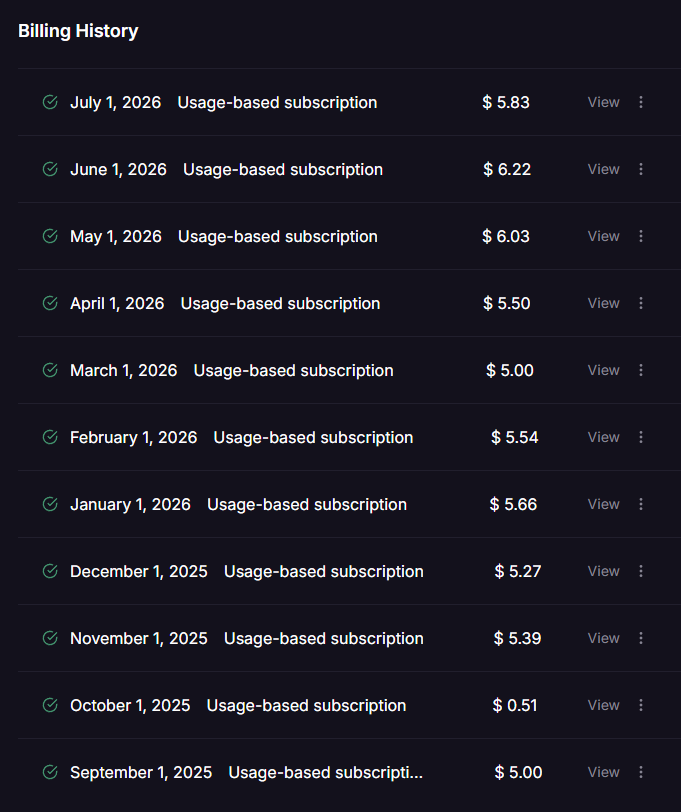
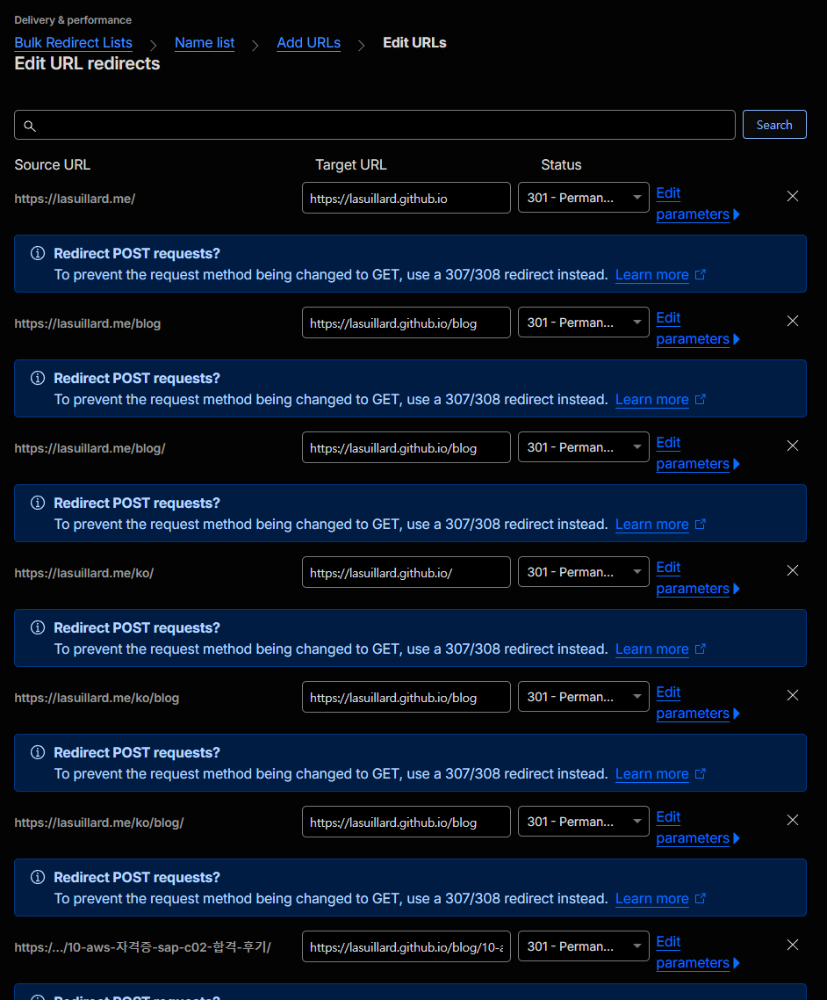

기술 블로그를 작년 말에 Railway로 옮겼습니다. 블로그를 Django로 완전히 재작성하고 필요한 동적 기능들을 붙이기 위해서였습니다. 하지만 최근 다시 GitHub Pages로 블로그를 옮기게 되었습니다.

## 🤔 전환 이유

다시 GitHub Pages로 돌아가게 된 이유는 다음과 같습니다.

### 📉 서버 필요성의 감소

블로그를 Django로 다시 만들었던 데에는 다음과 같은 목적이 있었습니다.

- **유지보수 자동화**: 글 속 깨진 링크 검증, 미사용 애셋 정리, 데이터베이스 정기 백업 등 Celery와 Beat 기반 비동기 작업을 중심으로 한 다양한 자동화 작업을 구현하고자 했습니다.
- **다양한 동적 기능 구현**: 이력서, 연관 프로젝트 및 블로그 글 등을 총망라해 관리하는 개인 홈페이지를 구상했습니다.
- **Django 학습**: Django SSR을 활용하여 웹 애플리케이션을 개발, 배포, 운영해 보는 경험을 쌓고자 했습니다.

하지만 블로그를 운영하면서 이러한 구성이 제 블로그 운영 및 관리 패턴과 다소 동떨어져 있다는 사실을 체감했습니다.

작업 스케줄링은 Celery 대신 Railway Functions와 Cron 기능을 활용하는 것으로 충분함을 알게 되었고, 블로그 글이나 이력서, 포트폴리오 등을 위해 다양한 Django 앱을 개발하고 관리하는 것은 그리 편리하지 않았습니다.

### 💸 비용 대비 효용성

두 번째 이유는 비용입니다. 지난 10개월간 지출한 $55.95가 효용성 대비 합리적이지 못했다고 판단했습니다. 블로그 사용 및 관리 패턴을 감안했을 때, 정적 웹 사이트 호스팅 대비 크게 나은 점이 없었습니다.

여전히 Railway의 비용 정책은 매력적입니다. Railway Hobby 플랜은 월 $5에 불과한 데다 실제 CPU 및 메모리 사용량에 기반하는 과금 정책, 그리고 서버리스 기능을 활용한 개발 환경 비용 절감 덕분에 월 $5\~$6 정도로 Django와 Postgres, Redis, 그리고 Celery로 구성된 제 블로그를 개발과 운영 두 환경에서 큰 문제 없이 운영할 수 있었습니다.

결국 블로그를 Django로 전환한 것이 제 기술적 허영심과 과욕, 섣부른 판단이 부른 실수였음을 받아들여야 했습니다. 그리고 다시 GitHub Pages로 돌아가기로 했습니다.

## 🏗️ 전환 과정

기존 정적 블로그 코드 저장소는 아카이브 상태로 보관되어 있었기에 쉽게 코드를 복원할 수 있었습니다. 하지만 그 짧은 기간 동안, 많은 패키지 업데이트가 있었고 제 개발 방식도 많이 달라져 있었습니다.

### 🛠️ 개발 환경 최신화

겨우 10개월도 채 안 되었지만, 아카이브되었던 프로젝트는 패키지 버전이 뒤처져 있었고 손봐야 할 곳이 많았습니다. 이번에는 완벽함보다 **운영 피로도를 낮추는 단순함**에 초점을 맞췄습니다.

- **개발 환경 단순화**

  개발 컨테이너에 크게 의존하는 기존 구성 대신, Nix를 활용하여 프로젝트 도구를 선언적으로 관리하면서 더 가볍고 단순화된 개발 환경으로 전환했습니다.

- **불필요한 구성 정리**

  Renovate로 대체된 Dependabot, Lighthouse 측정, 개인화된 GitHub Copilot 설정 등 사용하지 않거나 관리 부담을 주는 구성 요소들을 과감히 삭제했습니다.

- **SvelteKit 어댑터 변경**

  정적 웹 사이트로 빌드하기 위해 어댑터를 [adapter-static](https://svelte.dev/docs/kit/adapter-static)으로 변경했습니다. 어댑터 변경은 사이트가 빌드되는 방식을 바꾸기 때문에 구현 변경이 뒤따랐지만, 아카이브 시점에 남겨두었던 시각적 회귀(Visual Regression) 스냅샷 테스트와 단위 테스트 덕분에 깨진 UI와 로직을 손쉽게 잡아낼 수 있었습니다.

### 🚀 GitHub Pages 배포 구성

Cloudflare Pages나 Vercel 같은 대안도 있지만, 코드 관리부터 이슈 트래킹, CI/CD, 웹 호스팅까지 GitHub 하나로 끝낼 수 있는 편리함이 가장 큰 매력입니다. Django로 전환하기 전 Cloudflare Workers 배포 구성을 사용하면서 과거의 GitHub Pages 설정이 지워진 상태였기에, GitHub Actions 배포 워크플로를 새롭게 작성했습니다.

### 🚚 블로그 글 이전

최근 블로그 글들은 Django 모델(데이터베이스)로 관리되고 있었습니다. 이를 정적 파일로 되돌리기 위해 데이터베이스와 애셋을 덤프한 뒤, AI를 활용해 메타데이터(Frontmatter)가 포함된 Markdown 파일로 손쉽게 일괄 변환했습니다. CloudFront에 의해 서빙되던 이미지 등 애셋 또한 로컬로 내려받아 참조하도록 수정했습니다.

### ↪️ 도메인 전환

현재 블로그 도메인(`lasuillard.me`) 트래픽을 옛 도메인(`lasuillard.github.io`)으로 전환할 필요가 있었습니다. 굳이 블로그에 도메인을 할당해서 관리 피로도를 높일 필요가 없다고 판단했습니다. GitHub가 기본 제공하는 도메인(.github.io)으로도 충분했기 때문입니다.

하지만 Railway에 리디렉션 서버를 띄워둔다면 당분간 추가 지출이 발생할 터였습니다. 가능한 가장 쉽고 확실한 방법을 찾던 중, 도메인을 관리하고 있던 Cloudflare의 [Bulk Redirects](https://developers.cloudflare.com/rules/url-forwarding/bulk-redirects/) 기능에 대해 접하게 되었습니다.

기존 Django 블로그는 다국어 지원(i18n) 기능을 포함하고 있어 URL 경로가 다양(`/blog`, `/ko/blog`, `/en/blog`, ...)했습니다. 제 블로그는 글 수가 많지 않아서, 경로 접두사까지 처리하는 복잡한 리디렉션 규칙을 작성하는 대신 리디렉션 URL을 하나하나 직접 입력해 주었습니다.

리디렉션 목록을 CSV 파일로 업로드할 수도 있으니 웹사이트 규모가 크거나 페이지가 많다면 스크립트를 통해 CSV 파일을 만들어 업로드해도 좋겠습니다.

## 💭 마치며

다시금 전환을 결심하게 된 데에는 최근 AWS 자격증을 취득하기 위해 공부한 경험이 큰 계기가 되었습니다. 비용, 보안, 유지보수성 등 다양한 요구사항을 만족하는 최적의 아키텍처에 대해 깊이 고민하면서, 블로그의 본래 요구사항과 현재 아키텍처를 다시 한번 재고하게 되었습니다.

기존 Django 블로그는 구성과 용도를 바꿔 재활용하려고 합니다. Celery를 쳐내고 서버리스 환경에서 최저한의 비용으로 동작할 수 있는 유용한 개인용 웹 애플리케이션을 만들어볼 생각입니다.
