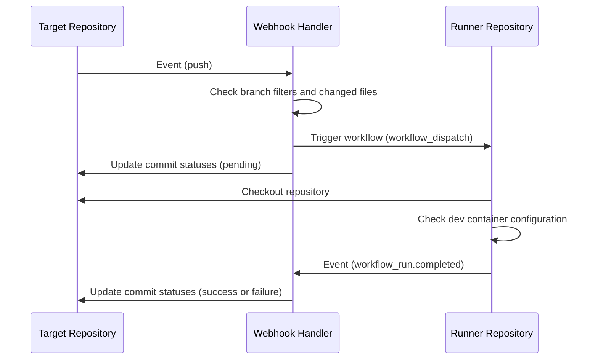
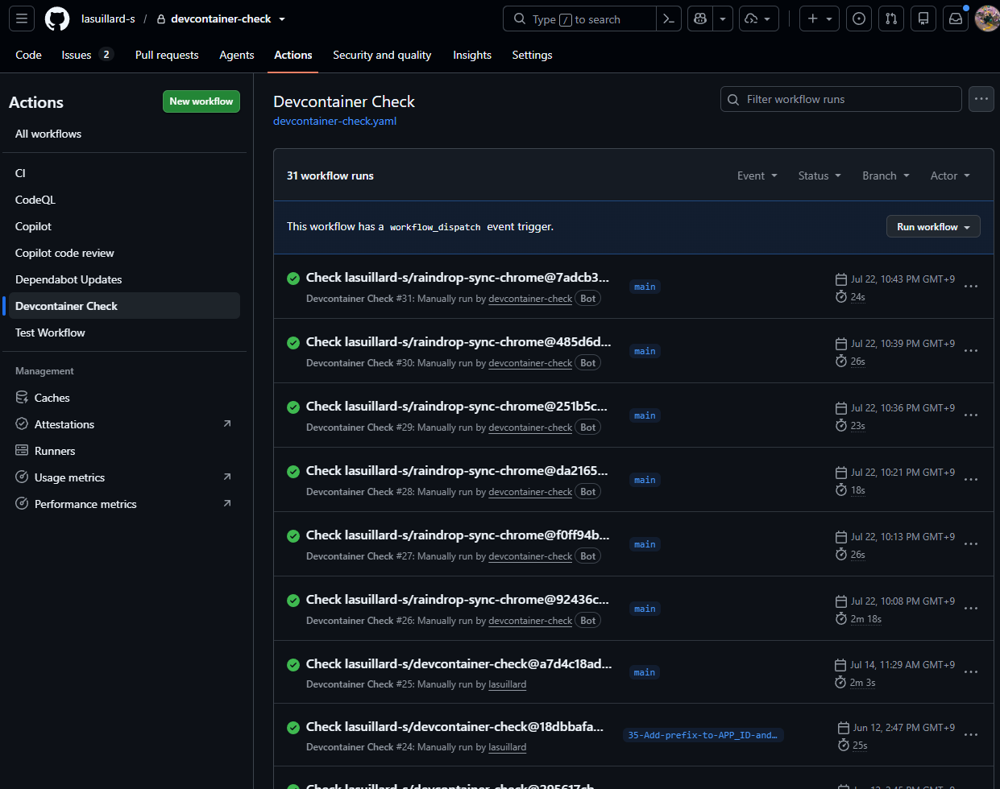
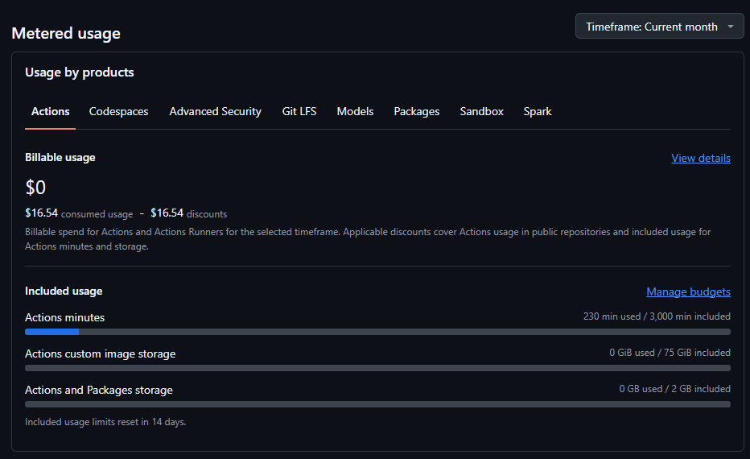
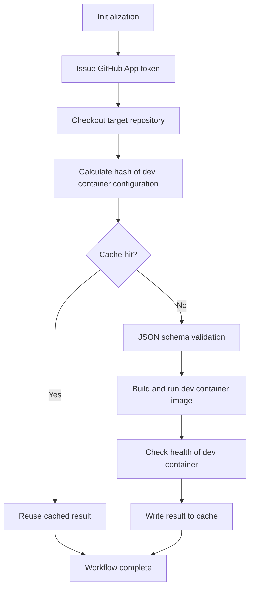
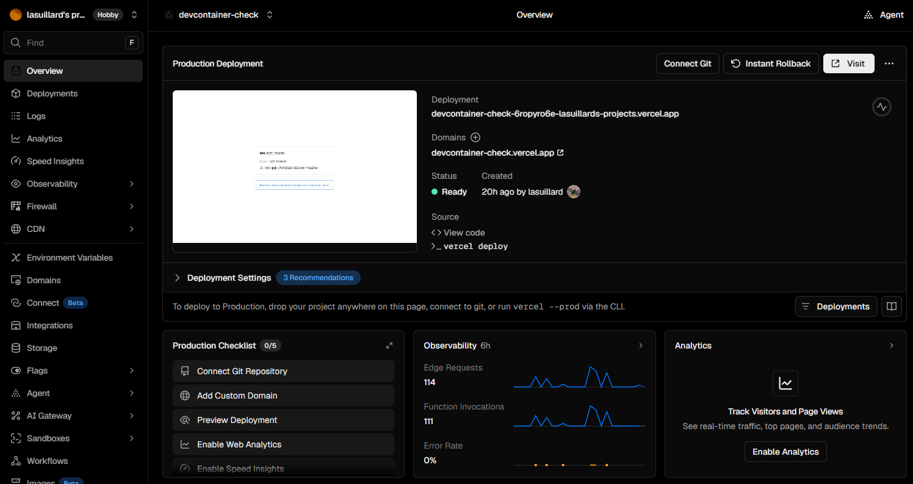
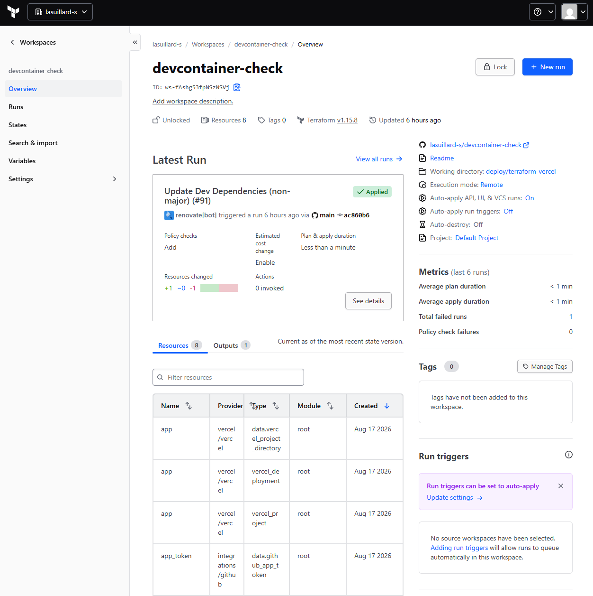
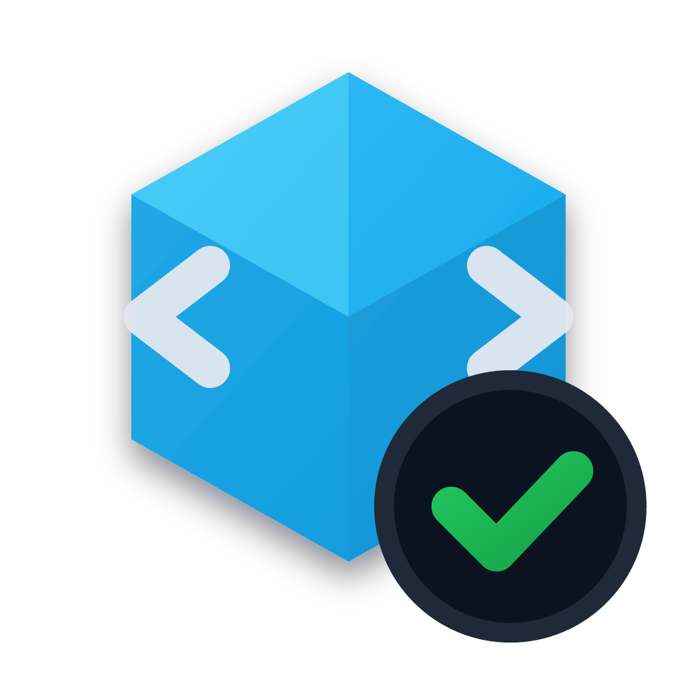
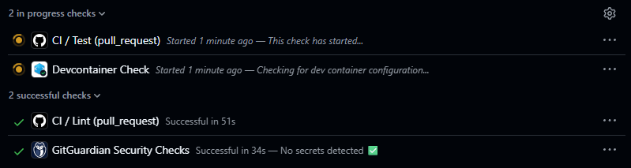
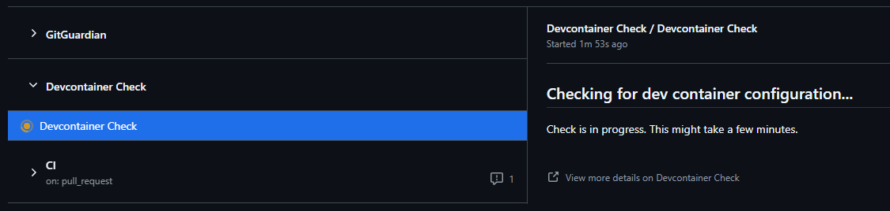
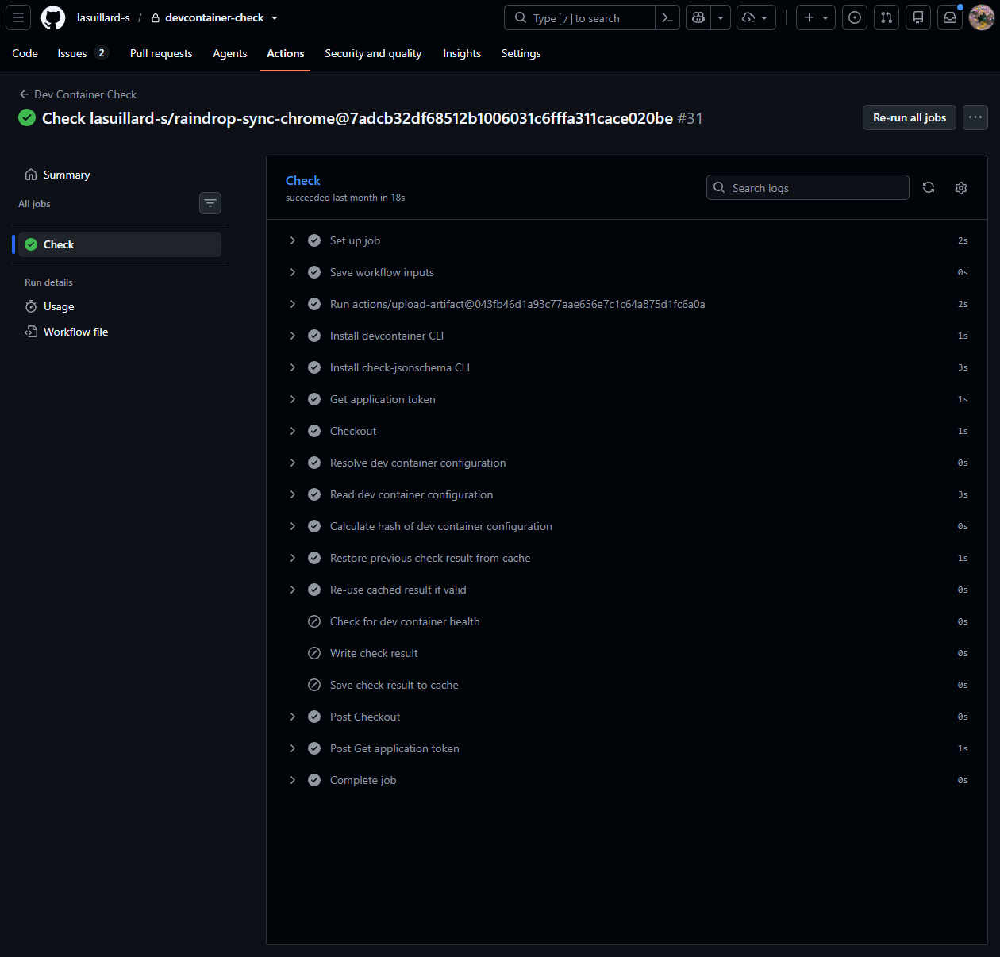

이전 글에서 개발 컨테이너에 대해 다루었습니다. 개발 컨테이너를 활용하면 재현 가능하고 격리된 개발 환경을 쉽고 빠르게 구성할 수 있습니다. 하지만 의도대로 잘 동작하는 환경을 완성하기까지는 다양한 설정 오류나 예외 상황을 겪게 됩니다. 특히 개발 컨테이너를 구성하는 도구와 기능이 늘어날수록 이러한 문제는 더욱 빈번해집니다.

따라서 개발 컨테이너의 구성이 정확한지, 변경 후에도 정상 동작하는지 지속적으로 검증할 필요가 있습니다. 이번 글에서는 Probot과 GitHub Actions를 활용하여 Dev Container 구성 검증을 중앙화하고 자동화한 경험을 공유합니다.

## 🤔 GitHub Actions의 한계

개발 컨테이너의 구성 검증을 자동화하기 위해 다음과 같은 워크플로를 잠시 활용했었습니다. 개발 컨테이너의 구성이 변경되면 GitHub Actions 워크플로가 실행되어 개발 컨테이너를 빌드하고, 간단한 명령어를 실행하여 성공하면 검증이 완료되었다고 판단합니다.

```yaml
# This workflow builds and runs the dev container defined in the .devcontainer directory to ensure validity.
name: Dev Container

on:
  push:
    branches:
      - main
    paths:
      - .devcontainer/**
      - .github/workflows/devcontainer.yaml
      - docker-compose.yaml
  pull_request:
    branches:
      - main
    paths:
      - .devcontainer/**
      - .github/workflows/devcontainer.yaml
      - docker-compose.yaml
  schedule:
    - cron: 0 0 1 * * # At midnight on the first day of every month

concurrency:
  group: ${{ github.workflow }}-${{ github.ref }}
  cancel-in-progress: true

jobs:
  devcontainer:
    name: Validate Dev Container
    runs-on: ubuntu-latest
    steps:
      - uses: actions/checkout@v4

      - name: Build and run dev container
        uses: devcontainers/ci@v0.3
        with:
          runCmd: echo "Dev container is running successfully."
          push: never
```

하지만 동일한 검증 로직을 여러 프로젝트 저장소에 반복 적용하다 보면, 관리해야 할 저장소가 늘어날수록 다음과 같은 문제가 발생합니다.

- 새 프로젝트를 생성할 때마다 거의 동일한 검증 워크플로 파일을 매번 복사해 붙여넣어야 합니다.
- GitHub Actions 워크플로는 프로젝트 저장소에 종속적이어서 워크플로를 수정하려면 각 프로젝트 저장소를 일일이 수정해야 합니다.

[재사용 가능한 워크플로](https://docs.github.com/en/actions/how-tos/reuse-automations/reuse-workflows)나 [커스텀 액션](https://docs.github.com/en/actions/concepts/workflows-and-actions/custom-actions)을 활용하더라도 각 저장소마다 워크플로 정의 파일을 생성하고 관리해야 하는 부담은 여전합니다.

그렇게 모색한 대안은 [GitHub App](https://docs.github.com/en/apps)을 활용하는 것이었습니다.

## 🐙 GitHub App 개발하기

[GitHub App](https://docs.github.com/en/apps)은 GitHub의 기능을 확장하고 특정 프로세스를 자동화하기 위한 서드파티 통합 도구입니다. 새 이슈를 생성하거나 PR에 댓글을 다는 등 GitHub의 다양한 기능을 프로그래밍 방식으로 제어할 수 있으며, 외부 서비스와의 연동이나 이벤트 기반 자동화 작업도 손쉽게 구현할 수 있습니다.

무엇보다 GitHub App은 특정 프로젝트 저장소에 종속되지 않습니다. 조직이나 계정에 앱을 한 번 설치해두면 설정을 통해 대상 저장소를 유연하게 지정할 수 있고, 각 저장소에서 발생하는 이벤트를 중앙의 단일 서비스에서 감지하여 필요한 작업을 일괄 트리거할 수 있습니다.

개발하기에 앞서, 요구사항을 간단히 정리했습니다.

- 중앙화된 관리가 가능해야 합니다. 쉽게 저장소를 추가하고 제거할 수 있어야 합니다.
- 대상 프로젝트 저장소에 별도의 설정이나 구성이 필요하지 않아야 합니다. GitHub App 설치만으로 충분해야 합니다.
- 검증 결과를 커밋 상태에서 쉽게 확인할 수 있어야 하며, 디버깅이 용이하도록 로그를 쉽고 빠르게 확인할 수 있어야 합니다.
- 비용 발생을 최소화해야 합니다. 별도의 인프라를 구축할 필요가 없다면 이상적입니다.

요구사항을 충족하는 다음과 같은 구조를 설계했습니다.



- 각 프로젝트 저장소에서 코드 변경(`push`, `pull_request.synchronize`) 이벤트가 발생하면 Webhook Handler가 이벤트를 감지하고, 변경된 브랜치와 파일을 확인하여 검증 워크플로를 트리거합니다. 서버리스 환경의 Webhook Handler는 Docker 구동 등의 무거운 작업을 직접 처리할 수 없으므로, 검증 워크플로는 전용 Runner 저장소에서 실행됩니다.
- 검증 결과는 다시 Webhook Handler에 `workflow_run.completed` 이벤트로 전달됩니다. Webhook Handler는 각 프로젝트 저장소의 커밋 상태를 업데이트합니다.
- Runner(실행) 저장소의 존재 목적은 GitHub Actions 인프라를 활용하기 위함입니다. 별도 인프라 구축의 부담을 덜고, 워크플로를 중앙화하여 유지보수성과 비용 효율을 높입니다.

### 🤖 Probot 프레임워크


GitHub App을 밑바닥부터 개발하려면 웹훅 이벤트 수신 검증부터 토큰 발급까지 번거로운 작업이 많습니다. [@octokit/app](https://www.npmjs.com/package/@octokit/app)을 직접 다룰 수도 있지만, [Probot](https://github.com/probot/probot) 프레임워크를 활용하면 이러한 인증과 이벤트 라우팅 코드를 직접 작성하는 대신 핵심 로직에만 집중할 수 있습니다.

### ⚙️ GitHub Actions 인프라 재사용하기

개발 컨테이너 검증에는 Docker 구동을 위한 권한과 안정적인 컴퓨팅 리소스(VM)가 필수적입니다. AWS CodeBuild나 GCP Cloud Build 같은 별도 클라우드 CI 서비스도 고려했으나, 무료 사용량이 넉넉하지 않고 복잡한 클라우드 IAM 설정이 필요하다는 단점이 있었습니다.

반면 GitHub Actions를 활용하면 복잡한 IAM 구성 없이도 GitHub App 권한 체계와 자연스럽게 연동할 수 있습니다. 또한 공개(Public) 저장소 대상 무료 실행 혜택을 온전히 누릴 수 있어 추가 비용 발생을 최소화하고, GitHub 플랫폼 내에서 사용량을 통합 관리할 수 있습니다.



비용 최적화와 보안 격리를 위해 Runner 저장소는 공개(Public)와 비공개(Private)로 분리하여 운영합니다. 공개 Runner 저장소에서는 무료 실행 시간 혜택을 최대한 활용하고, 비공개 저장소 전용 Runner를 따로 두어 비공개 코드나 빌드 로그가 외부에 노출되는 보안 사고를 원천 차단합니다.

Runner 저장소의 GitHub Actions Secret에는 GitHub App의 자격 증명(App ID, Private Key)을 미리 등록해 둡니다. 워크플로가 실행되면 이 자격 증명으로 타깃 저장소에 접근 가능한 단기 인증 토큰을 발급(`actions/create-github-app-token`)받아 코드를 체크아웃하고 검증을 수행합니다.



### 📋 개발 컨테이너 구성 검증하기

검증에는 [Dev Container CLI](https://github.com/devcontainers/cli)와 [check-jsonschema](https://github.com/python-jsonschema/check-jsonschema)를 활용합니다. Dev Container CLI는 개발 컨테이너를 빌드하고 실행하는 데 필요한 명령어를 제공하며, check-jsonschema는 개발 컨테이너 구성 파일의 JSON 스키마 유효성을 검증합니다.

검증 과정은 다음과 같이 진행됩니다.



검증 속도 최적화를 위해 해시 기반 캐싱을 도입했습니다. 단순 설정 파일 비교 대신 `devcontainer read-configuration --include-features-configuration --include-merged-configuration` 명령을 사용하여 Features와 상속 설정이 완전히 병합된 최종 형상의 해시를 계산합니다. GitHub Actions 캐시(`actions/cache`)에 저장된 이전 검증 결과와 해시를 비교하여, 동일한 해시 값을 가지는 설정에 대해서는 빌드를 생략하고 캐시된 성공 결과를 재사용함으로써 통상 2 ~ 3분 이상 소요되던 검증 시간을 약 20초 내외로 단축했습니다.

다만 이 방식은 설정 파일에 직접 명시되지 않은 외부 `Dockerfile`이나 의존 파일의 단독 변경까지 완벽히 감지하지 못할 수 있다는 한계가 있어, 향후 의존 파일 전체를 해시 계산에 포함하도록 보완할 계획입니다.

## 🚀 배포 및 인프라 자동화

### ⚡ Vercel 서버리스 배포

Webhook Handler는 상시 실행되는 대규모 서버가 필요하지 않고, 간헐적으로 발생하는 웹훅 요청만 빠르게 안정적으로 처리하면 됩니다. 따라서 넉넉한 무료 티어와 손쉬운 배포를 제공하는 Vercel 서버리스 환경을 선택했습니다.



개발 초기에는 Vercel CLI와 GitHub 기본 통합만을 이용해 수동으로 배포하려 했습니다. 하지만 Webhook Handler(Vercel) 외에도 Runner 저장소, GitHub App 권한 및 웹훅 구독 등 여러 리소스가 서로 긴밀하게 맞물려 있어, CLI와 수동 스크립트만으로는 리소스를 누락 없이 관리하기 어려웠습니다.

### 🏗️ Terraform과 `check` 블록을 통한 상태 관리

이에 따라 Terraform과 Terraform Cloud를 도입하여 사전 요건 검증부터 Vercel 배포 및 인프라 상태 관리를 일원화했습니다.

특히 Terraform의 `check` 블록을 활용하여 배포 전 필수적인 사전 요건들을 선언적으로 검증할 수 있도록 구성했습니다. 예를 들어 GitHub App이 Runner 저장소에 정상 설치되어 있는지, 필요한 최소 권한(Permissions)이 올바르게 부여되어 있는지, 필수 웹훅 이벤트 구독이 누락되지 않았는지 등을 배포 단계에서 자동으로 점검합니다. 다음은 코드 예시입니다.

```hcl
/*
Validate GitHub app / repository configuration through GitHub API

Since the official GitHub Terraform provider does not provide enough information
to validate the GitHub app configuration, we call the GitHub API directly using
the GitHub App Token and HTTP data sources to fetch the app information.
*/
locals {
  # Expected (from app.yaml)
  app_manifest        = yamldecode(file("${local.project_root}/app.yaml"))
  required_perms      = local.app_manifest.default_permissions
  required_events     = local.app_manifest.default_events
  runner_repositories = compact([var.runner_repository, var.runner_repository_for_private])

  # Current (from GitHub API)
  app_info               = jsondecode(data.http.github_app.response_body)
  installed_repositories = jsondecode(data.http.github_app_installation.response_body).repositories[*].full_name
  missing_perms          = { for perm, access in local.required_perms : perm => access if !contains(keys(local.app_info.permissions), perm) || local.app_info.permissions[perm] != access }
  missing_events         = [for event in local.required_events : event if !contains(local.app_info.events, event)]
}

data "github_app_token" "app_token" {
  app_id          = var.app_id
  installation_id = var.app_installation_id
  pem_file        = var.private_key
}

/*
We use `/apps/{slug}` API instead of `/app` or `/app/installations/{installation_id}` API,
because the latter two APIs do not work with the token returned by `data.github_app_token.app_token.token`.

- https://docs.github.com/en/rest/apps/apps?apiVersion=2026-03-10#get-the-authenticated-app
- https://docs.github.com/en/rest/apps/apps?apiVersion=2026-03-10#get-an-installation-for-the-authenticated-app

To use the latter APIs, we would need to take additional user API tokens or personal access tokens,
which would require additional configuration and permissions.

Please feel free to suggest a better approach if you have one.
*/
data "http" "github_app" {
  # https://docs.github.com/en/rest/apps/apps?apiVersion=2026-03-10#get-an-app
  method = "GET"
  url    = "${var.github_api_base_url}/apps/${var.app_slug}"

  request_headers = {
    "Accept"               = "application/vnd.github+json"
    "Authorization"        = sensitive("Bearer ${data.github_app_token.app_token.token}")
    "X-GitHub-Api-Version" = "2026-03-10"
  }
}

# WARNING: We only fetch the first 100 repositories accessible to the app installation (no filtering supported).
#          If we need to support more than 100 repositories, we would need to implement pagination.
data "http" "github_app_installation" {
  # https://docs.github.com/en/rest/apps/installations?apiVersion=2026-03-10#list-repositories-accessible-to-the-app-installation
  method = "GET"
  url    = "${var.github_api_base_url}/installation/repositories?per_page=100"

  request_headers = {
    "Accept"               = "application/vnd.github+json"
    "Authorization"        = sensitive("Bearer ${data.github_app_token.app_token.token}")
    "X-GitHub-Api-Version" = "2026-03-10"
  }
}

check "app_information_accessible" {
  assert {
    condition     = data.http.github_app.status_code == 200 && data.http.github_app_installation.status_code == 200
    error_message = "Failed to fetch GitHub app information. Please check if the app configuration is valid."
  }
}

check "app_installed_for_runner_repositories" {
  assert {
    condition = alltrue([
      for repo in local.runner_repositories :
      contains(local.installed_repositories, repo)
    ])
    error_message = "GitHub app is not installed for the required runner repositories. Please install the app for the following repositories: ${jsonencode(local.runner_repositories)}"
  }
}

check "app_has_required_permissions" {
  assert {
    condition     = length(local.missing_perms) == 0
    error_message = "GitHub app permissions do not match the expected configuration. Missing permissions: ${jsonencode(local.missing_perms)}"
  }
}

check "app_listen_to_required_events" {
  assert {
    condition     = length(local.missing_events) == 0
    error_message = "GitHub app events do not match the expected configuration. Missing events: ${jsonencode(local.missing_events)}"
  }
}
```

저장소 커밋 시 배포를 자동 실행하는 Terraform Cloud의 VCS Driven Workflow를 활용하여 인프라 변경 사항을 투명하게 추적하고 자동 배포할 수 있도록 했습니다.



## ✅ Devcontainer Check



이렇게 완성된 **Devcontainer Check** GitHub App은 Checks API를 활용하여, 각 프로젝트 저장소의 커밋마다 개발 컨테이너 검증 상태와 상세 워크플로 실행 내역 링크를 자동으로 표시합니다.



코드 변경이 발생하면 즉시 백그라운드에서 검증이 시작됩니다.



문제가 발생하더라도 커밋 상세 페이지의 Checks 탭에서 실패 원인과 로그를 바로 확인하고 디버깅할 수 있습니다.



## 🛣️ 개선할 점

우여곡절 끝에 첫 GitHub App을 배포했지만, 여전히 개선할 점이 많습니다.

### 🔄 워크플로 동기화

워크플로 실행 저장소는 보안을 위해 의도적으로 공개/비공개 저장소로 나누어 운영하고 있습니다. 공개 저장소 환경에서 비공개 저장소의 워크플로를 무분별하게 실행할 경우, 비공개 코드나 환경 변수가 외부에 노출될 위험이 있기 때문입니다.

하지만 두 저장소로 나누어 관리하다 보니, 워크플로 구성이나 공통 로직을 수정할 때마다 두 저장소를 모두 갱신해야 하는 번거로움이 있습니다. 현재는 Renovate와 선언적 디렉터리 동기화 도구인 [vendir](https://carvel.dev/vendir/)를 활용해 두 저장소의 워크플로 코드를 동기화하고 있지만, 동기화 시점이나 충돌 관리 등 여전히 개선할 여지가 남아 있습니다.

### 🧩 검증 워크플로 모듈화

현재 검증 워크플로는 약 350줄에 달하는 단일 YAML 파일로 작성되어 있습니다. 초기 개발 당시 외부 종속성이나 추가 바이너리 배포를 최소화하고자 하나의 파일에 모든 인라인 스크립트를 포함시키다 보니 구조가 복잡해졌고, 사소한 셸 스크립트 문법 오류 하나를 디버깅할 때도 CI 전체를 재실행해야 하는 비효율이 있었습니다.

향후에는 단계별 검증 로직을 재사용 가능한 Composite Action이나 전용 스크립트로 분리하여 워크플로의 가독성과 유지보수성을 높일 계획입니다.

### 🌐 오픈소스 공개

초기에는 이 프로젝트를 바로 오픈소스로 공개하려 했으나, 사용자가 직접 GitHub App과 인프라를 프로비저닝하는 과정에서 겪는 진입 장벽이 여전히 존재하여 공개를 잠시 보류했습니다. 향후 누구나 클릭 몇 번만으로 손쉽게 자신의 저장소에 설치해 활용할 수 있도록 설정을 간소화한 뒤 공개할 예정입니다.

## 💭 마치며

최근에는 Nix Flake와 Home Manager를 중심으로 개발 환경을 구성하고 있습니다. Nix 환경에서는 `flake.nix`를 수정하는 즉시 환경 구성 피드백을 얻을 수 있어 별도의 복잡한 사전 검증이 필요 없고, 개발 컨테이너 또한 개발 도구들을 직접 빌드하는 대신 필요한 최소한의 Nix 도구만 설치하는 얇은 래퍼(Thin Wrapper)로 단순화되었기 때문에 현재는 이 프로젝트의 실질적인 필요성이 다소 줄어들었습니다.

하지만 여러 저장소 환경에서 반복되는 워크플로를 중앙화하고, 서버리스와 GitHub 인프라의 제약을 마주하며 극복해 낸 과정은 매우 유익한 경험이었습니다. 이번 시도는 향후 다른 자동화 시스템을 설계할 때도 큰 자산이 될 것입니다.
