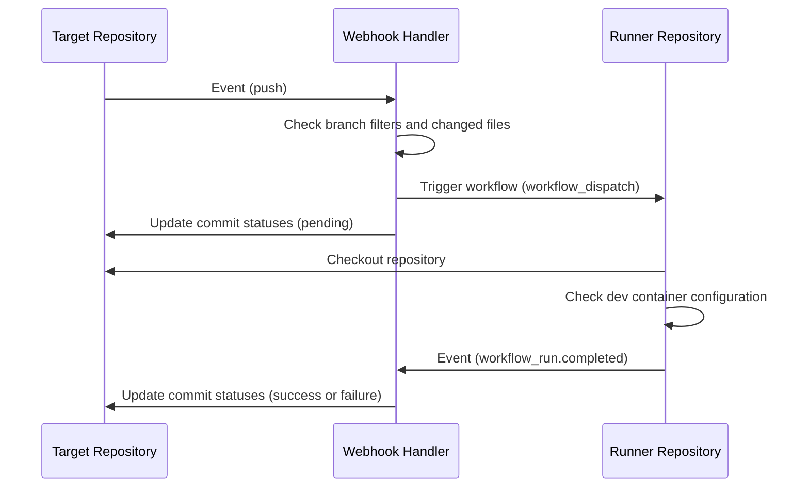
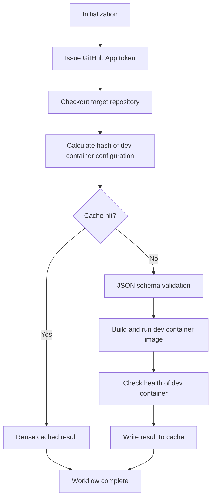

이전 글에서 개발 컨테이너에 대해 다루었습니다. 개발 컨테이너를 활용하면 재현 가능하고 격리된 개발 환경을 쉽고 빠르게 구성할 수 있습니다. 하지만 의도대로 잘 동작하는 환경을 완성하기까지는 다양한 설정 오류나 예외 상황을 겪게 됩니다. 특히 개발 컨테이너를 구성하는 도구와 기능이 늘어날수록 이러한 문제는 더욱 빈번해집니다.

따라서 개발 컨테이너의 구성이 정확한지, 변경 후에도 정상 동작하는지 지속적으로 검증할 필요가 있습니다. 이번 글에서는 Probot과 GitHub Actions를 활용하여 Dev Container 구성 검증을 중앙화하고 자동화한 경험을 공유합니다.

## 🤔 GitHub Actions의 한계

개발 컨테이너의 구성 검증을 자동화하기 위해 다음과 같은 워크플로를 잠시 활용했었습니다. 개발 컨테이너의 구성이 변경되면 GitHub Actions 워크플로가 실행되어 개발 컨테이너를 빌드하고, 간단한 명령어를 실행하여 성공하면 검증이 완료되었다고 판단합니다.

```yaml
# This workflow builds and runs the dev container defined in the .devcontainer directory to ensure validity.
name: Dev Container

on:
  push:
    branches:
      - main
    paths:
      - .devcontainer/**
      - .github/workflows/devcontainer.yaml
      - docker-compose.yaml
  pull_request:
    branches:
      - main
    paths:
      - .devcontainer/**
      - .github/workflows/devcontainer.yaml
      - docker-compose.yaml
  schedule:
    - cron: 0 0 1 * * # At midnight on the first day of every month

concurrency:
  group: ${{ github.workflow }}-${{ github.ref }}
  cancel-in-progress: true

jobs:
  devcontainer:
    name: Validate Dev Container
    runs-on: ubuntu-latest
    steps:
      - uses: actions/checkout@v4

      - name: Build and run dev container
        uses: devcontainers/ci@v0.3
        with:
          runCmd: echo "Dev container is running successfully."
          push: never
```

하지만 여러 프로젝트 저장소에서 비슷한 방식으로 개발 컨테이너를 구성하고 검증 과정도 비슷하다면, 관리해야 할 저장소가 늘어날수록 다음과 같은 문제가 발생합니다.

- 새 프로젝트를 생성할 때마다 거의 동일한 검증 워크플로 파일을 매번 복사해 붙여넣어야 합니다.

- GitHub Actions 워크플로는 프로젝트 저장소에 종속적이어서 워크플로를 수정하려면 각 프로젝트 저장소를 모두 수정해야 합니다.

[재사용 가능한 워크플로](https://docs.github.com/en/actions/how-tos/reuse-automations/reuse-workflows)나 [커스텀 액션](https://docs.github.com/en/actions/concepts/workflows-and-actions/custom-actions)을 활용하더라도 각 저장소마다 워크플로 정의 파일을 생성하고 관리해야 하는 부담은 여전합니다.

그렇게 모색한 대안은 [GitHub App](https://docs.github.com/ko/apps)을 활용하는 것이었습니다.

## 🐙 GitHub App 개발하기

[GitHub App](https://docs.github.com/ko/apps)은 GitHub의 기능을 확장하고 특정 프로세스를 자동화하기 위한 서드파티 통합 도구입니다. 새 이슈를 생성하거나 PR에 댓글을 다는 등 GitHub의 다양한 기능을 프로그래밍 방식으로 제어할 수 있으며, 외부 서비스와의 연동이나 이벤트 기반 자동화 작업도 손쉽게 구현할 수 있습니다.

무엇보다 GitHub App은 특정 프로젝트 저장소에 종속되지 않습니다. 조직이나 계정에 앱을 한 번 설치해두면 설정을 통해 대상 저장소를 유연하게 지정할 수 있고, 각 저장소에서 발생하는 이벤트를 중앙의 단일 서비스에서 감지하여 필요한 작업을 일괄 트리거할 수 있습니다.

개발하기에 앞서, 요구사항을 간단히 정리했습니다.

- 중앙화된 관리가 가능해야 합니다. 쉽게 저장소를 추가하고 제거할 수 있어야 합니다.
- 대상 프로젝트 저장소에 별도의 설정이나 구성이 필요하지 않아야 합니다. GitHub App 설치만으로 충분해야 합니다.
- 검증 결과를 커밋 상태에서 쉽게 확인할 수 있어야 하며, 디버깅이 용이하도록 로그를 쉽고 빠르게 확인할 수 있어야 합니다.
- 비용 발생을 최소화해야 합니다. 별도의 인프라를 구축할 필요가 없다면 이상적입니다.

요구사항을 충족하는 다음과 같은 구조를 설계했습니다.



- 각 프로젝트 저장소에서 코드 변경(`push`, `pull_request.synchronize`) 이벤트가 발생하면 Webhook Handler가 이벤트를 감지하고, 변경된 브랜치와 파일을 확인하여 검증 워크플로를 트리거합니다. 검증 워크플로는 Runner 저장소에서 실행됩니다.
- 검증 결과는 다시 Webhook Handler에 `workflow_run.completed` 이벤트로 전달됩니다. Webhook Handler는 각 프로젝트 저장소의 커밋 상태를 업데이트합니다.
- Runner(실행) 저장소의 존재 목적은 GitHub Actions 인프라를 활용하기 위함입니다. 별도 인프라를 구축할 필요성을 최소화하고, 워크플로를 중앙화하며, 비용 발생을 최소화합니다.

### 🤖 Probot 프레임워크


GitHub App을 개발하기 위해 [@octokit/app](https://www.npmjs.com/package/@octokit/app)을 직접 사용해도 되지만, [Probot](https://github.com/probot/probot) 프레임워크를 활용하면 훨씬 효율적입니다. Probot은 Node.js 기반의 프레임워크로 웹훅 이벤트 핸들링, 인증 토큰 발급, GitHub API 호출 등 GitHub App 개발에 필요한 기능을 제공합니다.

### ⚙️ GitHub Actions 인프라 재사용하기

GitHub Actions 워크플로를 트리거하는 방식을 선택한 이유는, 개발 컨테이너 검증에 Docker 구동을 위한 안정적인 컴퓨팅 리소스가 필요하기 때문입니다. AWS CodeBuild나 GCP Cloud Build 같은 별도 CI 서비스를 연동할 수도 있지만, GitHub Actions를 활용하면 추가 인프라 구축 없이 이미 친숙한 환경에서 검증 워크플로를 실행할 수 있습니다.


또한 GitHub 계정에 기본 제공되는 실행 시간을 활용하여 추가 비용 발생을 최소화할 수 있고, 사용량 및 예산 모니터링도 GitHub 플랫폼 내에서 통합 관리할 수 있다는 장점이 있습니다.


### 📋 개발 컨테이너 구성 검증하기

검증에는 [Dev Container CLI](https://github.com/devcontainers/cli)와 [check-jsonschema](https://github.com/python-jsonschema/check-jsonschema)를 활용합니다. Dev Container CLI는 개발 컨테이너를 빌드하고 실행하는 데 필요한 명령어를 제공하며, check-jsonschema는 개발 컨테이너 구성 파일의 JSON 스키마 유효성을 검증합니다.

검증 과정은 다음과 같이 진행됩니다.



동일한 해시 값을 가지는 설정에 대해서는 검증을 생략하고 캐시된 결과를 재사용합니다. 이를 통해 통상 2 ~ 3분 이상 소요되는 검증 과정을 약 20초 내외로 단축할 수 있었습니다. GitHub Actions의 캐시 기능을 활용하므로 별도의 캐시를 구축할 필요가 없습니다.

## 🚀 Vercel에 배포하기

배포 플랫폼은 Vercel을 선택했습니다. 넉넉한 무료 요금제 덕분에 개인 프로젝트나 소규모 팀에서도 부담 없이 사용할 수 있어 많은 개발자들이 GitHub App을 배포하는 데 Vercel을 활용하고 있습니다.


Vercel은 서버리스 플랫폼이므로 별도의 서버를 관리할 필요가 없고, 자동으로 확장되므로 트래픽이 증가해도 안정적으로 서비스를 제공할 수 있습니다.

개발 초기에는 Vercel CLI와 GitHub 통합 기능만을 이용하여 Vercel에 배포하는 것을 목표로 삼았습니다. 하지만 Vercel 외에도 긴밀히 통합되어야 할 리소스(실행 저장소, GitHub App 설정 등)가 여럿 있었고, CLI와 스크립트만으로 이러한 리소스를 관리하는 것은 번거롭고 오류가 발생하기 쉽기 때문에 조금 복잡해지더라도 더 나은 대안을 찾기로 했습니다.

### 🏗️ Terraform으로 배포하기

Vercel CLI와 GitHub 기본 통합만으로는 연관 리소스의 일관된 검증과 상태 관리가 어렵다고 판단하여, Terraform[^1]과 Terraform Cloud[^2]를 도입해 사전 요건 검증부터 Vercel 배포 및 인프라 상태 관리를 일원화하기로 결정했습니다.

[^1]: Terraform은 인프라를 코드로 관리할 수 있는 IaC(Infrastructure as Code) 도구입니다. Terraform을 활용하면 Vercel, GitHub, AWS 등 다양한 클라우드 서비스의 리소스를 코드로 정의하고, 배포 및 상태 관리를 자동화할 수 있습니다.

[^2]: Terraform Cloud는 Terraform을 클라우드 환경에서 실행하고 상태를 관리할 수 있는 서비스입니다. 무료 요금제도 제공되므로 개인 프로젝트나 소규모 팀에서도 부담 없이 사용할 수 있습니다.

지금은 Vercel 배포와 `check` 블록을 통한 사전 요건 검사만 수행하고 있으며, 향후 GitHub App 설치와 실행 저장소의 워크플로 구성 등 GitHub App 배포에 필요한 모든 리소스를 Terraform으로 관리할 수 있도록 고도화할 계획입니다.


VCS Driven Workflow를 활용하면 GitHub 저장소의 변경 사항을 감지하여 Terraform Cloud에서 자동으로 배포 및 상태 관리를 수행합니다. 향후 프로젝트를 오픈소스로 공개할 때에도 Terraform Cloud의 무료 티어를 통해 누구나 비용 부담 없이 인프라를 프로비저닝할 수 있도록 구성했습니다.

## ✅ Devcontainer Check


이렇게 완성된 **Devcontainer Check** GitHub App은 Checks API를 활용하여, 각 저장소의 커밋마다 검증 결과와 워크플로 실행 내역 링크를 자동으로 표시합니다.


코드 변경이 감지되면 자동으로 실행되며, 변경 사항이 있을 경우 상세 로그를 바로 확인할 수 있습니다.


## 🛣️ 개선할 점

우여곡절 끝에 첫 GitHub App을 배포했지만, 여전히 개선할 점이 많습니다.

### 🔄 워크플로 동기화

워크플로 실행 저장소는 의도적으로 공개/비공개 저장소로 각각 분리하여 운영하고 있습니다. 공개 저장소 환경에서 비공개 저장소의 워크플로를 무분별하게 실행할 경우, 비공개 저장소의 내부 구성이나 코드가 외부에 노출될 위험이 있기 때문입니다.

하지만 두 저장소로 나누어 관리하다 보니, 워크플로 구성이나 공통 로직을 수정할 때마다 두 저장소를 모두 갱신해야 하는 번거로움이 있습니다. 현재는 Renovate와 [vendir](https://carvel.dev/vendir/)를 활용해 두 저장소의 워크플로 코드를 동기화하고 있지만, 동기화 시점이나 충돌 관리 등 여전히 개선할 여지가 남아 있습니다.

### 🧩 검증 워크플로 모듈화

현재 검증 워크플로는 약 350줄에 달하는 단일 YAML 파일로 작성되어 있습니다. 초기 개발 당시 외부 종속성이나 추가 바이너리 배포를 최소화하고자 하나의 파일에 모든 검증 스크립트를 포함시키다 보니 장황해졌습니다.

향후에는 단계별 검증 로직을 재사용 가능한 Composite Action이나 전용 스크립트로 분리하여 워크플로의 가독성과 유지보수성을 높일 계획입니다.

### 🌐 오픈소스 공개

초기에는 이 프로젝트를 바로 오픈소스로 공개하려 했으나, 사용자가 직접 GitHub App과 인프라를 프로비저닝하는 과정에서 겪는 진입 장벽이 여전히 존재하여 공개를 잠시 보류했습니다. 향후 누구나 클릭 몇 번만으로 손쉽게 자신의 저장소에 설치해 활용할 수 있도록 설정을 간소화한 뒤 공개할 예정입니다.

## 💭 마치며

최근에는 Nix Flake와 Home Manager를 활용하여 개발 환경을 구성하기 때문에 개발 컨테이너 구성이 단순해지면서 이 프로젝트의 필요성이 다소 줄어든 면이 있습니다. 하지만 특정 워크플로를 중앙화하여 관리하는 방법을 고민하는 과정에서 많은 것을 배웠습니다.

GitHub 인프라를 최대한 활용하여 비용을 최소화하면서도, 각 프로젝트 저장소의 개발 컨테이너 구성 검증을 중앙화하고 자동화할 수 있는 방법을 찾는 과정은 흥미로웠습니다. 예전부터 GitHub App을 만들어보고 싶었는데, 이번 프로젝트를 통해 GitHub App 개발에 대한 경험을 쌓을 수 있었습니다.
