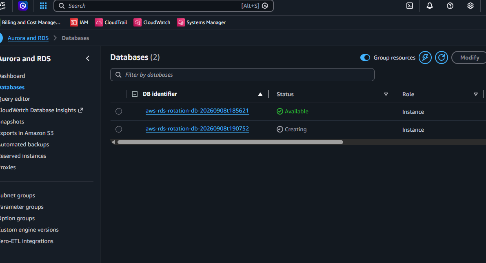
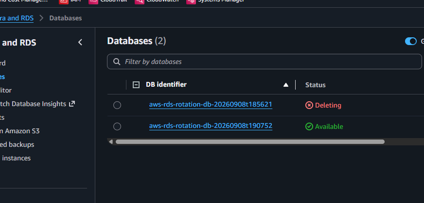
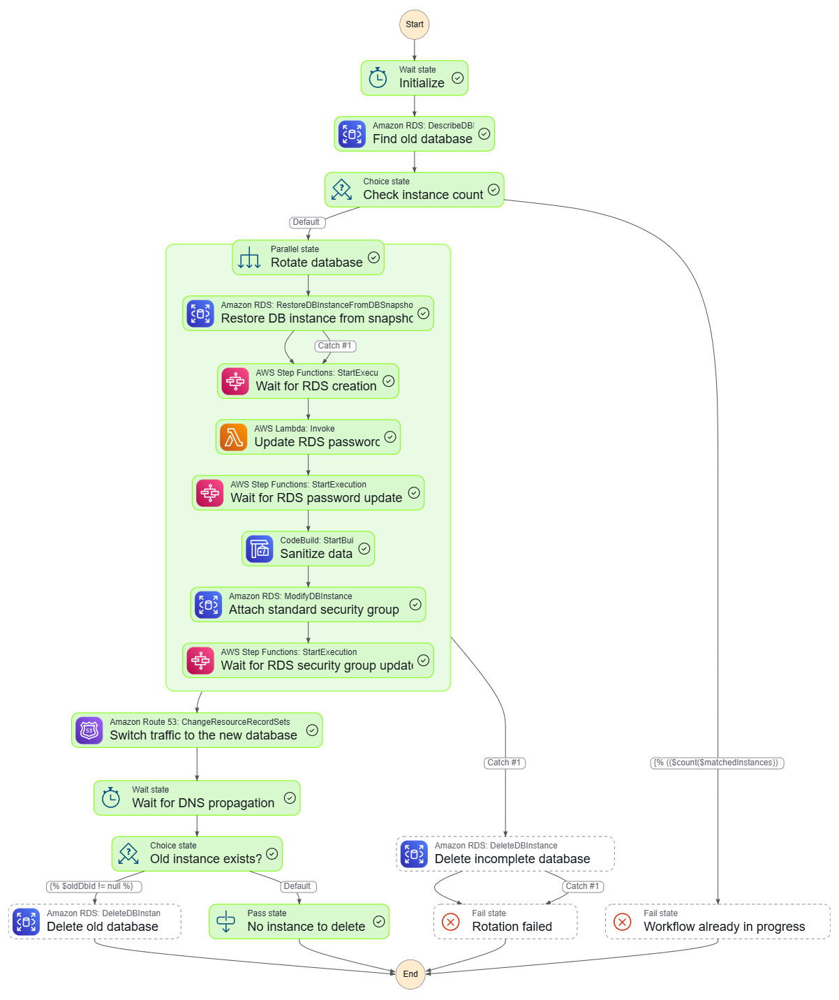
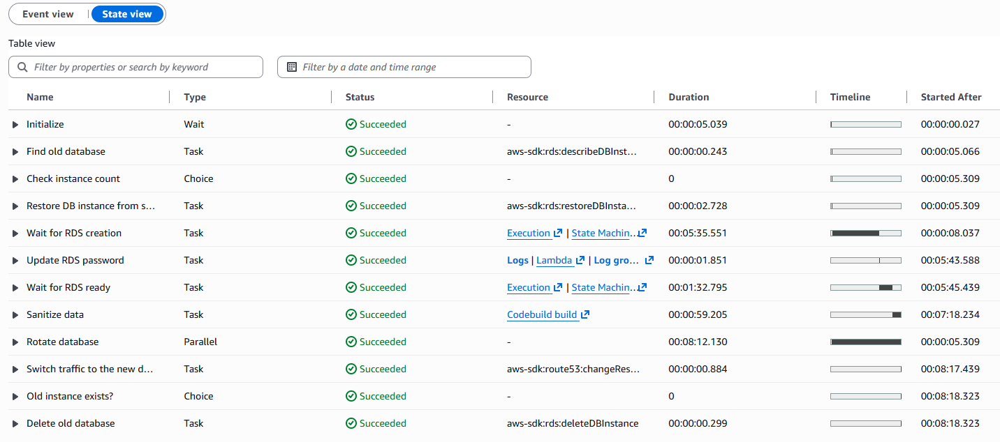
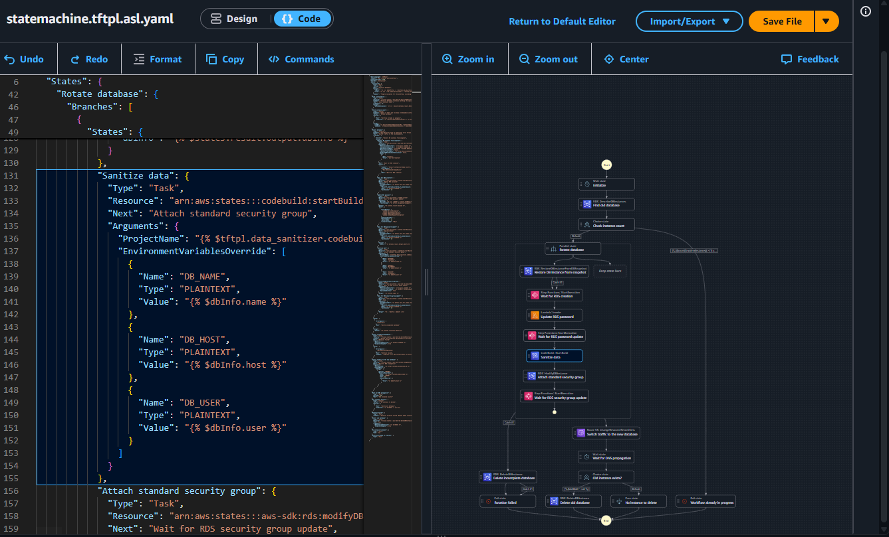
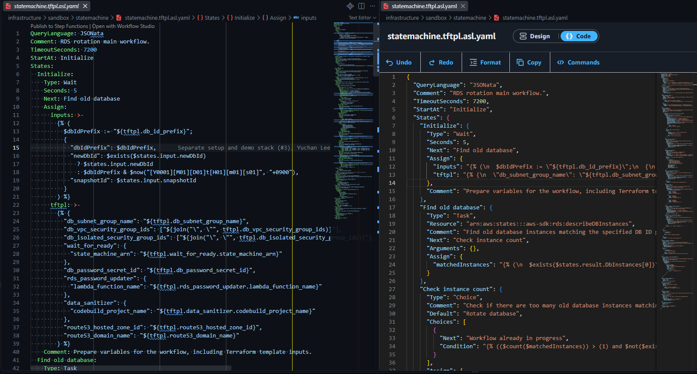
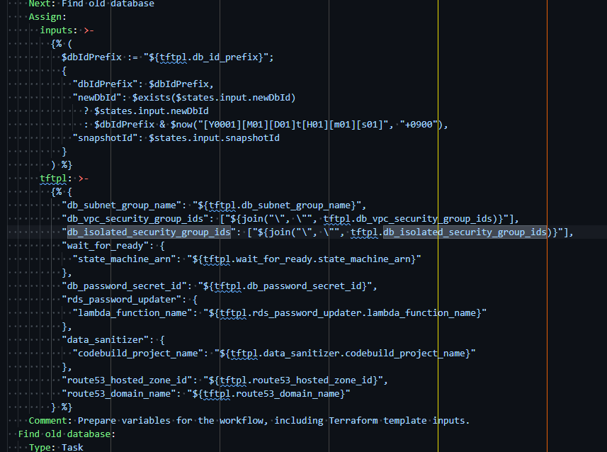
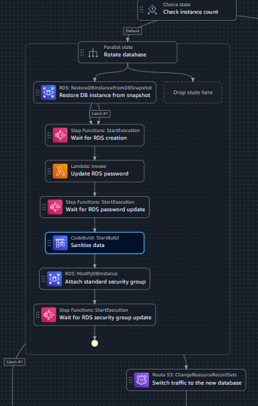
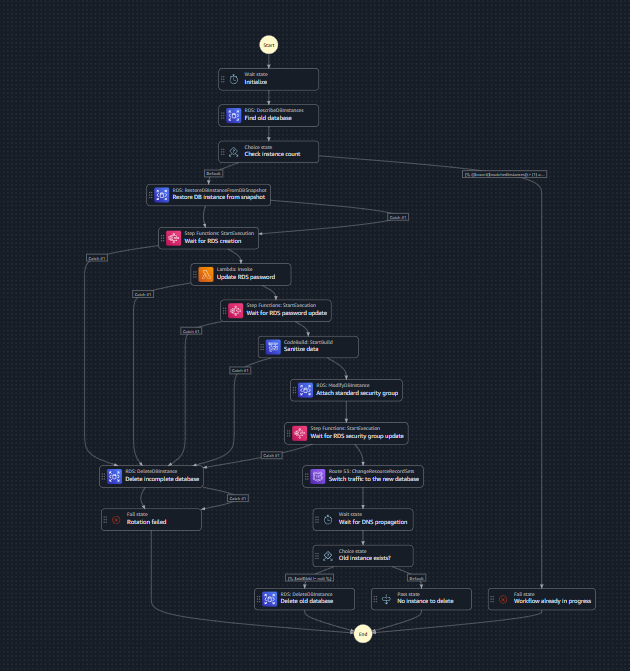

이전 글에서 개발 환경에서 운영 환경의 데이터를 안전하게 추출하고 활용하기 위한 다양한 방법을 검토했습니다. 그 중 데이터베이스 로테이션 방식이 가장 유용했고, 이를 개인적으로 재현하고 고도화해보고 싶었습니다.

이번 글에서는 이 방식을 AWS 인프라 위에서 직접 자동화 워크플로를 구축하고 개선한 과정을 다루고자 합니다. Terraform을 이용해 인프라를 코드로 관리하고, Step Functions (SFN) 워크플로를 중심으로 AWS의 다양한 서비스를 연계하여 자동화한 과정을 상세히 살펴보겠습니다.

## 🔄 데이터베이스 로테이션

> ❓ 데이터베이스 로테이션은 표준 용어는 아닙니다. 당시 워크플로를 가리킬 때 사용했던 내부 용어였고, 팀 내에서도 입에 착 붙는 표현이었어서 곧잘 사용하게 되었습니다.

데이터베이스 로테이션은 운영 환경의 데이터베이스 스냅샷을 이용해 개발 환경의 데이터베이스를 구축하는 일련의 자동화 과정을 의미합니다.

이전 글에서는 GitHub Actions를 이용해 데이터베이스 로테이션을 자동화한 경험에 대해 이야기했습니다. 당시에는 Python으로 CLI 도구를 작성하여 데이터베이스 로테이션을 수행했었습니다. 직관적이고 단순하지만, 다양한 한계점도 명확했습니다.

### ⚠️ 기존 방식의 한계

- **부분 실패 시 전체 프로세스 중단**

  데이터베이스 로테이션 과정에서 일부 단계가 실패하면 전체 프로세스가 중단되어 이후 단계가 수행되지 않았습니다. 또한 GitHub Actions 인프라의 불안정성으로 인해 Python 예외 처리로도 대응할 수 없는 상황이 발생하기도 했습니다.

  당시 해결책은 나름의 멱등성 메커니즘을 구현하는 것이었습니다. 어느정도 실패를 감내할 수 있었지만, 완전한 보장은 어려웠습니다. 불완전한 상태로 남은 데이터베이스를 직접 찾아 정리하는 부수적인 작업이 동반되었습니다.

- **네트워크 격리**

  GitHub Actions 환경에서 VPC 프라이빗 서브넷에 위치한 데이터베이스에 접근하려면 추가적인 네트워크 구성이나 터널링이 필요하며, AWS 리소스에 접근하기 위한 IAM 역할과 권한 설정도 필요합니다.

  당시 해결책은 SSM Session Manager[^1]를 활용하여 네트워크 터널을 구성하고 접근하며, AWS OIDC[^2]를 이용해 GitHub Actions 환경에서 필요한 IAM 역할과 권한을 부여하는 것이었습니다.

- **보안 격리 미흡**

  로테이션 중 데이터베이스가 개발 환경에 노출될 수 있으며, 이로 인해 아직 마스킹되지 않은 민감 데이터가 의도치 않게 접근될 위험이 있습니다. 또한 부분 실패로 인해 개발 환경의 데이터베이스가 불완전한 상태로 남을 수 있으며, 이 데이터베이스에 접근하여 마스킹되지 않은 민감 데이터에 접근할 수 있습니다.

  당시 데이터베이스를 안전하게 격리할 뚜렷한 방안을 마련하지 못했기 때문에, 로테이션 중 민감 데이터가 노출될 위험이 존재했습니다.

이러한 문제점을 해결하기 위해서는 각 단계의 멱등성을 보장하고, 실패 시 재시도 및 롤백 메커니즘을 도입하며, 아직 마스킹되지 않은 민감 데이터가 개발 환경에 노출되지 않도록 안전하게 격리하는 등의 조치가 필요했습니다.

[^1]: https://docs.aws.amazon.com/systems-manager/latest/userguide/session-manager.html

[^2]: https://aws.amazon.com/ko/blogs/security/use-iam-roles-to-connect-github-actions-to-actions-in-aws/

## 🏗️ 설계 및 고려 사항

앞서 언급한 기존 방식의 한계점을 해결하기 위해 다음과 같이 개선된 아키텍처를 설계했습니다.

### 🕹️ Step Functions를 통한 워크플로 오케스트레이션

Step Functions를 이용해 워크플로를 구축하고 멱등성 보장 및 실패 시 재시도, 롤백 메커니즘을 도입했습니다. AWS 네이티브 연동 기능을 활용하여 다양한 AWS 서비스와 손쉽게 통합됩니다. SFN의 `Catch` 구문을 활용하여 실패 시 특정 상태로 이동하거나 롤백 작업을 수행하도록 구성할 수 있습니다. 예를 들면,

- 데이터베이스 복원 시, `Rds.DbInstanceAlreadyExists` 오류가 발생할 경우 이미 동일 식별자의 인스턴스가 존재함을 의미합니다. 이전에 부분 작업 실패가 있었다고 간주하고, 해당 인스턴스를 받아들여 이후 작업을 계속 진행하도록 구성할 수 있습니다.
- 복원 완료 후 기존 데이터베이스를 삭제할 때, `Rds.DbInstanceNotFound` 오류가 발생할 경우 이미 해당 인스턴스가 삭제되었음을 의미하므로, 오류를 무시하고 이후 작업을 계속 진행하도록 구성할 수 있습니다.

### 🛡️ 프라이빗 VPC 격리

모든 워크플로가 VPC 프라이빗 서브넷 내에서 실행되도록 구성되어 네트워크 격리를 강화했습니다. 최소한의 권한만 가진 IAM 역할을 할당하여 불필요한 접근을 제한했습니다.

### 🏝️ 마스킹 환경 격리

로테이션 중에는 데이터베이스가 안전하게 격리되도록 구성했습니다. 복원 및 처리 중에는 격리된 보안 그룹을 적용하여 오직 데이터 마스킹 작업을 수행하는 CodeBuild 프로젝트만 접근할 수 있도록 하고, 작업이 모두 정상적으로 완료된 후에 격리된 보안 그룹을 해제하여 개발 환경에서 접근할 수 있도록 했습니다. 이를 통해 아직 마스킹되지 않은 민감 데이터가 의도치 않게 노출되지 않도록 했습니다.

> ❓ 개발 환경에 데이터베이스를 복원하는 것 자체가 꺼려질 수 있습니다. 만약 더 엄격한 보안 컴플라이언스가 요구되는 환경이라면, 전용 격리 환경(예: 별도의 VPC 또는 계정)에서 마스킹 작업을 수행하도록 구성할 수 있을 것이라 생각합니다.

## 🐞 마주한 문제점들

워크플로 구성을 설계하고 구현하는 과정에서 여러 문제점들을 마주하게 되었습니다. 그 중 일부(IaC 상태 관리)는 이전 방식에서도 골머리를 앓게 했던 문제점들이었습니다.

### 🔀 IaC 상태 관리 및 워크플로 통합

모든 리소스 상태를 Terraform으로 관리하려고 했습니다. SFN 워크플로를 통해 RDS 로테이션 작업을 수행하고, 그 상태를 Terraform과 어떻게 연동할지 고민했습니다. 하지만 Terraform의 어떤 기능(`import`, `removed`, `action`, ...)으로도 외부에서 관리되는 리소스 상태를 억지로 끼워맞추는 것은 밑 빠진 독에 물 붓기나 다름없었습니다.

결국 상태 관리와 충돌을 피하기 위해 일부 책임을 SFN에 넘기는 것이 최선이라고 판단했습니다. SFN이 Terraform 상태를 관리하도록 할 수도 있었지만, 양방향 의존성과 복잡성(상태 저장소 접근, 동기화 등)으로 인해 상태 관리가 지저분해질 것이 뻔했습니다. Terraform을 통해 기반 리소스를 관리하고, SFN이 실제 워크플로를 수행하도록 역할을 위임하되 수행할 수 있는 작업 경계(IAM 권한, 네트워크)를 명확히 설정하고 감사(Audit), 모니터링하며 책임을 분리하는 것이 가장 현실적인 접근이었습니다.

SFN이 직접 상태를 추적하고 관리해야 하였으므로, 상태 관리 메커니즘을 도입해야 했습니다. 상태를 엄격하게 관리한다면 당장 필요한 것에 비해 구성이 복잡해질 테니 RDS 조회 기반 휴리스틱 방식을 도입하였습니다. 특정 RDS 접두사(예: `aws-rds-rotation-db-`) 기반으로 인스턴스를 찾고 기존(Old) 데이터베이스를 선택(정렬)하는 방식입니다. 이 방식은 완벽하지 않지만, 현재 구조에서는 실용적인 타협안이었습니다.

### 🪜 Step Functions (SFN)의 동작 메커니즘

Step Functions는 실패한 워크플로를 재개(Redrive)하거나 최신 버전에서 새 워크플로를 시작(Start new execution)할 수는 있지만, 새 버전의 워크플로에서 실패한 워크플로를 재개(Temporal의 Workflow Versioning / Workflow Patching)할 수는 없습니다. SFN 워크플로 작성 시 멱등성을 신경써주어야 합니다.

> ⚖️ **Step Functions vs Temporal**
>
> Step Functions는 선언형, 상태 중심이며 상태 전환을 엄격하게 관리합니다. 버전 변경에 따라 DAG 구조 자체가 바뀔 수 있으므로, 이러한 패칭(Patching)이 원천적으로 차단되어 있습니다. 반면 분산 상태 관리 플랫폼인 Temporal[^3]은 명령형, 코드 중심이며 Event Sourcing (상태 변경 이력을 모두 저장하고 재생하는 방식) 구조를 사용하고 있습니다. 코드가 수정되어도 과거 이벤트 이력으로부터 최신 코드로 빠르게 리플레이한 뒤 이어서 실행할 수 있습니다.

[^3]: https://temporal.io/

### 🔑 RDS 마스터 비밀번호 변경

RDS 마스터 비밀번호를 SFN 워크플로 내에서 변경하고자 할 경우, Secrets Manager에 저장된 비밀번호를 불러오고 RDS 인스턴스를 업데이트하는 과정을 거쳐야 합니다. 이는 비밀번호가 SFN 실행 문맥 및 로그에 노출될 수 있음을 의미합니다. 간단한 Lambda 함수를 정의하여 Secret Manager ARN을 전달받아 비밀번호 변경을 수행하도록 함으로써, 비밀번호 노출 없이 보다 안전하게 처리할 수 있었습니다.

### ⏱️ 쿼리 수행 시간 제한

초기에는 Lambda로 마스킹 쿼리를 실행할 계획이었습니다. 하지만 Lambda는 실행 시간 제한(최대 15분)과 리소스 제약이 있어, 장기 실행 쿼리나 대규모 데이터 처리에는 적합하지 않았습니다. 이에 대신 CodeBuild로 마스킹을 처리하도록 변경하였습니다. 쉘 스크립트 및 다양한 언어를 활용한 유연한 구현이 가능해졌고, 장기 실행 작업에도 안정적으로 대응할 수 있게 되었습니다.

## ▶️ 워크플로 실행 및 모니터링

구현 결과물에 대해 간단한 시연입니다. Step Functions CLI 또는 AWS 관리 콘솔을 통해 워크플로를 시작하고 진행 상황을 모니터링할 수 있습니다.

워크플로가 시작되면, 새 데이터베이스가 생성됩니다.

데이터베이스 계정 비밀번호 변경, 마스킹 등의 작업이 모두 정상적으로 완료되면 기존 데이터베이스는 삭제됩니다.

워크플로 진행 상태와 결과, 실행 로그 등은 관리 콘솔을 통해서 일목요연하게 확인할 수 있습니다.

## 🪞 회고

### ✂️ 덜어낸 것들 (CUT LIST)

있으면 좋겠지만 당장 필수적이지 않은 것들은 과감히 덜어냈습니다. 워크플로 자체에 집중하고, 부수적인 기능들은 나중에 필요할 때 추가할 수 있도록 했습니다.

- 실제 마스킹 쿼리(SQL) 작성:

  현재 구성은 CodeBuild와 RDS 인스턴스 사이의 연결 및 테스트 쿼리(`SELECT 1`)만 수행합니다. SQL이 실행될 수 있는 구성만 만족하면, 실제 마스킹 쿼리는 언제든지 작성할 수 있으며, 필요에 따라 즉시 적용할 수 있습니다.

  > ❓ 마스킹 SQL 스크립트들은 동일 Git 저장소에서 관리되며, Terraform을 통해 S3 객체 리소스로 배포됩니다. CodeBuild는 해당 S3 객체를 참조하여 마스킹 작업을 수행합니다.

- 워크플로 실행 방식 개선

  현재 Step Functions 워크플로를 수동으로 트리거하고 있는데, 추가 편의성을 챙기고자 한다면 GitHub Actions 워크플로를 통해 트리거하도록 하여 필요한 입력 파라미터를 제공받을 수 있도록 할 수 있습니다.

- 워크플로 결과 수신(Slack)

  AWS Chatbot 및 SNS 연동으로 간편하게 실행하고 결과를 확인할 수 있다면 더욱 편리합니다. 필수적인 기능은 아니기 때문에 이번에는 구현하지 않았습니다.

- 범용 마스킹 도구 도입

  SQL 쿼리를 직접 작성할 경우, 원본 데이터베이스 스키마 변경에 취약합니다. 실수로 민감 데이터를 노출할 가능성도 있고, 쿼리가 망가질 수도 있습니다. 범용 마스킹 도구를 도입하면, 쿼리 작성 부담을 줄이면서도 안전하게 마스킹 작업을 수행할 수 있습니다. 이와 함께 워크플로를 확장하면 다양한 데이터베이스 엔진에 대한 지원을 제공할 수 있습니다.

- SFN 상태 관리 개선

  현재 휴리스틱(RDS 접두사 기반) 상태 관리에 태그 기반 검색(`ResourceGroupsTaggingAPI`)을 함께 조합하여 안정성을 높일 수 있습니다.

### 🤔 무엇을 얻었고, 무엇을 잃었는가?

이번 프로젝트를 통해 Step Functions, CodeBuild 등 다양한 AWS 서비스 중심의 워크플로 구축을 통해 AWS의 여러 서비스에 대한 이해와 경험의 깊이를 더할 수 있었습니다. 또한 GitHub Actions 대비 더 많은 제어권을 가지게 되었고, 강력한 가시성과 모니터링 기능을 확보할 수 있었습니다. 또한 IAM 및 네트워크 통합을 통해 기존 워크플로 대비 보안 및 네트워크 구성을 강화할 수 있었습니다.

하지만 단순함을 잃었습니다. 이전에 작성했던 GitHub Actions와 Python CLI 기반 워크플로에 비해, Step Functions 중심의 워크플로는 구성과 관리가 훨씬 복잡해졌습니다. JSON 쿼리 및 변환 언어인 JSONata[^4]는 강력하지만, Python 만큼 직관적이고 범용적인 프로그래밍 언어의 유연성을 제공하지는 못합니다. 또한 AWS에 워크플로가 강하게 결합되어 있어, 다른 환경으로의 이식성이 떨어집니다.

[^4]: https://docs.jsonata.org/overview.html

### 🛞 핸들은 한 사람만 잡아라

Terraform, Pulumi IaC를 처음 배운 직후 계속 머리를 싸맸던 문제는, 여러 주체가 서로 상태를 관리하려고 할 때 그 제어권을 어떻게 분배할 것인가였습니다. 그리고 이 고민은 오늘에 이르러서야 나름의 결론에 도달하게 되었습니다.

바로 핸들은 한 주체만 잡아야 한다는 원칙입니다. 이번 워크플로는 Step Functions가 핸들을 잡고 있으며, 다른 주체들은 이를 받아들이되, 서로 감시하고 필요 시 조정하는 역할만 수행해야 합니다. 여러 주체가 동시에 상태를 관리하려고 하면 끝없는 경합과 충돌이 발생하게 되고, 결국 시스템 전체의 복잡성과 불안정성이 증가하게 됩니다.

비슷한 경험은 이전 직장에서 ECS 클러스터에 서비스를 배포할 때도 있었습니다. Pulumi로 ECS 클러스터와 관련된 리소스를 관리하면서, 배포 파이프라인과 애플리케이션 간의 상태 관리와 제어권 분배 문제로 골머리를 앓았던 경험이 있습니다. 그 결과 Jsonnet 기반의 해괴한 배포 구성이 탄생하기도 했습니다. 지금 구성한다면, 애플리케이션에 필요한 권한을 위임하고 보안을 위한 경계(Boundary)를 설정하는 데 초점을 두고, 애플리케이션 단에서 CloudFormation을 활용하여 배포를 관리하게 될 것이라 생각합니다.

### 🧠 Step Functions 노하우

SFN을 사용하는 것은 이번이 처음이었고, 그 과정에서 여러 가지 시행착오를 겪었습니다. 특히 ASL (Amazon States Language)의 문법과 작성 요령을 익히는 데 많은 시간이 소요되었습니다. 하지만 그 과정에서 많은 노하우와 유용한 팁을 (몸소 삽질한 끝에) 얻을 수 있었습니다.

- AWS VS Code Extension (AWS Toolkit)을 적극 활용하기

  AWS Toolkit을 사용하면 ASL(State Machine)을 시각화하고 디버깅할 수 있습니다. 상태 전이를 한 눈에 확인할 수 있다는 것은 워크플로의 흐름을 이해하고 문제를 빠르게 파악하는 데 큰 도움이 됩니다.

  

- 코드로 작업할 땐 JSON 대신 YAML 포맷을 사용하기

  YAML의 블록 스칼라(Block Scalar) 문법은 JSONata 표현식을 읽고 쓰는 데 큰 도움을 줍니다. JSON의 이스케이프(`\"`) 지옥에서 벗어나 보다 가독성 높은 코드를 작성할 수 있습니다. AWS Toolkit은 `.asl.yaml` 파일도 지원합니다.

  

  JSONPath 대신 JSONata를 사용하는 이유는, JSONata가 더 강력한 쿼리 및 변환 기능을 제공하며, 복잡한 데이터 구조에서도 보다 직관적이고 유연하게 데이터를 추출하고 변환할 수 있기 때문입니다. 이는 또한 AWS에서 권장하는 접근 방식이기도 합니다.

- Terraform Templating으로 연관 서비스 연동하기

  ASL 정의를 템플릿화하여 관리하면 Terraform을 통해 연관된 AWS 서비스와 손쉽게 연동할 수 있습니다. 매번 워크플로 입력값을 수동으로 설정할 필요 없이, Terraform에서 제공하는 변수와 출력값을 활용하여 자동으로 주입할 수 있습니다.

  

- 복잡한 워크플로는 서브 워크플로로 분리하기

  주 워크플로가 복잡해지면 서브 워크플로로 분리하는 것이 크게 도움이 됩니다. RDS 생성 및 변경 후 이를 기다리는 로직이 세 차례 반복되었는데, 이를 아래와 같은 서브 워크플로로 분리함으로써 코드의 중복을 줄이고 가독성을 높일 수 있었습니다.

  

- Parallel 타입으로 `try-catch` 패턴 구현하기

  같은 오류 처리 로직을 공유하는 여러 상태는 Parallel로 래핑하여 `try-catch` 패턴을 구현할 수 있습니다. 이는 워크플로 가독성을 높이는 데 도움이 됩니다.

  

  Parallel을 사용하지 않았을 때에는 다음과 같은 기괴한 다이어그램이 나타납니다.

  

- 명시적 변수 할당으로 가독성 높이기

  이전 상태의 `Output`에 의존하기보다, `Assign`을 통해 명시적으로 변수에 할당하여 이후 상태에서 참조하면 가독성과 유지보수성이 향상됩니다. 워크플로 실행 순서가 조정되어도, 순서가 아예 뒤바뀌지 않는 한 참조가 올바르게 유지됩니다. 또한 `states.context.Execution.Input`[^5]같은 내장 변수를 활용하면 워크플로 실행 시점의 입력값이나 컨텍스트 정보를 쉽게 참조할 수 있습니다.

[^5]: https://docs.aws.amazon.com/step-functions/latest/dg/input-output-contextobject.html

## 💭 마치며

여전히 TDM (Test Data Management) 솔루션과 견주기에는 부족한 점이 많습니다. 이전 GitHub Actions로 구현했던 방식을 AWS의 다양한 서비스로 옮기며 많은 것을 배우고 개선할 수 있었지만, 그 과정에서 예상치 못한 복잡성과 AWS 서비스 간의 통합 문제를 경험하게 되었습니다. 평소 애플리케이션을 개발할 때와는 다르게 아키텍처 설계에 집중한 이번 프로젝트는 많은 고민(주로 트레이드오프)과 판단을 요구하는 과정이었습니다.

이 모든 고민의 흔적, 경험과 학습의 결과물은 [이 GitHub 저장소](https://github.com/lasuillard/aws-rds-rotation)에서 확인하실 수 있습니다.
