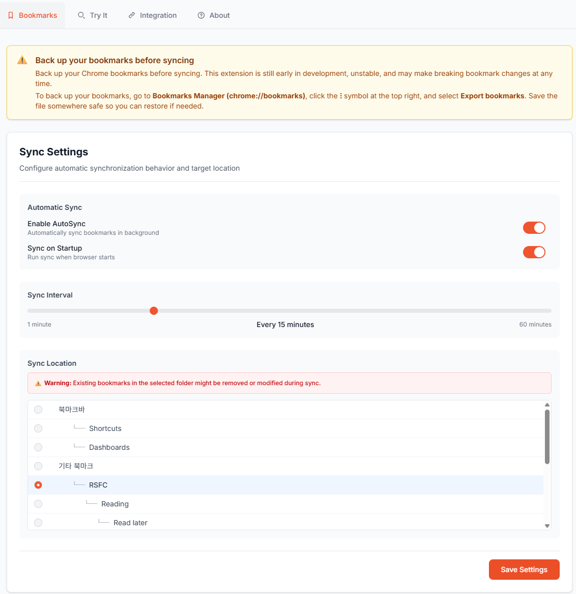
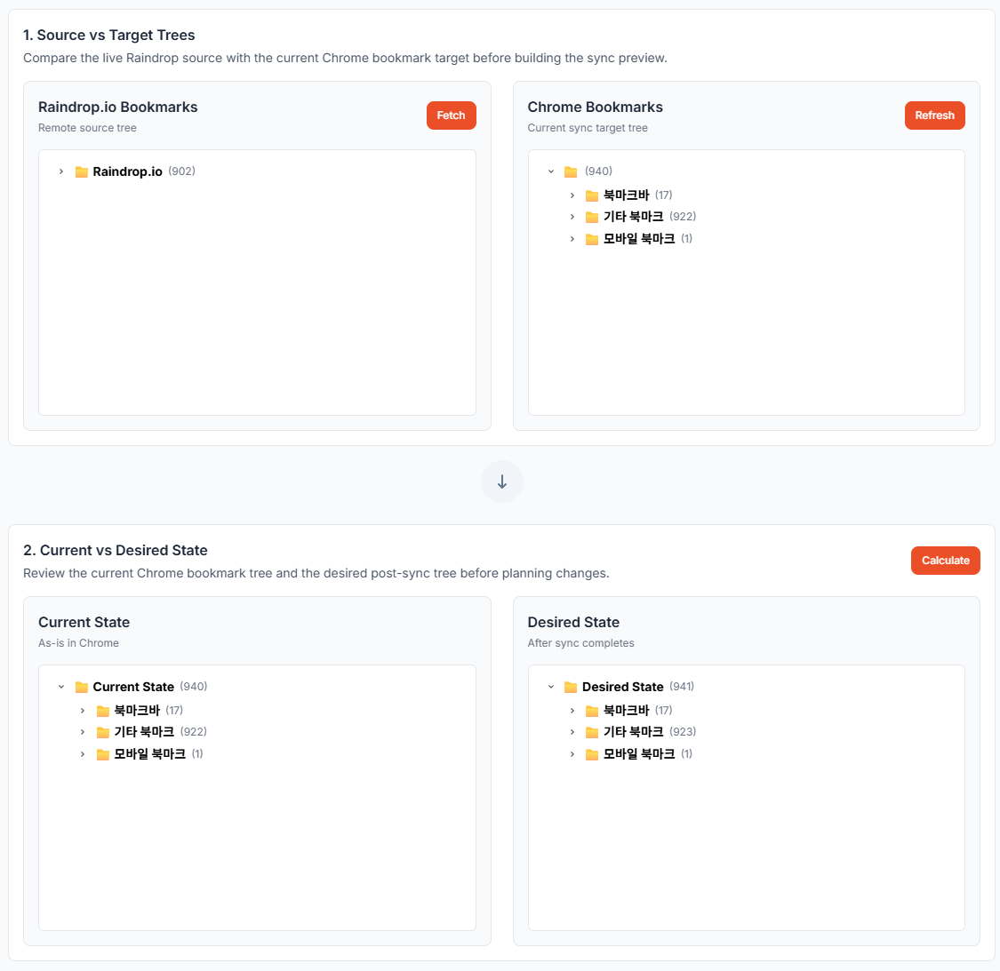
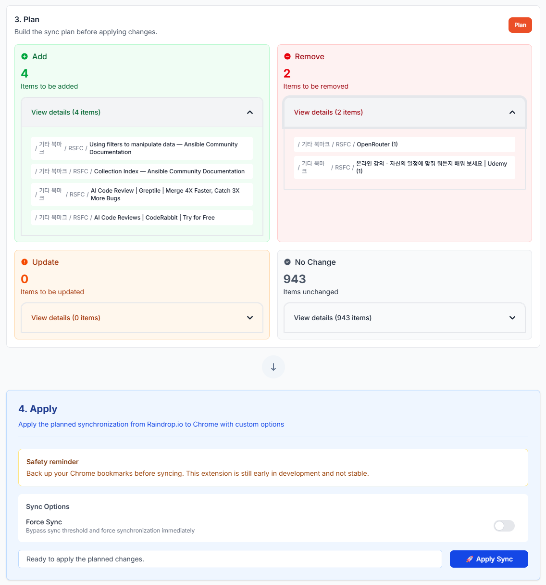
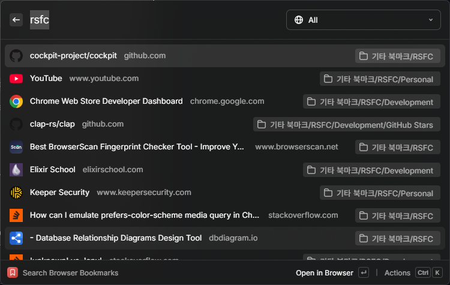
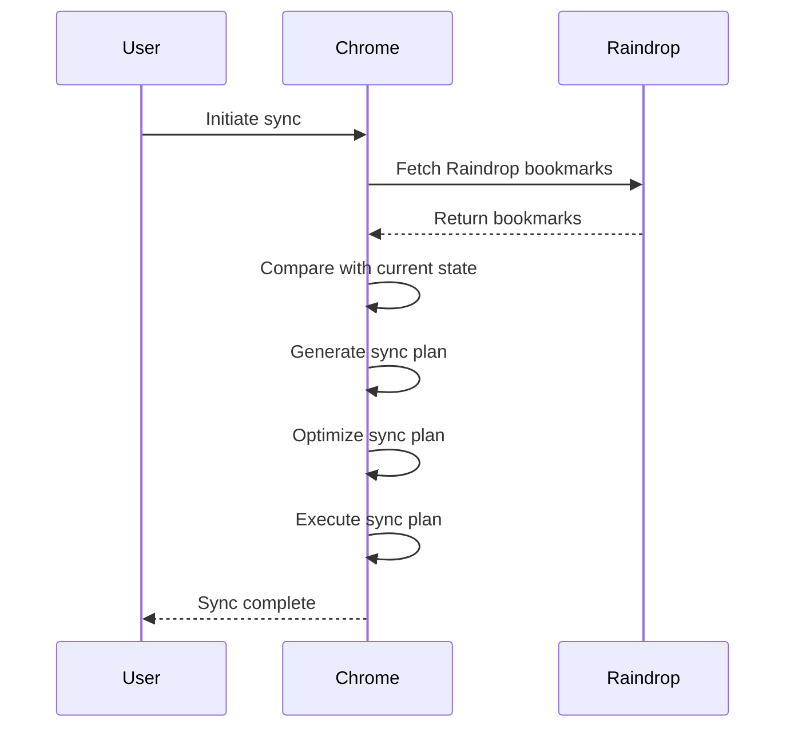
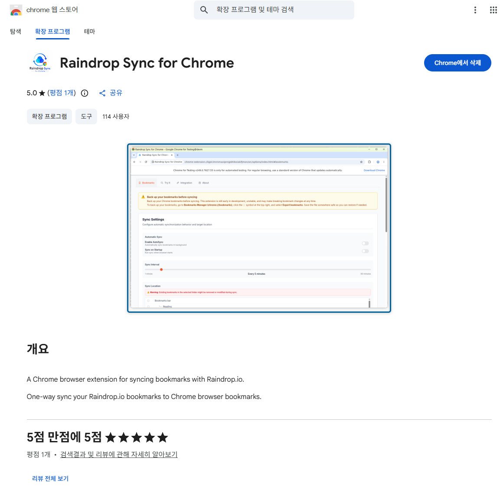

이전 글에서는 Raindrop Sync for Chrome (RSFC) 브라우저 확장 프로그램을 위한 raindrop-client 라이브러리 개발 및 테스트에 대해 다루었습니다. 이번 글에서는 실제로 Chrome 확장 프로그램을 개발하고 배포한 과정에 대해 이야기하고자 합니다.

## ✨ RSFC 미리보기

> 💡 RSFC는 Chrome Web Store([링크](https://chromewebstore.google.com/detail/raindrop-sync-for-chrome/iacjnnndmkebkjdcdedfbmccofnmaojf))에 게시되어 있으며, 누구나 설치하여 사용할 수 있습니다.

언제, 어떻게 동기화가 이루어지는지 설정할 수 있습니다.

현재 Chrome 및 Raindrop 북마크 상태를 불러와 비교할 수 있습니다.

동기화 계획을 수립하고 실행할 수 있습니다. 어떤 북마크가 추가되거나 삭제될지 미리 확인할 수 있습니다.

동기화 후 브라우저 북마크가 정상적으로 생성됩니다. 아래는 Raycast Browser Bookmark 플러그인을 통해 본 모습입니다.

## 🏗️ 애플리케이션 설계

동기화 과정은 사용자 브라우저(Chrome), Raindrop 서버 간에 이루어지는 비교적 단순한 과정입니다.

### 🧰 테크 스택

| 항목 | 설명 |
|--- | --- |
| 프론트엔드 | [Svelte](https://svelte.dev/) + TypeScript |
| UI | [Flowbite Svelte](https://flowbite-svelte.com/) |
| 빌드 및 패키징 | Vite + [CRXJS](https://crxjs.dev/) |
| 상태 관리 | Chrome Storage API (`storage.sync`) |
| 배포 | GitHub Actions |
| 호스팅 | Chrome Web Store |

### 🔄 동기화 전략

Chrome 북마크와 Raindrop 북마크 데이터의 차이로 인해 동기화 구현에 신중하게 접근해야 했습니다. Chrome 북마크는 단순한 구조를 가지고 있으며, 제목, URL, 폴더 구조 정도만 존재합니다. 반면 Raindrop 북마크는 메타데이터와 태그 등 추가 정보를 포함하고 있어 양방향 동기화 구현 시 충돌 관리가 복잡해질 수 있으며, 데이터 손실로 이어질 가능성이 있습니다.

따라서 RSFC는 Raindrop을 단일 진실 소스(Source of Truth)로 설정하고, Raindrop에서 Chrome으로의 단방향 동기화를 구현함으로써 이러한 문제를 해결하고자 했습니다. 이는 애플리케이션 목적에 부합하며, 데이터 손실 및 충돌 가능성을 최소화할 수 있는 전략이었습니다.

동기화는 크게 두 가지 방법으로 시작할 수 있습니다. 사용자가 수동으로 실행하거나, 브라우저 Alarms API를 사용하여 주기적으로 자동 실행하는 방식입니다. Raindrop User API는 최종 수정 시각 정보를 제공하므로, 이를 브라우저 상태(`storage.sync`)에 저장된 최종 동기화 시각과 비교하여 변경 사항이 있는 경우에만 동기화 작업을 수행하도록 최적화할 수 있습니다.

## 🛠️ 개발 과정

### 🌳 초기 구현: 트리 기반 동기화

극초기 구현은 Chrome 북마크와 Raindrop 북마크를 트리 구조로 표현하고, 전체 동기화를 수행하는 방식이었습니다.

1. Chrome 및 Raindrop 북마크 트리를 만듭니다.
1. Chrome 동기화 대상 폴더를 삭제합니다.
1. Raindrop 북마크 트리를 기반으로 Chrome 북마크를 모두 재생성합니다.

이 방식은 직관적이고 구현도 비교적 간단하지만, Chrome 북마크가 많아질수록 성능 문제가 발생할 수 있었습니다. 또한 부분 동기화나 최적화 등 세밀한 동기화 조정이 어렵다는 한계가 있었습니다. 이후 점진적 동기화(Incremental Sync) 구현을 위해 Desired State Model을 도입함으로써, 변경 사항만을 반영하는 효율적인 동기화가 가능해졌습니다.

### ⚡ 점진적 동기화: Desired State Model

점진적 동기화는 전체 동기화를 수행하는 대신, 변경 사항만을 반영하여 효율적으로 동기화를 수행하는 방식입니다. 이를 위해 IaC(Infrastructure as Code)에서 영감을 받아 Desired State Model을 도입하여, 현재 상태(Current State)와 목표 상태(Desired State)를 비교하고 필요한 변경만 적용하도록 구현했습니다.

요구 상태 모델을 도입함으로써 다음과 같은 이점을 얻을 수 있었습니다.

- **선언적 동기화(Declarative Sync)**: Desired State Model을 통해 목표 상태를 선언적으로 정의하고, 현재 상태와 비교하여 필요한 변경만 적용함으로써 동기화 과정을 명확하고 예측 가능하게 만들 수 있으며, 목표 상태를 변경하는 것으로 세부 동기화 정책을 조정할 수 있습니다.
- **충돌 관리 용이**: 단일 진실 소스를 기반으로 동기화를 수행하므로 충돌 발생 가능성이 낮고 관리가 용이합니다.
- **자가 치유(Self-Healing)**: 충돌, 오류 및 예외 상황에 대응하여 동기화 상태를 멱등성(Idempotency)을 기반으로 자동으로 복구할 수 있습니다.

현재 동기화 구현의 주요 컴포넌트는 다음과 같습니다.

- `ReadableAdapter`: 현재 상태(Current State)를 읽어오는 역할을 하는 어댑터입니다.
- `WritableAdapter`: `ReadableAdapter`을 확장하며, 상태를 읽어올 뿐만 아니라 변경 사항을 적용하는 역할을 하는 어댑터입니다.
- `SyncDiffAnalyzer`: 현재 상태(Current State)와 목표 상태(Desired State)의 차이를 계산하는 역할을 하는 컴포넌트입니다.
- `SyncPlanner`: 동기화 계획(Sync Plan)을 수립하는 역할을 하는 컴포넌트입니다.
- `SyncPlanOptimizer`: 동기화 계획을 최적화하는 역할을 하는 컴포넌트입니다. 실행 계획을 분석하여 순서 조정, 작업 병합 등 다양한 최적화 작업을 수행합니다.
- `SyncExecutor`: 동기화 계획을 실제로 실행하는 역할을 하는 컴포넌트입니다.
- `SyncService`: 전체 동기화 과정을 관리하고 조율하는 역할을 하는 컴포넌트입니다.

동기화 진행 과정은 `SyncService`에 옵저버 패턴을 적용하여 관리됩니다. `SyncService`는 동기화 상태 변경을 구독자에게 통지하며, 이를 통해 UI 업데이트나 로그 기록 등의 작업을 수행할 수 있습니다.

## 🐞 트러블슈팅

### 🪪 노드의 고유성(Identity)

현재 무상태성(Stateless) 구현에서는 Raindrop ID에 대한 Chrome 북마크 매핑을 유지하지 않기 때문에 두 트리의 ID를 비교하는 것은 의미가 없습니다. ID 기반 비교는 신뢰할 수 없으며, 대신 노드의 위치(Path)와 내용(URL)을 기반으로 동등성을 평가해야 했습니다. 하지만 북마크는 동일한 위치에 동일한 URL을 가진 항목이 존재할 수 있습니다. Path와 URL의 조합으로 고유성을 보장할 수는 없었기에 중복을 허용하지 않도록 구현하여 동일한 위치에 동일한 URL을 가진 북마크가 존재할 경우, 후속 항목은 무시되도록 처리했습니다.

### 🟰 노드 간 동등성(Equality) 비교

앞서 짧게 언급했듯, Chrome 북마크와 Raindrop 북마크 노드는 서로 다른 데이터 구조를 가지고 있습니다. 따라서 두 시스템 간의 동기화를 위해서는 이러한 구조적 차이를 고려한 동등성 비교가 필요했습니다. 가장 큰 차이점은 Raindrop은 원본 URL을 그대로 저장하지만, Chrome은 URL 리디렉션을 자동으로 처리한다는 점입니다. 같은 URL을 북마크해도 실제 비교 결과가 달라질 수 있습니다. URL 비교 시 이러한 문제를 해결하기 위해 비교 시 반드시 URL 정규화 과정을 거치도록 구현했습니다.

## 🚀 배포 파이프라인

배포 과정은 빌드 후 Chrome Web Store (CWS)에 업로드하는 방식으로 진행됩니다. 먼저 소스 코드를 빌드하여 확장 프로그램 패키지를 생성하고, [MobileFirstLLC/cws-publish](https://github.com/MobileFirstLLC/cws-publish)(내부적으로 Chrome Web Store API 사용)를 이용하여 CWS에 제출합니다. 업로드 후 즉시 배포되는 것이 아니라 심사를 거쳐 승인된 후 사용자에게 배포됩니다.

## ⚠️ 향후 과제

이번에 구현한 RSFC는 기본적인 단방향 동기화 기능만을 제공하며, 여전히 여러 가지 개선 과제가 남아 있습니다.

- **대량 동기화 시나리오 최적화**: 큐, Rate Limiting (Raindrop API)
- **브라우저 지원 추가**: Firefox 등 다른 브라우저에 대한 지원을 고려하고 있습니다. 현재 Chromium 기반으로 개발 및 테스트가 이루어지고 있으며, 다른 브라우저로의 확장도 검토 중입니다.
- **선택적 동기화(Selective Sync)**: Raindrop 쿼리 기반, 단일 동기화 폴더가 아니라 사용자가 지정한 조건에 따라 북마크를 선택적으로 동기화할 수 있는 기능을 제공하고자 합니다.
- **코드베이스 리팩토링**: 더 나은 구조와 유지보수성을 위해 점진적으로 테스트 케이스를 보강하며 기능 구현과 함께 코드를 다듬어 나갈 생각입니다. 현재 구조는 백엔드 Service - Repository 패턴을 사용하고 있는데, 이 프로젝트 특성에 맞지 않고 겉도는 느낌이 있습니다. 브라우저 확장이라는 특수한 실행 환경과 단기적인 생명 주기를 고려한 최적의 설계를 모색하고 있습니다.

## 💭 마치며

사실 RSFC를 Chrome Web Store에 게시한 지도 벌써 몇 달이 지났습니다. 이 글을 이제야 작성하게 된 이유는, 놀랍게도 그저 까먹었기 때문입니다. 하지만 이렇게 늦게라도 기록을 남기게 되어 다행이라고 생각합니다. 다른 사이드 프로젝트를 하다보니 RSFC에 시간을 충분히 투자하지 못하고 있지만, 앞으로도 꾸준히 개선하고 발전시켜 나갈 계획입니다.
