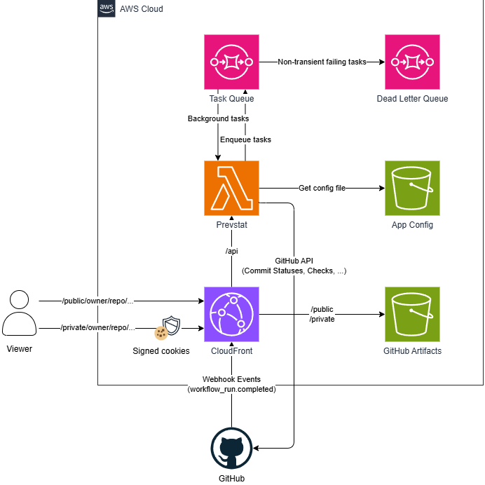
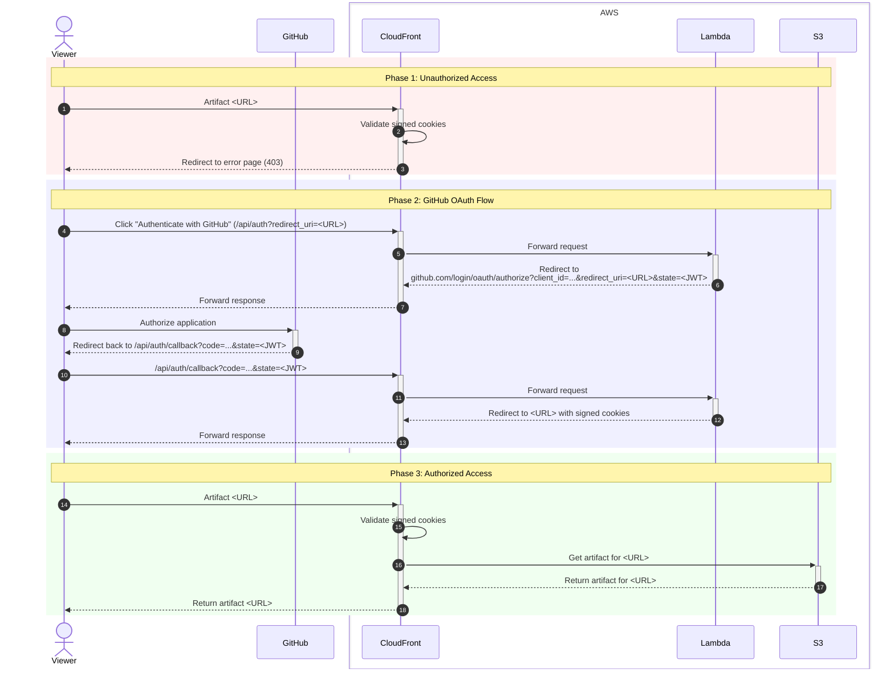
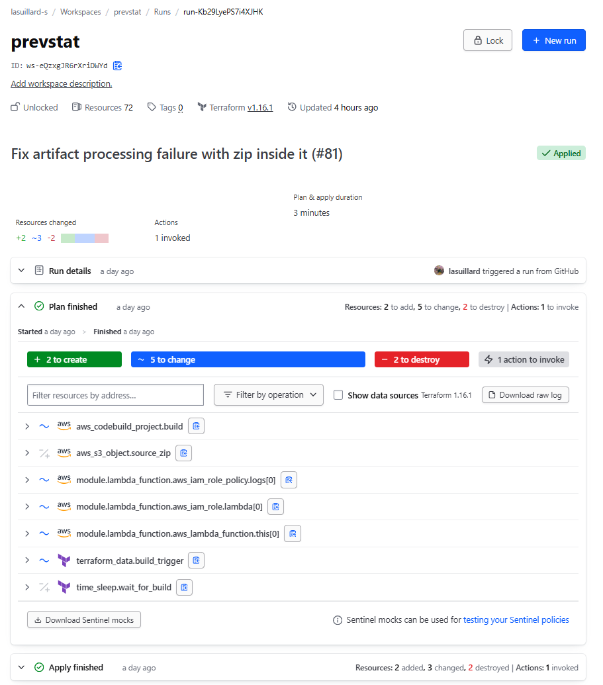
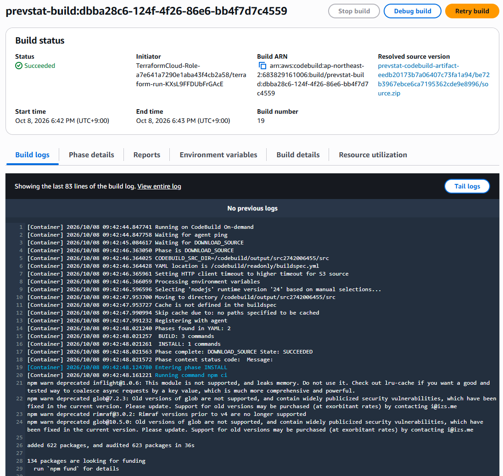
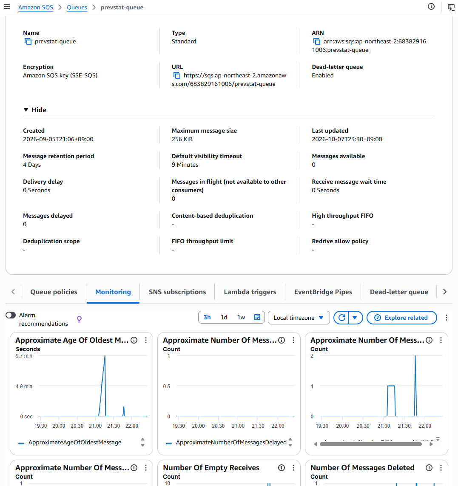
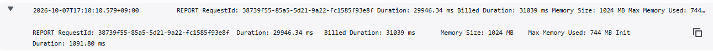
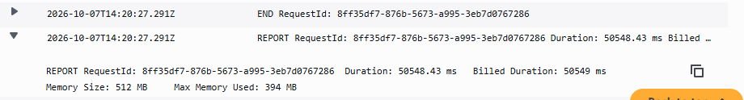

저번 글에서 Playwright 테스트 리포트를 GitHub Actions와 S3, CloudFront를 활용하여 브라우저에서 바로 확인할 수 있도록 게시하는 방법에 대해 이야기했습니다. 하지만 이 방법은 명백한 한계를 지니고 있었습니다.

- **AWS 인증**

  해당 기능을 필요로 하는 새 저장소가 추가되면 AWS OIDC 역할을 수정하고, AWS 인증 및 S3 업로드 과정을 수행하도록 워크플로를 변경해야 합니다.

- **접근 제어**

  공개된 저장소에 대해서는 접근 제어 없이 테스트 리포트를 바로 게시해도 보통 문제가 없지만, 비공개 저장소의 경우 적절한 접근 제어가 필요합니다.

- **파편화된 관리**

  기존 방식은 각 저장소마다 별도로 S3 버켓과 CloudFront 배포를 설정해야 하므로 관리가 분산되고 복잡해집니다. 중앙화된 S3 버켓 및 CloudFront 배포를 사용하면 관리가 단순해지겠지만, 모든 저장소가 동일한 인프라를 공유하게 되어 유연성이 떨어질 수 있습니다.

어떻게 하면 반복되는 코드와 설정을 줄이고 중앙화된 방식으로 테스트 리포트를 효율적으로 관리할 수 있을까요? 이번 글에서는 GitHub App을 활용하여 이러한 문제를 해결한 경험에 관해 이야기해보겠습니다.

## 🔍 Prevstat

완성된 GitHub App의 이름은 **Prevstat**입니다. **Prev**iew **Stat**ic을 줄여 만든 이름(Presta를 쓰고 싶었지만, 아쉽게도 이미 사용 중인 이름이었습니다)입니다.

<video controls src="assets/demo.mp4" title="Prevstat 데모"></video>

Prevstat이 해결하고자 하는 문제는 CI 환경에서 생성된 아티팩트의 관리를 단순화, 중앙화하는 것입니다.

1. (1) CI 실행 내역에 접근해서 (2) 아티팩트를 다운로드하고 (3) 로컬에서 압축을 풀고 열어봐야 하는 번거로움을 (1) 클릭 한 번으로 단축하고,
1. GitHub App을 통해 중앙화된 방식으로 관리함으로써 각 저장소의 테스트 리포트 게시 과정을 아티팩트 업로드 방식으로 통일하고,
1. 추후 확장 및 개선을 통해 단순 정적 웹 사이트 임시 호스팅을 넘어 다양한 형태의 아티팩트(테스트 리포트, 코드 커버리지, 빌드된 정적 웹 사이트)의 관리를 개발 환경으로부터 독립시키는 것입니다.

## 🏗️ 설계

Prevstat은 AWS 인프라에 구축된 서버리스 아키텍처를 기반으로 동작합니다.



GitHub 웹훅을 통해 워크플로 완료 이벤트를 수신하면, 설정(패턴)에 부합하는 아티팩트가 있는지 확인합니다. 조건에 맞는 아티팩트를 다운로드하여 S3에 저장하고, 상세(Details) 버튼 클릭 한 번으로 브라우저에서 바로 확인할 수 있도록 Commit Statuses API를 호출하여 링크를 붙입니다. 공개 저장소에 대해서는 접근 제어 없이 바로 확인할 수 있으며, 비공개 저장소에 대해서는 GitHub App을 통해 인증 과정을 거쳐야만 접근할 수 있습니다.

- 접근 권한은 무엇으로 판단하나요?

  공개 저장소 아티팩트는 누구나 접근할 수 있으며, 비공개 저장소 아티팩트의 경우 해당 GitHub 저장소에 대한 읽기 권한을 토대로 판단합니다.

- CloudFront Signed Cookie의 인가 범위는 어떻게 되나요?

  단순히 Signed Cookie만 있으면 아무 저장소의 아티팩트에 접근할 수 있는 건 아닙니다. 해당 저장소의 아티팩트에 대해서만 접근할 수 있도록 동적 정책이 적용된 CloudFront Signed Cookie가 발급됩니다.

각 저장소에서 해주어야 할 일은 GitHub App을 설치하고, 원하는 정적 웹사이트를 아티팩트로 업로드하도록 워크플로를 설정하는 것뿐입니다. 이후 아티팩트를 처리하는 대부분의 설정(패턴 매칭, 접근 제어, CloudFront 설정 등)은 중앙화된 인프라 설정을 통해 관리됩니다.

## ✨ 주요 구현 사례

Prevstat은 TypeScript와 [Probot](https://probot.github.io/)(GitHub App 개발을 위한 Node.js 프레임워크)을 기반으로 구현되었습니다. 인프라 구축 및 배포는 모두 Terraform을 통해 이루어집니다. 주요 구현을 조금 톺아보겠습니다.

### 🔐 아티팩트 접근 제어

비공개 저장소의 아티팩트에 대한 접근 제어는 GitHub App OAuth 2.0 Flow를 통해 수행됩니다. 저장소 인증 및 접근 권한 관리는 GitHub와 통합하여 외부 IdP 없이 안전하게 접근을 제어할 수 있습니다.



상태(`state`)는 JWT 서명 및 검증을 통해 CSRF 보호를 수행합니다. 그리고 요청 및 리디렉션 단계에서 원본 리디렉션 URL은 항상 허용된 도메인 내의 URL인지 검증하여, 허용되지 않은 도메인으로의 리디렉션을 미연에 방지합니다.

다만 현재 구현은 불완전하여 Login CSRF를 효과적으로 방어하지는 못합니다. 이는 검토 중 확인하게 된 보안 취약점 중 하나로, 현재 JWT 상태 토큰이 클라이언트 세션과 바인딩되지 않아 공격자가 악의적으로 조작된 요청을 통해 사용자를 속일 수 있는 가능성이 존재합니다. 이는 추후 개선 예정입니다.

### 📨 Lambda Event Source Mapping (ESM)

Terraform 구성에서 Lambda 함수가 SQS 이벤트를 수신하고 처리할 수 있도록 ESM을 구성했습니다. 초기 개발 단계에서 구성을 단순하게 가져가기 위해 분리된 Lambda 함수를 만들지 않고, 단일 Lambda 함수로 모든 이벤트를 처리하도록 구현했습니다.

```ts
const handler = serverlessExpress({
  app,
  eventSourceRoutes: {
    AWS_SQS: "/aws/sqs",
  },
});
```

[@codegenie/serverless-express](https://www.npmjs.com/package/@codegenie/serverless-express) 패키지의 `eventSourceRoutes` 옵션을 통해 동일 서비스 내 API 엔드포인트로 이벤트를 라우팅하도록 설정할 수 있습니다. Express와 Probot으로 구성된 기존 애플리케이션 소스 코드를 크게 변경할 필요 없이, API 엔드포인트처럼 이벤트를 처리할 수 있어 편의성이 높습니다.

작업 성격에 따라 요구되는 런타임 환경(CPU, 메모리, 임시 저장 공간 등)이 다르기 때문에 자원 효율성을 위해 추후 웹훅 이벤트 핸들러와 백그라운드 작업 핸들러는 별도 Lambda 함수로 분리할 방침입니다. 웹훅 이벤트 처리는 비교적 요구 자원이 적음에도, 백그라운드 작업 처리를 위해 많은 자원이 할당된 단일 Lambda 함수에서 처리하게 되면 자원 낭비 및 비용 증가로 이어질 수 있기 때문입니다.

### 🚀 IaC 주도 배포

인프라 구축 및 애플리케이션 배포는 Terraform으로 통합 관리했습니다. 프로젝트를 추후 오픈소스로 공개할 계획이어서 누구나 쉽게 인프라를 구축하고 애플리케이션을 배포할 수 있기를 원했습니다.



다만 로컬 환경과 Terraform Cloud 환경 간의 차이로 인해 몇 가지 문제에 직면했습니다. 로컬 환경에서는 애플리케이션 의존성 설치와 빌드가 자유롭습니다. 하지만 로컬 환경을 기반으로 `local-exec` Provisioner[^1]를 사용하면 Terraform Cloud 환경에서는 동작하지 않을 가능성이 높습니다. OS도, 가용 도구도 다르니까요. 그렇다고 TFC 환경에 모든 필요한 도구를 설치하고 관리하는 것은 재현성 및 유지보수성을 크게 저해할 수 있었습니다. 언제든지 개입하여 디버깅할 수 있는 환경이 아니니까요. 그렇다고 Custom Agent를 셀프 호스팅해야 한다면, 누구든지 쉽게 배포할 수 있도록 한다는 초기 목표와 크게 멀어질 수밖에 없었습니다.



이 문제에 대한 해결책은 AWS CodeBuild였습니다. Terraform Cloud 환경에서도 소스 코드에 접근할 수 있으므로, 이 소스 코드에서 필요한 파일만 가져와 압축하여 S3에 업로드(리소스로 관리)하고, CodeBuild를 트리거([aws_codebuild_start_build](https://registry.terraform.io/providers/hashicorp/aws/latest/docs/actions/codebuild_start_build) 액션)하여 빌드를 수행(동기식)합니다. 빌드가 완료되면 Lambda 함수를 새 빌드로 업데이트합니다.

> ❗ 이 방식은 일반적으로 권장되는 방식은 아니며, 설치 및 배포를 단순화하기 위해 선택한 타협안입니다. 추후 프로젝트가 성장하고 요구사항이 변화하면, CI/CD 파이프라인을 분리하거나, 사용자가 쉽게 사용할 수 있는 패키징 옵션을 제공하는 방향으로 전환할 계획입니다.

[^1]: https://developer.hashicorp.com/terraform/language/provisioners#local-exec

## 🔧 문제 해결

이전에 GitHub App을 개발한 경험이 있었음에도 불구하고, 예상치 못한 여러 가지 문제에 직면했습니다.

### ⌛ GitHub 웹훅 타임아웃

GitHub 웹훅은 전송 후 10초 내에 ACK를 반환할 것을 요구합니다. 이 시간이 초과되면 GitHub는 웹훅 전송을 실패로 간주하고, 연결을 끊어버립니다. 현재 애플리케이션은 연결이 끊어지자마자 종료되는 문제가 있었으며, 그 결과 아티팩트가 정상적으로 처리되지 못하고 실패하는 상황이 발생했습니다.



이 문제에 대한 해결책은 Lambda 함수가 웹훅 요청을 비동기적으로 처리하도록 구현하는 것이었습니다. SQS를 도입하여 큐 기반으로 작업을 처리하도록 변경했고, GitHub 웹훅 요청을 수신하면 SQS에 작업을 제출한 뒤 즉시 ACK를 반환합니다. Lambda Event Source Mapping (ESM)으로 SQS 큐의 메시지를 트리거로 Lambda가 실행되도록 구성하고, 실제 아티팩트 처리 작업은 백그라운드에서 수행하도록 구현했습니다. SQS와 함께 구성한 Dead Letter Queue (DLQ)는 처리 실패 시 메시지를 보관하여 재처리할 수 있게 해 주었고, 추후 디버깅에 큰 도움이 되었습니다.

### 🔒 CloudFront Lambda Origin Access Control (OAC)

Lambda를 CloudFront Origin으로 설정하려면 Lambda Function URL을 사용해야 합니다. 보안상 `AWS_IAM` 인증 방식이 권장되지만 현재 아키텍처는 `AWS_IAM` 방식을 사용할 수 없다는 제약이 있습니다. 그 이유는,

- Lambda Function URL은 POST/PUT 요청 페이로드에 서명(`x-amz-content-sha256` 헤더)을 요구[^2]합니다. 설정된 GitHub Webhook 수신 엔드포인트는 `POST /api/github/webhooks`입니다.
- CloudFront는 이 요청 페이로드를 서명하지 않고 그대로 Lambda Function URL로 전달(`x-amz-content-sha256: UNSIGNED-PAYLOAD`)합니다.
- Lambda가 요청을 정상적으로 처리하려면 클라이언트가 직접 요청 페이로드를 서명해야 하지만, GitHub Webhook은 이를 지원하지 않으며, 우리가 이를 대신 처리할 수 있는 방법이 없습니다.

따라서 `AWS_IAM` 방식을 사용할 수 없습니다. 대신 노출된 Lambda Function URL을 보호하기 위해 `X-Origin-Verify` 헤더를 활용하여 요청의 출처(CloudFront)를 검증하도록 구현했습니다. CloudFront Custom Origin Header를 통해 `X-Origin-Verify` 헤더를 설정하고, Lambda 함수에서 이를 확인하도록 구성했습니다.

> ⚠️ 후술하겠지만, 이 방식은 완벽한 보안 대책이 아닙니다. 여전히 악의적인 클라이언트는 Lambda Function URL을 직접 호출할 수 있습니다. 추후 API Gateway를 도입하여 보다 강력한 인증 및 접근 제어를 적용하고, 근본적으로 Lambda Function URL을 외부에 노출하지 않는 방향으로 개선할 계획입니다.

[^2]: https://docs.aws.amazon.com/AmazonCloudFront/latest/DeveloperGuide/private-content-restricting-access-to-lambda.html

### 💥 Lambda OOM

[adm-zip](https://www.npmjs.com/package/adm-zip) 라이브러리를 사용하여 아티팩트 압축 해제 및 처리하는 과정에서 Lambda 함수가 메모리 부족으로 실패하는 문제가 반복적으로 발생했습니다. 문제가 되는 아티팩트는 170MB 용량의 Playwright 테스트 리포트로, 많은 스크린샷 스냅샷을 포함하고 있었습니다. 기존 구현은 512MB 메모리를 할당한 Lambda 함수 환경도 감당할 수 없었습니다. 압축 파일과 압축 해제 후 파일 용량은 모두 합쳐 약 370MB 정도였지만, Node.js 런타임과 AWS 내부 관리 프로세스 등 여러 부수적인 요인으로 인해 빠르게 한계에 도달했습니다.

단순히 메모리를 늘리면 해결되겠지만, 이 방식으로는 근본적인 해결이 어려울 뿐더러 장기적인 비용 부담도 커질 수 있었습니다. 메모리 사용량을 줄이기 위해 조금 더 알아본 결과, `adm-zip` 라이브러리는 모든 압축 해제 작업을 메모리 내에서 처리함을 알게 되었습니다. 이는 대용량 아티팩트를 처리할 때 Lambda 함수의 메모리 부족 문제를 유발했고, OOM 오류로 이어졌습니다. 따라서 스트리밍 방식으로 압축 데이터를 처리할 수 있는 [unzipper](https://www.npmjs.com/package/unzipper) 라이브러리를 사용하도록 구현을 변경하기로 했습니다.

기존 구현에서 Lambda 메모리를 잠시 1,024MB로 늘렸을 때, 31초간 744MB 메모리를 사용하여 작업을 완료했습니다.



unzipper 라이브러리를 이용하도록 변경한 구현에서는 임시 저장 공간에 압축 파일을 저장하고 스트리밍 방식으로 파일을 처리합니다. 아래와 같이 약 50초 동안 394MB 메모리를 사용하여 작업을 완료했습니다. 절반에 가깝게 메모리 사용량이 줄었지만, 대신 스트림을 순차적으로 처리하기 때문에 실행 시간은 다소 늘어났습니다.

> 🤔 실시간 인메모리 스트리밍 처리 대신, 파일을 다운로드한 뒤 처리하는 이유는?
>
> 압축 파일 내에 또 다른 압축 파일을 포함하는 경우, 스트리밍 중 "unexpected end of file" 오류가 발생하는 문제가 있었습니다. 이는 내부 압축 파일의 끝과 외부 압축 파일의 끝을 정확히 분간할 수 없기 때문에 발생하는 문제였습니다. 따라서 파일을 다운로드한 뒤 처리하는 방식으로 변경했습니다. 파일을 다운로드하여 처리하기 때문에, 다시 병렬 처리할 수 있는 여지가 생겼습니다. 향후 병렬 처리를 통해 성능을 더욱 개선할 예정입니다.



실행 시간은 늘었지만 메모리 사용량이 크게 줄었습니다. 단순 비교만으로는 성능 향상과 비용 절감을 평가하기에는 이르지만, 메모리 부족으로 인한 Lambda 함수 실패 문제는 효과적으로 해결되었으며, 낙관적으로는 비슷한 아티팩트 처리 환경에서 약 16% 비용 절감 효과도 기대할 수 있습니다.

## 💡 향후 개선 방향

- 보안 취약점 개선

  프로토타입 구현 후, 글을 작성하며 리뷰를 거치던 중 미처 인지하지 못했던 보안 취약점들을 발견했습니다. 앞서 언급한 Lambda Function URL과 `X-Origin-Verify` 문제에 더해, GitHub OAuth 2.0 인증 흐름 내 클라이언트 세션에 대한 검증이 불완전하다는 것을 알게 되었습니다. 현재 클라이언트 세션 검증이 취약하여 Login CSRF 공격을 방어할 수 없었습니다. 리다이렉트 URL 검증을 통해 Open Redirects 공격은 방어할 수 있지만, 여전히 개선이 필요한 상태였습니다.

  이 문제들은 추후 개선을 위해 프로젝트 이슈 트래커에 등록해 두었습니다. Lambda Function URL 대신 API Gateway를 도입하여 CloudFront의 Origin으로 설정하고 접근을 일원화하여 내부 백엔드 엔드포인트 노출을 원천 차단하고, CSRF 문제는 클라이언트 Nonce 쿠키를 활용하여 OAuth 요청 흐름에 대한 공격을 방어하도록 개선할 예정입니다.

- 성능 최적화

  Lambda 함수의 메모리 부족 문제를 해결하기 위해 스트리밍 방식으로 아티팩트를 처리하도록 구현을 변경했지만, 여전히 대용량 아티팩트 처리 시 실행 시간이 길어질 수 있습니다. 향후에는 아티팩트를 분할하여 병렬 처리하거나, Lambda 외부에서 처리하는 방안을 고려할 수 있습니다. 아티팩트 크기에 따라 적절한 성능(메모리 할당량)의 Lambda 함수를 선택하도록 하는 방법도 고려할 수 있을 것입니다.

- 아티팩트 제한

  테스트 리포트는 빠르게 쌓일 수 있습니다. Playwright 테스트 아티팩트를 통해 쉽게 200MB까지도 도달할 수 있다는 것도 확인했습니다. Lambda에서 처리할 수 없는 대용량 아티팩트가 발생할 수 있으며, 명시적인 용량 제한을 둘 필요가 있습니다.

  또한 모든 테스트 리포트가 유용한 것은 아닙니다. 대부분의 경우 개발자는 실패한 테스트의 리포트에 관심이 있습니다. 실패한 워크플로의 아티팩트만 수집하도록 하는 설정 등 여러 가지 필터링 옵션을 제공하려고 합니다.

- AWS 및 GitHub 디커플링

  현재 구조는 GitHub와 AWS에 강하게 결합되어 있습니다. 향후에는 더 다양한 VCS(Version Control System)와 클라우드 제공자를 지원할 수 있도록 코드를 리팩토링하여 추상화하고 아키텍처를 개선해나갈 생각입니다.

- 단순 정적 파일 호스팅을 넘어서

  테스트 리포트뿐만 아니라 다양한 아티팩트를 수집 및 처리할 수 있는 플랫폼으로 발전시킬 수 있는 가능성이 충분하다고 생각합니다. 예를 들면, Codecov와 같은 커버리지 리포트를 수집하는 방식은 현재 GitHub Actions 워크플로를 통한 Push 방식이 주류를 이루고 있습니다. 테스트 커버리지 공급자를 바꾸고 싶을 때, 모든 프로젝트의 워크플로를 수정해야 합니다.

  하지만 중앙화된 아티팩트 처리 플랫폼으로 발전시켜 Pull 방식으로 아티팩트를 수집 및 처리하도록 하면, 아티팩트 처리 요구사항이 바뀌어도 모든 저장소를 오가며 워크플로를 수정할 필요가 없어질 것입니다.

## 💭 마치며

이 프로젝트는 저의 오랜 숙원이기도 했습니다. 매번 테스트 리포트를 확인하는 과정은 번거롭고 귀찮은 일이었습니다. GitHub App을 활용함으로써 크게 줄일 수 있었고, 테스트 리포트를 보다 효율적으로 관리할 수 있게 되었습니다. 새로운 아티팩트를 추가하는 것도 설정 변경만으로 가능해졌습니다. 서버리스 아키텍처를 활용함으로써 인프라 관리 부담도 최소화할 수 있었고, 비용도 최저 수준으로 유지할 수 있었습니다.

하지만 여전히 개선하고 싶은 부분이 많습니다. 단기간에 개발하다보니 일부 구현은 임시방편으로 때운 부분도 있고, 코드 구조나 아키텍처 측면에서 더 나아질 여지가 많이 보입니다. 앞으로는 이러한 부분들을 점진적으로 개선해 나가면서, 더 안정적이고 확장 가능한 아티팩트 처리 플랫폼으로 발전시키고자 합니다.
