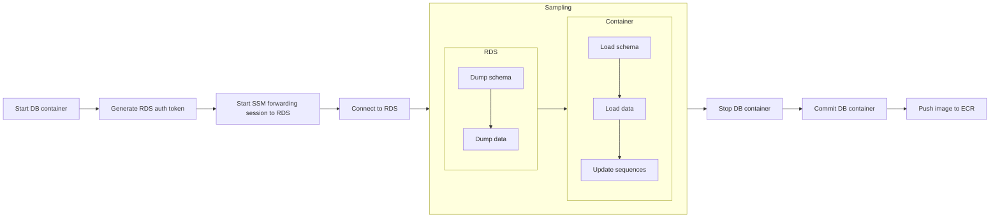

현재 직장에서는 Postgres 데이터베이스를 이용하고 있습니다. 기능 개발, 버그 수정 등 개발 전반에서 다양한 데이터가 필요했기에, 데이터를 추출하기 위해 `pg_dump`와 `pg_restore`를 이용하고 있었습니다.

하지만 데이터가 점차 쌓이면서 추출과 적재에 소요되는 시간이 계속 늘어났고, 개인정보 보호 및 보안 강화에 대한 요구 사항도 점점 많아졌습니다. 체계적인 데이터 추출 방법을 고안해야 할 필요성이 점점 높아지고 있었기에, 개발팀이 데이터를 안전하게 추출하고 쉽게 이용할 수 있도록 하는 방법을 찾아보게 되었습니다.

## 🔎 데이터 추출 방식 비교

안정적인 데이터 추출 방법을 선택하기 위해 현재 사용 중인 방법들과 대안들을 비교해보았습니다

### 💻 `pg_dump`, `pg_restore`

이미 사용하고 있던 `pg_dump`와 `pg_restore`는 유용하지만 여러 문제점이 있었습니다:

- 데이터베이스가 마냥 작지는 않기 때문에 이미 작업에 상당한 시간(수십 분에서 수 시간)이 소요되고 있었습니다.
- 민감한 데이터가 여러 개발자 사이에서 떠돌아다니게 되는 치명적인 문제가 있었습니다.
- 프라이빗 서브넷에 위치한 데이터베이스에 접근하기 위해 바스티온 호스트를 경유하는 SSH 터널링을 이용해야 했고, 이 SSH 키를 안전하게 관리해야 했습니다.

이후 SSH 대신 AWS SSM Session Manager를 이용하도록 네트워크 구성을 전체적으로 개편하면서 데이터 전송 속도가 크게 느려지면서(수 MB/s 수준) 물리적으로 이 방법을 사용하는 것은 불가능해졌습니다. 개인정보 보호를 위해서도 이 방법을 유지해서는 안 되었습니다.

### 🔤 무작위 데이터 생성기

[factory_boy](https://github.com/FactoryBoy/factory_boy), [Faker](https://github.com/joke2k/faker) 같은 라이브러리를 이용하면 테스트를 위한 데이터를 쉽고 빠르게 생성할 수 있습니다. 하지만 서비스 특성상 수치 정합성이 중요하고 현실과의 괴리(결함을 포함하여)를 최소화하는 무작위 데이터셋을 생성하고 관리하는 것은 손이 많이 가는 작업인데다, 변경에 취약합니다.

### 🧪 데이터 샘플링

SQL 스크립트를 작성하여 필요한 데이터를 추출하는 가장 직관적인 방법입니다. 추출한 데이터를 컨테이너 이미지로 패키징하여 Amazon ECR에 업로드해두면 다른 개발자들이 쉽게 내려받아 사용할 수 있을 것이라 기대했습니다. 하지만 이 방식은 스키마 변경에 민감하고, SQL 스크립트를 지속적으로 관리해야 하며, 대규모 데이터 추출 시 운영 환경에 성능 문제를 일으킬 수 있다는 단점이 있습니다.

### 🔁 데이터베이스 로테이션

개발 데이터베이스를 운영 환경의 데이터베이스 스냅샷으로부터 재생성하는 방법입니다. 특정 시점의 데이터를 그대로 가져올 수 있다는 장점이 있습니다. Amazon RDS가 자동 생성해주는 스냅샷을 이용할 수도 있고, 필요할 경우 수동으로 스냅샷을 생성하여 이용할 수도 있습니다. 게다가 스냅샷으로부터 데이터베이스를 복원하는 과정은 비교적 빠르고(15\~20분 정도) 안정적인데다 저장 비용도 저렴한 편입니다. 복원 과정에서 운영 환경의 데이터베이스에 아무런 영향을 주지 않습니다.

AWS DMS (Database Migration Service)와 같은 대안도 있었지만, 현재 데이터베이스 크기를 감안했을 때 스냅샷 기반의 방식이 더 쉽고 저렴할 것이라는 조언을 받았습니다. DMS는 추후 데이터베이스 규모가 훨씬 커졌을 때 다시 검토해 보기로 했습니다.

## 🪣 S3를 이용한 데이터 샘플링

처음 시도했던 방식은 AWS RDS for Postgres를 위한 `aws_s3` 확장 프로그램[^1]을 이용하는 것입니다. IAM 역할, S3 버켓 ACL, RDS 설정 정도만 구성해주면 바로 이용할 수 있습니다. 쉽게 설치할 수 있고, 복잡한 설정이 필요하지 않습니다. 데이터베이스 내의 함수를 통해 S3에 쿼리 결과를 저장하고 쉽게 공유 및 재사용할 수 있습니다. 하지만 샘플링을 위해서는 몇 가지 추가적인 관리와 설정이 필요했습니다.

1. S3 버킷, 추출된 데이터를 저장하고 불러오기 위한 경로와 파일 이름의 규칙 등, 균일화된 추출 및 적재 방식을 정의하고 관리하기 위한 함수와 프로시저를 직접 관리해야 합니다.
2. PL/pgSQL 문법에 친숙하지 않다면 사용 및 관리가 어렵습니다.
3. `aws_s3` 확장 프로그램은 오픈소스가 아닙니다. 같은 확장 프로그램을 통해 데이터를 다운로드하고자 한다면 오픈소스 레플리카인 [chimpler/postgres-aws-s3](https://github.com/chimpler/postgres-aws-s3)를 이용해야 합니다. 이는 로컬 환경의 데이터베이스에 추가 설치 및 구성이 필요하게 만듭니다.

실제 동작하는 구성을 만든 뒤에도 사용성이 떨어져 거의 쓰이지 않았습니다. 직접 함수를 호출하고 데이터를 S3를 통해 업로드하고 다운로드하는 과정이 번거로웠으며, 추출 쿼리를 작성하고 관리하는 부담도 적지 않았습니다. 다른 방법을 모색할 필요가 있었습니다.

> 👀 Postgres 확장 프로그램을 이용해보는 것은 처음이었습니다. 나름 흥미로웠고 버리기엔 아까워서 개인 시간에 짬을 내어 구성을 재현해 남겨두었습니다: [lasuillard/learn-postgresql](https://github.com/lasuillard/learn-postgresql)

[^1]: https://docs.aws.amazon.com/AmazonRDS/latest/UserGuide/postgresql-s3-export.html

## 🐳 GitHub Actions + ECR을 이용한 데이터 샘플링

앞선 방식의 가장 큰 문제는 복잡한 구성으로 인해 사용성이 너무 떨어진다는 점이었습니다. 대신, 데이터가 적재된 데이터베이스 이미지를 생성하고 이를 공유하여 이용할 수 있게 한다면 비교적 쉽게 이용할 수 있을 것이라고 판단했습니다. 개발자가 직접 S3와 상호작용하는 대신, 필요한 데이터가 모두 포함된 데이터베이스 이미지를 다운로드한 뒤 컨테이너를 생성해서 연결하기만 하면 바로 이용할 수 있을 것이라 기대했습니다.

그리고 이 작업을 GitHub Actions를 이용해 워크플로로 정의해두고 언제든지 실행할 수 있게끔 하면 될 것입니다. 하지만 실제 구성에는 여러 문제에 마주하게 되었습니다.

### 🌐 네트워크 문제

`aws_s3` 확장을 쓸 때에는 데이터가 S3를 경유하였기에 네트워크를 크게 신경쓸 필요가 없었습니다. 하지만 데이터베이스와 직접 연결을 맺고 쿼리를 수행하는 방법으로 변경하면서 RDS에 접속하기 위한 방법을 찾아야 했습니다.

개발팀은 프라이빗 서브넷의 리소스에 접근하기 위해 SSM Session Manager를 이용하고 있었고, 이 방법을 그대로 사용하기로 했습니다. 하지만 Session Manager의 느린 네트워크 전송 속도로 데이터를 추출하는 데 상당한 시간이 소요되었습니다. 수십~수백 MB 수준의 데이터도 전송을 완료하는 데 수 분이 걸릴 정도였습니다. 하지만 필요한 선택적 데이터만을 추출할 것이니 그 용량이 방대하지는 않을 것이고, 디버깅 및 테스트를 위한 데이터셋 등 한정적인 용도로 이용할 것이어서 속도 문제는 감내할 수 있다고 판단했습니다. 필요하다면 `aws_s3` 확장을 활용하여 S3를 경유해 속도를 크게 개선할 수 있을 것입니다.

### 🔒 보안 문제

데이터베이스 인증 정보를 비롯, 그 어떤 인증 정보도 반복적으로 노출될 기회는 줄여야 했습니다. 샘플링에 마스터 계정을 이용하는 대신 최소 권한의 읽기 전용 계정을 할당하고 [IAM 기반 RDS 인증](https://docs.aws.amazon.com/AmazonRDS/latest/UserGuide/UsingWithRDS.IAMDBAuth.html)을 이용해 임시 인증 정보를 발급하여 이용하기로 했습니다.

### 📦 데이터 추출 및 적재

데이터베이스 스키마는 `pg_dump`를 이용할 수 있었고, 목적 데이터 또한 추출에는 큰 문제가 없었지만 추출된 데이터를 다시 적재하는 데에 골머리를 많이 썩였습니다.

- **외래 키 제약 조건**

  `aws_s3` 확장을 이용할 때에도 동일하게 발생했던 문제입니다. 데이터 적재 시 다양한 제약 조건(대표적으로 외래 키)으로 인해 문제가 발생했습니다. 이전 방법에서는 의존성에 맞추어 데이터 적재 순서를 조절했지만 이는 여간 귀찮은 일이 아니었습니다. 조사 끝에 `session_replication_role` 설정 파라미터를 통해 외래 키 등 제약 조건 검사를 일시적으로 비활성화할 수 있다는 것을 알게 되었습니다.

- **시퀀스 충돌**

  `COPY`를 이용해 데이터를 적재할 경우 관련된 시퀀스가 갱신되지 않는 문제가 있었습니다. 갱신되지 않은 시퀀스로 인해 로컬 서버 동작 중 새로운 객체가 생성될 때 문제를 일으켰습니다. `pg_dump`를 이용해 데이터를 추출하면 실행 가능한 `INSERT` SQL문을 뽑아낼 수 있어서 문제가 발생하지 않았지만 이번 데이터 추출 방식에서는 `COPY` 명령어를 이용하고 있었습니다. 이 문제는 데이터를 적재한 뒤 시퀀스를 일괄 갱신[^2]하는 것으로 해결하였습니다.

[^2]: https://wiki.postgresql.org/wiki/Fixing_Sequences

### 🐳 적재 후 데이터베이스 이미지 생성

데이터베이스 컨테이너를 실행한 뒤 스키마 초기화 및 데이터 적재, 시퀀스 갱신 후 데이터베이스 이미지를 커밋(`docker image commit`, 컨테이너의 현재 파일시스템 상태를 새 이미지로 저장하는 명령어)하는 것으로 충분하리라 생각했지만, 예상치 못한 문제가 있었습니다.

- **볼륨 데이터 누락**

  Postgres 컨테이너의 데이터 볼륨(`/var/lib/postgresql/data`)은 이미지에 포함되지 않아 컨테이너 실행 후 데이터가 비어있는 문제가 있었습니다. 데이터 위치(`PGDATA`)를 다른 곳으로 지정(`/data`)하여 이미지에 데이터가 포함되도록 했습니다. 개발 및 테스트 목적으로만 이용할 소량의 데이터만 포함하기 때문에 이미지 용량은 큰 문제가 아니었습니다.

- **컨테이너 실행 시 Redo 작업 실행**

  이미지로부터 컨테이너를 시작하면 비정상 종료된 데이터베이스의 복구(WAL Redo) 작업이 실행되는 문제가 있었습니다. 데이터 자체에 큰 문제는 없었지만 이 작업으로 인해 컨테이너 시작이 느려졌습니다. 문제 원인을 조금 더 확인해 본 결과 데이터베이스 이미지를 커밋하기 전 정상적으로 중단시키지 않았기 때문이었고, 이후 컨테이너를 정상 종료하도록 변경하였습니다.

구성된 워크플로는 다음과 같았습니다.

이로써 일부 사용자와 연관된 모든 데이터를 선택적으로 추출한다는 일차적인 목표는 달성할 수 있었습니다. 하지만 이와 연관된 인프라 구성, 워크플로 스크립트 관리 부담이 배가되었습니다. 무엇보다 당시 개발 시나리오에서 부분적인 샘플링 데이터만을 필요로 하는 경우가 매우 드물었습니다. 결국 작동은 했지만 아무도 쓰지 않게 되었습니다.

그렇게 반쪽짜리 성공을 뒤로 하고 다음 대안을 시도하기로 했습니다.

## ↪️ 데이터베이스 로테이션

앞선 방식은 범용 개발 환경을 위해 데이터를 준비하는 용도로는 적합하지 않았기에 결국 운영 데이터베이스 사본을 직접 이용하는 것이 가장 바람직하다는 결론에 도달했습니다. 샘플링은 추후 복잡한 테스트 시나리오를 위한 데이터셋을 준비하기 위해 쓰기로 했습니다.

AWS RDS는 정해진 시간에 스냅샷을 자동 생성하며, 이 스냅샷으로부터 데이터베이스를 복원할 수 있습니다. 데이터 용량에 따라 복원에 소요되는 시간은 다르지만 확인해본 결과 현재 데이터베이스 수준에서 20분 남짓 소요되었고, 현재 데이터 규모와 증가 추세를 검토한 끝에 현재로서는 이 방법이 최선이라고 결론을 내렸습니다.

추가로 다음과 같은 사항들을 고려했습니다.

### 💸 비용 문제

운영 환경과 동일한 성능, 구성 및 크기의 데이터베이스를 개발 환경을 위해 유지한다는 것은 다소 부담스러운 선택지일 수 있습니다. 초기에는 그대로 복원하여 사용했으나, 추후에는 복원 과정에서 개발 환경에 맞춰 더 작은 인스턴스 사양으로 변경하도록 구성하여 비용 부담을 덜었습니다.

### 🔄 설정 재현 및 데이터베이스 교체

새로운 데이터베이스를 생성하고, 이 데이터베이스로 모든 연결을 다시 맺게끔 하여야 합니다. 서버에서 데이터베이스 연결이 가능하도록 네트워크 및 보안 그룹 구성 또한 유지해야 합니다. 개발 환경 특성상 어느 정도의 다운타임이 허용되고 즉각적인 오류 감지가 가능했으며, 네트워크 설정 변경도 잦지 않았기에 초기 구성을 단순하게 유지하기로 했습니다.

데이터베이스 교체는 도메인 레코드(Route 53)를 이용하여 비교적 쉽게 해결할 수 있습니다. DNS 캐시가 빠르게 갱신될 수 있도록 TTL을 60초로 짧게 유지하고, 새 복제본 생성이 모두 성공적으로 완료되면 도메인 레코드를 갱신한 뒤 기존 데이터베이스를 삭제하는 방식입니다.

처리가 더 어려운 것은 리소스 상태 추적이었는데, Terraform과 같은 IaC를 이용하지 않았기 때문입니다. 대신 정해진 접두사(e.g. `app-dev-`)를 가진 RDS들을 로테이션 대상으로 처리하도록 관리하였으며 로테이션 스크립트의 버그나 개발자 실수로 인해 다른 RDS에 위험한 동작이 수행되지 않도록 IAM에서 해당 접두사를 가진 RDS에만 위험 동작을 수행할 수 있게끔 극히 제한적인 권한만을 부여했습니다.

### 🛡️ 민감한 정보의 처리

개발 환경은 비교적 보안이 취약해지기 쉽습니다. 개발 편의를 위해 일부 보안 기능을 끈다던가 하는 일도 비일비재합니다. 민감 정보의 유출을 원천 차단할 수 있게끔 마스킹하거나 스크러빙(민감 데이터 비식별화 및 삭제)하는 후처리 또한 구현하기로 했습니다.

- 마스터 계정을 포함한 개인 데이터베이스 계정 또한 복제됨

  마스터 계정 비밀번호는 RDS 복원 직후 강제로 새 비밀번호를 설정하고, 시스템 및 필요한 일부 서비스 계정(샘플링)을 제외한 모든 계정은 비밀번호를 제거하여 로그인할 수 없게 처리했습니다. 최선의 방법은 비밀번호 대신 임시 인증 토큰([generate-db-auth-token](https://docs.aws.amazon.com/cli/latest/reference/rds/generate-db-auth-token.html))을 사용하는 것이겠지만, 이 부분은 추후 개선할 요소로 남겨두었습니다.

- 개발 중 사용자에게 실수로 문자메시지나 이메일이 발송되는 불상사를 미연에 방지하기 위해 이러한 정보는 난수 처리, 삭제, 회사 이메일 / 전화번호 등으로 대체하도록 했습니다.

후처리 스크립트는 스키마 자동 탐색 없이 수작업으로 관리했습니다. 당시 마땅한 PII 마스킹 도구가 없었기 때문입니다. 스키마 변경에 따라 스크립트가 깨질 위험이 있었지만, 개발 환경에서만 사용하는 비중요 작업이어서 실패 시 수정 후 재실행하는 방식으로 운용했습니다.

### ⚡ 자동화

이러한 작업은 그 빈도가 잦지 않다면 사람이 직접 처리할 수 있습니다. 하지만 이런 반복 작업은 실수하기 쉽습니다. 더군다나 인프라 구성 요소와 관련된 요소가 많다면 실수할 가능성은 더 높아집니다. 그래서 GitHub Actions 워크플로를 작성하여 BE 개발자 누구나 필요할 때 수동으로 실행할 수 있도록 만들었습니다. 정기 자동 실행 대신 온디맨드 방식을 택했는데, 유용성이 입증된 이후에는 팀원들이 하루에 2~3번씩 돌릴 정도로 활발하게 활용되었습니다.

```mermaid
graph LR
  get-latest-snapshot[Get latest snapshot of RDS]
  --> restore-from-latest-snapshot[Restore new RDS from snapshot]
  --> update-master-password[Update master user password]
  --> start-ssm-forwarding-session[Start SSM forwarding session]
  --> connect[Connect to RDS]
  --> run-postproc[Run postprocessing SQL scripts]
  --> update-route53-record[Update Route 53 record]
  --> delete-old-rds[Delete old RDS]
```

실제로 구현해보니 그 구성과 구현이 그리 어렵지는 않았습니다. 다른 작업들에 비하면 훨씬 간단하고 결과물도 만족스러웠습니다. 도메인 변경 전후로 일시적인 다운타임이 발생하기는 하지만 개발 환경이라 그리 문제가 되지는 않았습니다.

아무래도 가장 큰 단점은 비용인데, 데이터베이스 인스턴스 타입이 바뀌면서 비용 증가를 쉽게 확인할 수 있었기 때문입니다(이후 인스턴스 타입을 다시 낮추어 비용을 절감했습니다). 하지만 개발팀의 생산성과 편의성을 개선하는 효과가 더욱 컸다고 생각합니다. 이전에는 개발용 데이터베이스를 로컬에서 직접 재구성하는 데 최소 수 시간이 소요되었고, 개발자마다 자신의 사본을 따로 관리해야 했습니다. 로테이션 도입 후에는 약 20분이면 팀 전체가 공유하는 최신 개발 데이터베이스를 쓸 수 있게 되었습니다.

## 💭 마치며

아무리 마스킹과 스크러빙을 거친다 해도 운영 데이터베이스 사본을 개발 환경에서 다루는 것에는 보안상 위험이 따릅니다. 하지만 당시 팀 상황에서는 보안 위험을 안전한 선으로 통제하면서 개발 생산성을 극대화하는 것이 무엇보다 중요했고, 이 타협점은 팀의 개발 속도를 끌어올리는 데 결정적인 역할을 했습니다.

하지만 보안 위험을 완전히 제거할 수는 없기에, 운영 데이터베이스 사본을 개발 환경에서 다루는 것은 최후의 수단으로만 고려해야 합니다. 데이터베이스 로테이션은 개발팀의 생산성을 크게 개선했지만, 어디까지나 당시 상황이 특수했기 때문에 활용할 수 있었고 보안 위험을 완전히 제거할 수는 없었습니다. 따라서 이 방법은 신중하게 고려하고, 필요에 따라 적절한 보안 조치를 취하는 것이 중요합니다.
