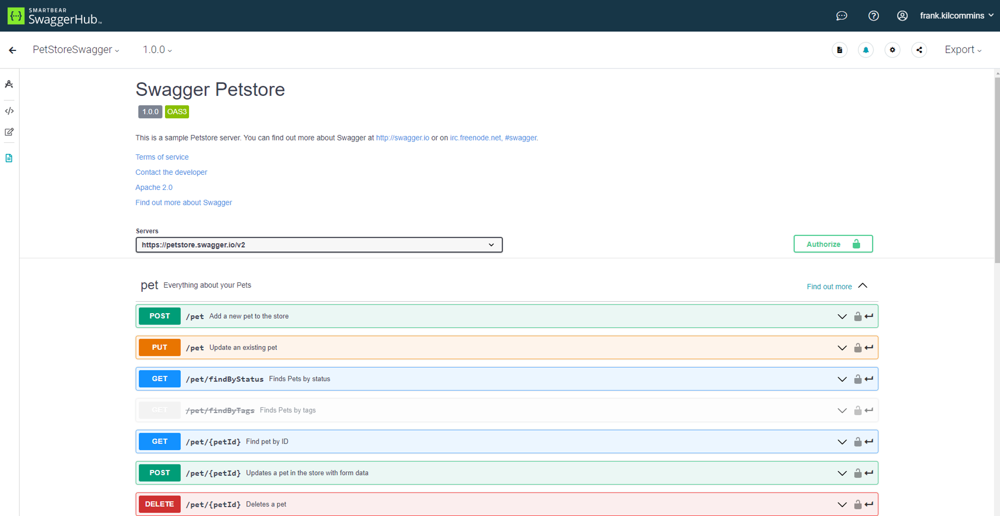
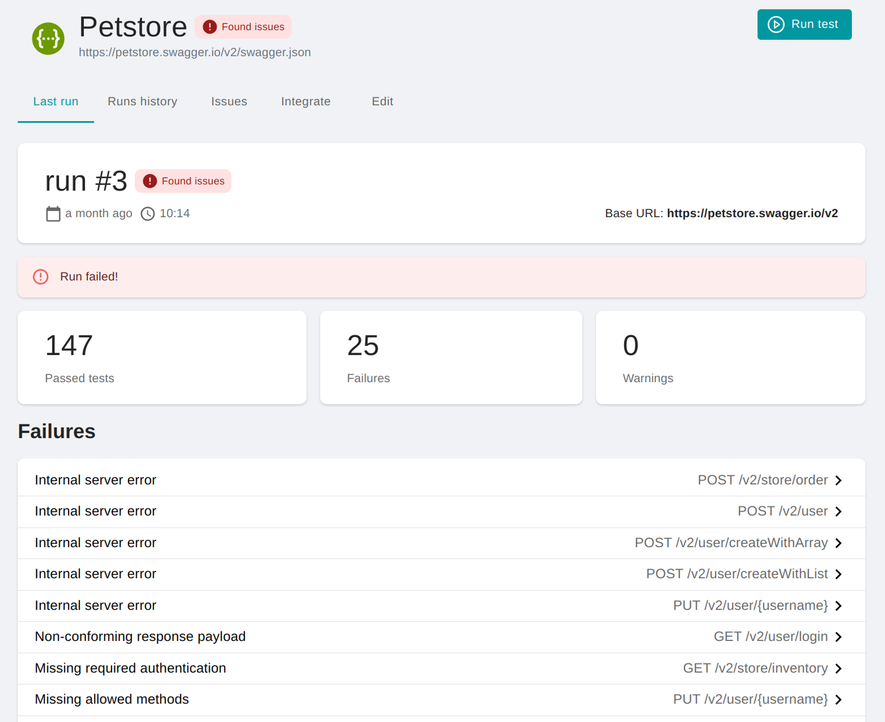

평소 북마크와 웹 페이지 하이라이트를 [Raindrop](https://raindrop.io/)에서 관리하고 있습니다. 특정 기기나 브라우저에 종속되지 않고 태그를 비롯한 편리한 기능을 이용할 수 있으며, 북마크를 공유하거나 공개할 수도 있습니다.

다만 아쉬운 점은 Chrome 북마크 동기화를 지원하지 않는다는 점입니다. Chrome 북마크를 이용하면 북마크 바에서 자주 사용하는 북마크를 바로 이용할 수 있고 검색 또한 훨씬 빠르며, [Albert](https://albertlauncher.github.io/)나 [Flow Launcher](https://www.flowlauncher.com/)와 같은 퀵 런처를 이용해 북마크를 바로 검색할 수도 있기 때문입니다.

목마른 자가 우물을 파는 법이라고, 결국 Chrome 확장 프로그램을 직접 만들기 시작했습니다. 하지만 Raindrop API를 이용하던 중 [공식 API 문서](https://developer.raindrop.io/)에서 많은 문제점을 발견하게 되었습니다. API 명세 자체가 설명이 미흡하거나 실제 API 호출 결과와 다르기까지 했습니다. 예를 들어 응답 데이터에 버젓이 존재하는 `$id`나 `oid` 같은 주요 속성들이 공식 문서에는 아예 누락되어 있거나 타입 정의가 불일치했습니다. 차라리 직접 OpenAPI 스키마를 정의하는 편이 낫겠다는 생각이 들 정도였습니다.

조금 생각해보니 직접 스키마를 정의해서 쓰는 것이 의외로 나쁘지 않은 생각인 듯 했습니다. 스키마를 한 번 만들어두면 언어를 막론하고 코드 생성기를 이용해 코드를 자동 생성할 수 있을 것이고, 다른 프로젝트에서도 쉽게 재사용할 수 있습니다. 그렇게 만든 것이 [lasuillard-s/raindrop-client](https://github.com/lasuillard-s/raindrop-client)입니다.

## ❓ OpenAPI란?

[OpenAPI](https://www.openapis.org/)는 HTTP API를 기술하기 위한 표준 사양(Specification)입니다. REST API를 접해보셨다면 친숙할 [Swagger](https://swagger.io/) UI가 바로 OpenAPI 문서를 기반으로 렌더링된 대표적인 예시입니다.



OpenAPI 스키마를 표준 규격으로 정의해두면 다음과 같은 이점을 얻을 수 있습니다.

- **소통 표준화**: API 명세에 대한 정형화된 규격을 제공하여 협업 시 혼선을 줄입니다.
- **자동화 및 DX 개선**: [Swagger](https://swagger.io/), [Redoc](https://redocly.com/redoc/), [OpenAPI Generator](https://openapi-generator.tech/) 등을 통해 대화형 문서, SDK/클라이언트 라이브러리, 목(Mock) 서버 등을 자동 생성할 수 있어 반복적인 문서 작업과 클라이언트 작성 비용을 대폭 줄여줍니다.
- **테스트 및 검증**: OpenAPI 스키마를 기반으로 API 요청과 응답을 검증할 수 있어, API 안정성을 높이고 테스트 자동화에 활용할 수 있습니다.

### 🪛 OpenAPI Generator

[OpenAPI Generator](https://openapi-generator.tech/)는 OpenAPI 스키마로부터 API 클라이언트 및 서버 코드를 생성하는 도구입니다. [Mustache](https://mustache.github.io/) 템플릿 언어를 통해 [다양한 언어와 프레임워크를 지원](https://openapi-generator.tech/docs/generators)하며 사용자 정의 템플릿을 이용할 수도 있습니다. OpenAPI Generator로 생성된 코드 예시는 다음과 같습니다.

```typescript
/**
* AuthenticationApi - functional programming interface
* @export
*/
export const AuthenticationApiFp = function(configuration?: Configuration) {
   const localVarAxiosParamCreator = AuthenticationApiAxiosParamCreator(configuration)
   return {
       /**
        *
        * @param {string} redirectUri
        * @param {string} clientId
        * @param {*} [options] Override http request option.
        * @throws {RequiredError}
        */
       async authorize(redirectUri: string, clientId: string, options?: RawAxiosRequestConfig): Promise<(axios?: AxiosInstance, basePath?: string) => AxiosPromise<void>> {
           const localVarAxiosArgs = await localVarAxiosParamCreator.authorize(redirectUri, clientId, options);
           const localVarOperationServerIndex = configuration?.serverIndex ?? 0;
           const localVarOperationServerBasePath = operationServerMap['AuthenticationApi.authorize']?.[localVarOperationServerIndex]?.url;
           return (axios, basePath) => createRequestFunction(localVarAxiosArgs, globalAxios, BASE_PATH, configuration)(axios, localVarOperationServerBasePath || basePath);
       },
```

이렇게 생성된 코드는 다음과 같이 이용할 수 있습니다.

```typescript
// Create Axios instance
const instance = axios.create();
const rateLimited = rateLimit(instance, { maxRPS: 5 });

// Create API client
const accessToken = process.env.RAINDROP_API_TOKEN;
const client = new Raindrop(new Configuration({ accessToken }), rateLimited);

// Make some call
const response = await client.collection.searchCovers('strawberry');
console.log(response.data);
```

현재 raindrop-client는 typescript-axios 템플릿을 이용하여 클라이언트 코드를 자동 생성하고 [npm 패키지 레지스트리](https://www.npmjs.com/package/@lasuillard/raindrop-client)로 배포하게끔 CI가 구성되어 있습니다.

## 🧪 스키마 테스트하기

OpenAPI 스키마를 가져다 쓰는 경우라면 스키마를 굳이 까다롭게 테스트할 필요가 없습니다. 보통 서버를 구현하는 측에서 테스트하기 때문입니다.

하지만 이번엔 상황이 조금 특별합니다. Raindrop에서 제공하는 OpenAPI 스키마가 없고, 제3자인 제가 스키마를 직접 작성하기 때문입니다. 그래서 실제로 작성한 스키마의 요청과 응답이 예상대로인지 확인할 필요가 있습니다.

- 동작(데이터) 테스트

  요청에 대해 응답이 정상적으로 돌아오는지, 기본적인 API 호출에 대한 테스트가 필요합니다.

- 스키마(타입) 테스트

  스키마를 테스트하기 위해 타입 체커(TypeScript)를 이용하고자 했지만 런타임 수준에서 응답 스냅샷(JSON 문자열)에 대한 동적인 타입 체크를 구성할 수 있는 방법을 찾을 수 없었습니다.

그래서 우선 스키마를 테스트할 수 있는 다른 도구들을 찾아보았고, [Schemathesis](https://schemathesis.io/)를 알게 되었습니다.

### 😎 Schemathesis

[Schemathesis](https://schemathesis.io/)는 API 스키마를 테스트하기 위한 도구입니다. API 안정성, 성능, 보안 등 여러 부분을 테스트할 수 있으며 CI 통합, 리포트 등 다양한 추가 기능을 제공합니다. OpenAPI 뿐만 아니라 GraphQL 스키마도 지원하는 것으로 보입니다.



Schemathesis는 꽤 매력적이었지만 최종적으로 도입하지는 못했습니다.

1. **API Fuzzing 부하**: 무작위/비정상 입력값을 대량으로 주입해 취약점을 찾는 퍼징(Fuzzing) 특성상 테스트 도중 방대한 양의 API 호출이 발생합니다. 직접 구축한 서버라면 문제없겠지만, 제3자의 실 서비스에 과도한 호출을 보내면 IP나 계정이 차단될 위험이 있습니다.
2. **모의 서버 관리 부담**: 실 서비스 대신 모의 서버(e.g. Mockoon)를 구성해 테스트 데이터셋을 관리하려고도 했으나 구성이 과도하게 복잡해졌고, UI를 통한 데이터 변경 및 갱신이 번거로웠습니다.
3. **언어 파편화**: Schemathesis를 커스터마이징하려면 Python이 필요한데, 현재 프로젝트는 TypeScript 기반이므로 관리 언어를 늘리는 것은 불필요한 복잡도를 높인다고 판단했습니다.

분명 흥미로운 도구였지만 이번 요구사항에는 맞지 않아 다음을 기약하기로 했습니다. 직접 API 서버를 구축하는 환경이라면 충분히 써볼 만할 것 같습니다.

### 🐦 Polly.js

결국 실제 API를 호출하되, 그 응답 내역을 파일로 저장(녹화)하고 재사용(Replay)하는 VCR 방식으로 기본 API 동작을 테스트하기로 했습니다. Python 진영에서는 [pytest-recording](https://github.com/kiwicom/pytest-recording)을 널리 사용하는데, Node.js 생태계에서도 유사한 기능을 제공하는 [Polly.js](https://github.com/Netflix/pollyjs)[^1]를 찾을 수 있었습니다.

[^1]: Polly.js는 Netflix에서 공개한 오픈소스로, HTTP 트래픽을 녹화(Record), 재생(Replay) 및 스텁(Stub)할 수 있는 독립적인 JavaScript 라이브러리입니다.

Polly.js가 요청을 분석해서 그 요청이 기존에 이미 녹화(캐싱)되어 있으면 저장된 응답을 반환하고, 그렇지 않으면 실제 요청을 보냅니다. 녹화 데이터(`tests/__recordings__`)를 갱신하고 싶다면 삭제하고 다시 실행하면 됩니다.

### 🔐 개인 데이터 보안

녹화 파일(`tests/__recordings__`)은 Git 저장소에 커밋되어 소스 코드와 함께 관리되므로, 보안이 중요합니다.

- **테스트 전용 계정**

  실제 개인 데이터 노출을 막기 위해 테스트 전용 더미 계정을 생성하여 사용합니다.

- **민감 정보 및 비결정적 데이터 마스킹**

  `beforePersist` 이벤트를 가로채어 토큰/쿠키 등 민감 정보를 걸러내고, 실행할 때마다 달라지는 타임스탬프(`time`, `startedDateTime`), 크기(`bodySize`), 멀티파트 경계값(`boundary`) 등을 정제하여 녹화 파일에 필요한 정보만 담기도록 하고, 무의미한 변경 사항으로 인해 테스트가 실패하지 않도록 합니다.

다음과 같이 Polly.js를 설정하고 녹화 파일을 관리합니다.

```typescript
import NodeHTTPAdapter from '@pollyjs/adapter-node-http';
import { Polly } from '@pollyjs/core';
import FSPersister from '@pollyjs/persister-fs';
import type { Task, Use } from '@vitest/runner';
import { taskId } from './common';

Polly.register(NodeHTTPAdapter);
Polly.register(FSPersister);

export async function polly({ task }: { task: Task }, use: Use<Polly>) {
	const _polly = new Polly(taskId(task), {
		adapters: ['node-http'],
		persister: 'fs',
		persisterOptions: {
			fs: {
				recordingsDir: 'tests/__recordings__'
			}
		},
		recordFailedRequests: true,
		matchRequestsBy: {
			headers: false
		}
	});
	_polly.server.any().on('beforePersist', (_, recording) => {
		interface Header {
			name: string;
			value: string;
		}

		// Ignore changing values
		delete recording.startedDateTime;
		delete recording.time;
		delete recording.timings;
		delete recording.request.bodySize;
		delete recording.request.cookies;
		delete recording.request.headersSize;
		delete recording.response.bodySize;
		delete recording.response.content.size;
		delete recording.response.cookies;
		delete recording.response.headersSize;

		// Filter request headers
		const headersToKeep = ['accept', 'content-type', 'accept-encoding', 'host'];
		recording.request.headers = recording.request.headers.filter((h: Header) =>
			headersToKeep.includes(h.name.toLowerCase())
		);

		// Suppress request mime type randomness
		const requestContentTypeHeader = recording.request.headers['content-type'];
		if (requestContentTypeHeader?.value.startsWith('multipart/form-data; boundary=')) {
			recording.request.headers['content-type'].value = 'multipart/form-data; boundary=0000000000';
		}
		const postData = recording.request.postData;
		if (postData) {
			if (postData.mimeType.startsWith('multipart/form-data; boundary=')) {
				recording.request.postData.mimeType = 'multipart/form-data; boundary=0000000000';
			}
		}

		// Filter response headers
		const responseHeadersToKeep = ['content-type', 'content-encoding'];
		recording.response.headers = recording.response.headers.filter((h: Header) =>
			responseHeadersToKeep.includes(h.name.toLowerCase())
		);
	});
	await use(_polly);
	await _polly.stop();
}
```

### 👻 스냅샷과 타입 체크

가능한 테스트 데이터 관리를 편하게 하기 위해 스냅샷으로부터 스키마 테스트가 가능하게 하고자 했습니다. 또한 임의의 JSON 문자열에 대해 타입 체크를 할 수 있는 방법을 찾지 못했기에 대안을 모색해야 했습니다.

- **커스텀 스냅샷 구현 작성**: 스냅샷 생성 시 문자열이 아니라 객체를 그대로 삽입할 수 있도록 구현
- **동적 타입 테스트 생성**: 스냅샷 생성 중 타입 체크를 위한 테스트 파일을 동적으로 생성

#### 💡 동적 타입 테스트 생성

구현과 관리를 단순하게 유지하기 위해 후자를 택했습니다. 런타임에 받은 실제 응답 데이터가 생성된 TypeScript 타입 정의와 부합하는지 정적으로 검증하기 위해, Vitest의 스냅샷 생성 시점에 개입해야 했습니다. 공식적으로 지원되는 방식이 없어 우회책으로 Snapshot Serializer를 활용했습니다.

```typescript
export async function generateTypeTest(
	{ task, expect }: { task: Task; expect: ExpectStatic },
	use: Use<RegisterHook>
) {
	const hookFn: RegisterHook = (args: RegisterHookArgs) => {
		// Check test file generation registered only once
		let ack = false;

		// Add snapshot serializer as an workaround for hook to generate type tests
		expect.addSnapshotSerializer({
			serialize(val, config, indentation, depth, refs, printer) {
				addTest({ testId: taskId(task), type: args.type, value: JSON.stringify(val) });
				ack = true;
				return printer(val, config, indentation, depth, refs);
			},
			test() {
				return !ack;
			}
		});
	};
	await use(hookFn);
}
```

여기에 테스트를 생성하는 코드를 삽입하여 [Vitest Type Testing](https://vitest.dev/guide/testing-types)용 타입 검증 파일(`.test-d.ts`)을 동적으로 생성합니다.

```typescript
function generateTest(dir: string, item: CreateTest): string {
	const filepath = path.join(dir, `${item.testId}.test-d.ts`);
	const content = `\
import { assertType, it } from 'vitest';
import type { ${item.type} } from '~/generated/api'

it('${item.testId}', () => {
 assertType<${item.type}>(
   ${item.value}
 )
})
`;
	console.debug(`Will generate file ${filepath} with content: \n\n ${content}`);
	fs.writeFileSync(filepath, content);

	return filepath;
}
```

테스트가 실행되고 나면 아래와 같은 테스트 파일이 생성되며 커밋하여 소스 코드의 일부로 관리됩니다.

```typescript
it('parseURL', async ({ client, expect, generateTypeTest }) => {
	const response = await client.import.parseURL('https://example.com');

	generateTypeTest({ type: 'ParseURLResponse' });
	expect(response.data).toMatchInlineSnapshot(`
		{
		  "item": {
		    "cover": "<screenshot>",
		    "excerpt": "",
		    "media": [],
		    "meta": {
		      "tags": [],
		    },
		    "title": "Example Domain",
		    "type": "link",
		  },
		  "result": true,
		}
	`);
});
```

먼저 단위 테스트가 실행되면서 실제 응답값 기반의 `.test-d.ts` 파일들이 생성되고, 이후 별도의 타입 테스트(`vitest typecheck`)를 통해 스키마와 응답값 간의 타입 일치 여부를 검증할 수 있습니다.

> 💬 **런타임 검증(Zod 등)과의 비교**
>
> [Zod](https://zod.dev/)와 같은 런타임 스키마 검증 라이브러리를 이용해 `schema.parse(response.data)` 형태로 검증하는 방법도 있습니다. 하지만 공식 제공되는 템플릿 중 Zod를 지원하는 템플릿이 없고, 직접 커스텀 템플릿을 만들어야 하는 부담이 있어 우선은 타입 테스트를 선택했습니다.

## 🤖 API 변경 사항 추적하기

스키마를 한 번 정의하고 테스트를 통과했다고 해서 끝이 아닙니다. 관리 권한이 없는 제3자 API 서버는 언제든 예고 없이 응답 필드를 추가, 변경, 삭제할 수 있습니다. 이를 방치하면 어느 순간 클라이언트 라이브러리가 깨지게 되므로, 변경 사항을 주기적으로 감지하여 자동으로 이슈를 생성하는 GitHub Actions 워크플로우를 구축했습니다.

````yaml
name: API Drift Detection

on:
  schedule:
    - cron: '0 9 * * 1' # Every Monday at 9am
      timezone: Asia/Seoul
  workflow_dispatch: # Allow manual triggering

concurrency:
  group: ${{ github.workflow }}-${{ github.ref }}
  cancel-in-progress: false

jobs:
  check-drift:
    name: Check Drift
    runs-on: ubuntu-latest
    timeout-minutes: 15
    permissions:
      contents: read
      issues: write
    steps:
      - name: Checkout
        uses: actions/checkout@3d3c42e5aac5ba805825da76410c181273ba90b1 # v7.0.1
        with:
          fetch-depth: 0

      - name: Set up Node.js
        uses: actions/setup-node@820762786026740c76f36085b0efc47a31fe5020 # v7.0.0
        with:
          node-version-file: package.json
          cache: npm

      - name: Install deps
        run: npm ci

      - name: Refresh test recordings
        id: refresh
        continue-on-error: true
        env:
          __RAINDROP_CLIENT_TEST_API_TOKEN: ${{ secrets.__RAINDROP_CLIENT_TEST_API_TOKEN }}
        run: |
          if [ -z "$__RAINDROP_CLIENT_TEST_API_TOKEN" ]; then
            echo '$__RAINDROP_CLIENT_TEST_API_TOKEN is not set'
            exit 1
          fi

          # Cleanup existing recordings
          rm --recursive --force ./tests/__recordings__/*

          # Run tests
          test_failed=false
          npm run test:unit -- --update || test_failed=true
          npm run test:type || test_failed=true

          echo 'done=true' >> "$GITHUB_OUTPUT"
          if [ "$test_failed" = true ]; then
            echo 'Test failed'
            exit 1
          fi

      # NOTE: If test have passed, API has not changed but there could be a file changes.
      #       However, the file changes can be ignored because it only consists of changes of changing values such as IDs, timestamps, etc.
      #       It's ideal to implement mitigation for file changes, but I have no idea how should I do it yet
      - name: Leave job summary for changes
        if: steps.refresh.outcome == 'failure' && steps.refresh.outputs.done == 'true'
        run: |
          cat <<'STEP_SUMMARY_1' >> "$GITHUB_STEP_SUMMARY"
          ## Change Summary

          API test refresh failed with the following changes:

          ```text
          STEP_SUMMARY_1

          git --no-pager diff --stat >> "$GITHUB_STEP_SUMMARY"

          cat <<'STEP_SUMMARY_2' >> "$GITHUB_STEP_SUMMARY"
          ```

          <details>
          <summary>Full diff (first 500 lines, excluding recordings)</summary>

          ```diff
          STEP_SUMMARY_2

          git --no-pager diff ':(exclude)tests/__recordings__/**' | head --lines=500 >> "$GITHUB_STEP_SUMMARY"

          cat <<'STEP_SUMMARY_3' >> "$GITHUB_STEP_SUMMARY"
          ```

          </details>
          STEP_SUMMARY_3

      - name: Create issue for API drift
        if: steps.refresh.outcome == 'failure' && steps.refresh.outputs.done == 'true'
        env:
          GH_TOKEN: ${{ secrets.GITHUB_TOKEN }}
          GH_REPO: ${{ github.repository }}
          TITLE: 'API drift detected'
          WORKFLOW_URL: ${{ github.server_url }}/${{ github.repository }}/blob/${{ github.sha }}/${{ job.workflow_file_path }}
          RUN_URL: ${{ github.server_url }}/${{ github.repository }}/actions/runs/${{ github.run_id }}
          LABELS: 'automated,api-drift'

          # Key in the body of the issue to find the issue created by this workflow
          FINGERPRINT: 'api-drift-detection:HVqRVovW6tqXX4HfQ8LLI9A71JRvnR79'
        run: |
          # Check if issue already exists
          existing_issue_number="$(gh issue list --search "is:open in:body ${FINGERPRINT}" --json number --jq '.[0].number // empty')"
          if [ -n "$existing_issue_number" ]; then
            gh issue comment "$existing_issue_number" --body "API test refresh failed with errors. Please check the [workflow run log](${RUN_URL}) for details and update the API spec as necessary."
            exit 0
          fi

          # Create issue
          body_file=/tmp/body.md
          cat <<EOF > "$body_file"
          API test refresh failed with errors. Please check the [workflow run log](${RUN_URL}) for details and update the API spec as necessary.

          _This issue was automatically generated by the [API drift detection workflow](${WORKFLOW_URL})._
          <!-- ${FINGERPRINT} -->
          EOF
          gh issue create \
            --title "$TITLE" \
            --body-file "$body_file" \
            --label "$LABELS"

      - name: Propagate refresh errors
        if: steps.refresh.outcome == 'failure' && steps.refresh.outputs.done != 'true'
        run: exit 1
````

이 워크플로우의 핵심 메커니즘은 다음과 같습니다.

1. **녹화본 전체 초기화 후 실 서버 호출**: 매주 정기적으로 기존 캐시(`tests/__recordings__/*`)를 전부 비우고 실제 Raindrop API를 호출하여 단위 테스트와 스냅샷을 갱신합니다.
2. **타입 테스트 검증**: 새롭게 생성된 응답값과 타입 정의 간 불일치가 발생하면 테스트가 실패합니다.
3. **자동 이슈 발행 및 중복 방지**: 테스트 실패 시 `git diff` 요약을 첨부하여 이슈를 생성합니다. 고유 `FINGERPRINT`를 추적해 이미 열려있는 이슈가 없을 때만 새 이슈를 생성하는 간단한 중복 방지 메커니즘을 구현했습니다.

이를 통해 제3자 API의 변경 사항을 개발자가 수동으로 일일이 모니터링하지 않아도 주기적으로 감지하고 스키마를 유지보수할 수 있습니다.

## 💭 마치며

raindrop-client는 [Raindrop Sync for Chrome](https://github.com/lasuillard-s/raindrop-sync-chrome) 프로젝트를 위해 만들어졌습니다. OpenAPI 스키마의 관리 주체가 서비스 제공자가 아닌 제3자인 이번 경우에는 고려해야 할 사항이 많았습니다. 단순히 스키마를 한 번 작성하고 끝내는 것이 아니라, VCR(Polly.js)을 통한 테스트, Snapshot Serializer를 활용한 동적 타입 검증, 그리고 API Drift Detection 자동화까지 유기적으로 연결해야 비로소 안심하고 쓸 수 있는 라이브러리가 완성될 수 있었습니다.

## 📜 변경 이력

- **2026-08-20** \- 2026년 7월 도입한 API Drift Detection 자동화 워크플로 도입에 관한 내용이 추가되었습니다.
