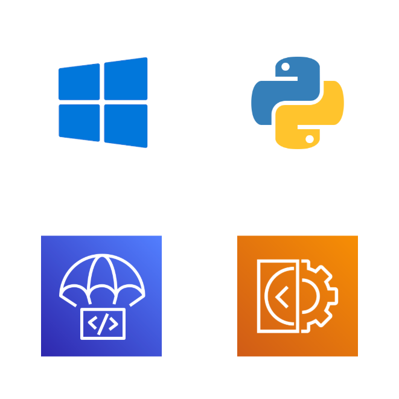

Windows는 개발에 적합하지 않다고 흔히들 이야기합니다. 다른 운영체제와 비교했을 때 개발자 친화적인 기능이 부족하고 불편하죠. Windows에 특화된 생태계는 크고 복잡하여 쉽게 들어설 수 없는 거대한 장벽이 존재합니다. 저는 Windows와 WSL (Windows Subsystem for Linux)과 많은 시간을 함께했지만 Windows에서 벗어날수록 개발이 편해졌다는 건 결코 부인할 수 없습니다.

개발 환경도 그럴진대, 서버 애플리케이션을 Windows에 배포하는 건 또 어떤가요? 가상화 및 컨테이너 기술이 발달하면서, 거기에 WSL까지 발전을 거듭하면서 Linux 외의 환경에 서버 애플리케이션을 배포하는 것은 흔치 않은 일이 되었으리라 봅니다.

잠시 몸담았던 회사에서는 서비스를 위해 다양한 데이터를 수집해야 했는데, 대부분의 데이터는 Linux 환경에서 수집할 수 있지만 드물게 Windows 환경을 요구하는 경우도 있었습니다. 이번 글에서는 그 경험을 공유하려고 합니다.

## 📜 요구사항

스크래핑할 사이트의 로그인은 다음과 같은 특징이 있습니다.

- 보안 프로그램 설치 및 실행을 요구합니다.
- 보안 프로그램이 실행중이면 로그인 시 키보드 또는 가상 키보드를 이용할 수 있습니다. 하지만 소프트웨어 키 입력(Selenium PyAutoGUI 등)은 먹히지 않습니다.
- 보안 프로그램이 실행중이지 않으면 올바른 계정 정보를 입력하더라도 로그인에 실패하게 됩니다. 네트워크 세부 정보를 확인해보면 비밀번호가 암호화 없이 그대로 전송되어 서버는 비밀번호를 틀린 것으로 간주합니다.

일반적으로 보안 프로그램이 설치되어 있지 않은 경우 보안 키보드를 이용할 수 있는 경우가 많은데 이 사이트는 그렇지 않습니다.

보안 프로그램을 우회하는 방법은 여럿 있지만 가장 쉬운 것은 다른 OS를 이용해 보는 것입니다. 일부 사이트는 Windows를 위해 구현된 보안 프로그램을 이용할 수 없는 OS에서는 보안 프로그램 없이도 로그인할 수 있도록 허용하기도 합니다. 혹은 어이없는 방법(ESC 키를 누른다거나)으로 설치 요구를 무시할 수 있는 경우도 있습니다. 하지만 이 사이트의 보안 프로그램은 제가 아는 방법으로는 우회할 수 없었습니다.

## 🛡️ 보안 프로그램

Selenium 및 PyAutoGUI로 실험해보았을 때 키 입력이 무시되었습니다. 보안 프로그램의 설계 및 동작 방식에 의한 것이라고 예상되었고 보안 프로그램의 동작을 이해하기 위한 충분한 자료를 찾을 수는 없었지만, 다음과 같은 다이어그램을 찾을 수 있었습니다.

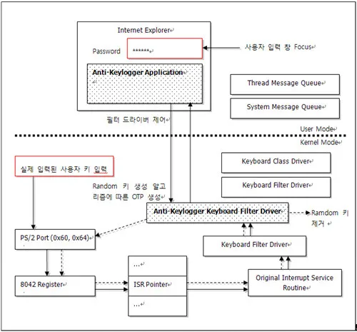

더 높은 수준의 키보드 입력 우선순위를 가진 보안 프로그램이 키 입력을 중간에서 관리하며 입력 키를 가로챌 수 없도록 하는 것이라고 추측했습니다.

떠올릴 수 있는 보안 프로그램에 대한 파훼 방법은 다음과 같았습니다.

1. 보안 프로그램 암호화 키, 알고리즘 등 모든 암호화 데이터를 찾아서 직접 암호화를 수행하기

    난이도가 높고 외부 변경(키, 알고리즘 등)에 취약합니다. 저 또한 이런 지식을 충분히 가지고 있지 않았습니다.

2. 하드웨어 입력을 활용하여 자동화하기

    이러한 하드웨어 입력을 소프트웨어로 제어할 수 있는 USB 장치를 직접 만들어 문제를 해결하는 분도 있다고 합니다. 하지만 제겐 그러한 지식이 없고, 모든 서비스는 AWS 클라우드에 호스팅되어 있어 이 장치를 마련하더라도 연결할 수 있는 물리 서버도 없었습니다. 무엇보다 이 기능의 중요도 대비 필요로 하는 비용이 너무 높았습니다.

3. 이미지 분석을 활용해 보안 키보드를 사용하여 입력하기

    브라우저 스크린샷과 OpenCV를 활용하여 키보드 버튼을 찾아 클릭하는 방법입니다.

다양한 선택지를 검토한 끝에 결국 보안 키보드를 직접 파훼하는 정공법이 가장 합리적인 선택이 되었습니다. Selenium 스크린샷에서 OpenCV를 이용해 키 좌표를 찾아 클릭하도록 할 수 있습니다. [soulee-dev/fuckvkeypad](https://github.com/soulee-dev/fuckvkeypad)에서 영감을 받아 작업을 진행했습니다.

## 🔧 구현

이제 계획을 실행에 옮겨야 했습니다. 로컬 환경에서 개발하는 중에는 Vagrant를 이용해 Windows Server VM을 프로비저닝하여 이용했습니다. Selenium Node를 배포하고, VM 외부의 Selenium Hub에 합류시켜 이용했습니다.

구현 중 가장 신경을 쓴 부분은 한/영/숫자 등 키 배열 전환에 대한 상태 전이([python-statemachine](https://python-statemachine.readthedocs.io/en/latest/)을 활용)에 대한 추상화였습니다. 추후 다른 웹 사이트에서도 활용할 있기를 원했기 때문입니다.

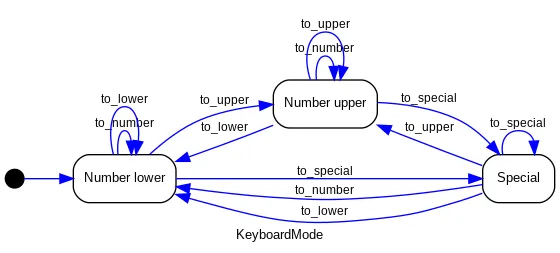

가장 귀찮았던 건 키 배열을 하나하나 뜯어내는 노가다 과정이었습니다. 이 작업을 위해 처음으로 Figma를 활용하게 되었네요.

기능을 구현한 뒤 실제 인프라를 구성했습니다. 빠른 구현 및 검토를 위해 단일 EC2 인스턴스를 퍼블릭 서브넷에 배포하고 EIP를 할당해주었습니다. EC2 User Data를 이용해서 사이트 보안 프로그램과 Selenium Server, [NSSM (Non-Sucking Service Manager)](https://nssm.cc/)을 설치했습니다. NSSM을 이용해서 Selenium Server를 서비스로 등록하여 실행했습니다.

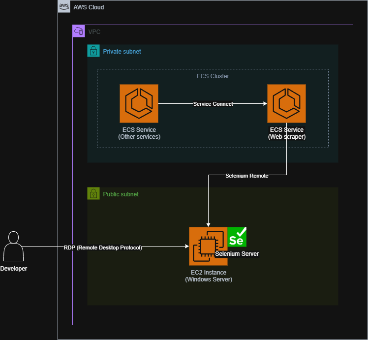

ECS에 배포된 스크래핑 애플리케이션은 인스턴스의 EIP를 이용해 Selenium Server를 Remote Webdriver로 이용해 로그인 과정을 수행합니다.

이 과정에서 생소한 Windows Server와 씨름해야 했고, 여러 문제와 맞닥뜨렸습니다.

- Windows 생태계

    친숙하지 않은 PowerShell, 익숙하지 않은 Windows Server 등등.. 기존 경험을 그대로 적용할 수 없는 난관이 굉장히 많았습니다.

- 웹 사이트 보안 프로그램이 자꾸 꺼지는 문제

    연결된 RDP 세션이 없으면 보안 프로그램이 자꾸 꺼지는 문제가 있었습니다. 초기에는 RDP 세션을 유지하는 Linux EC2 인스턴스를 추가 배포했지만, 문제가 끊이지 않았고 한동안 마땅한 해결책을 찾지 못했습니다.
    다른 우선순위가 높은 업무에 밀려 매번 직접 서버에 접속하여 고치는 임시방편을 거듭하다 결국 시간을 내어 추가 조사에 나섰고 보안 프로그램이 활성화된 콘솔 세션이 있어야 한다는 것을 알게 되었습니다.
    RDP 세션을 연결한 뒤 다음 명령어로 현재 세션을 콘솔 세션으로 전환할 수 있습니다.

    ```powershell
    tscon %SESSIONNAME% /dest:console
    ```

    이후 RDP 연결이 끊기게 되지만 콘솔 세션은 유지되어 보안 프로그램이 상시 실행될 수 있게 합니다. 하지만 간혹 관리 및 디버깅을 위해 서버에 접속하거나 서버를 재시작해야 하는 경우가 있습니다. 이 경우 콘솔 세션을 수동으로 시작해주어야 하는데, 매번 이 과정을 수동으로 하다 보면 실수가 발생할 수도 있고 손도 많이 가기에 자동화하고자 했습니다.
    그래서 찾은 방법은 [AutoLogon 기능을 활용](https://learn.microsoft.com/ko-kr/troubleshoot/windows-server/user-profiles-and-logon/turn-on-automatic-logon)하는 것이었습니다.

    사용된 User Data의 일부입니다.

    ```powershell
    # WARNING: Autologon user credentials stored to registry as plain text, without any encryption
    $adminUsername = '...'
    $adminPassword = '...'

    # Configure autologon
    $registryPath = 'HKLM:\SOFTWARE\Microsoft\Windows NT\CurrentVersion\Winlogon'
    Set-ItemProperty -Path $registryPath -Name AutoAdminLogon -Value 1
    Set-ItemProperty -Path $registryPath -Name DefaultUserName -Value $adminUsername
    Set-ItemProperty -Path $registryPath -Name DefaultPassword -Value $adminPassword
    Set-ItemProperty -Path $registryPath -Name ForceAutoLogon -Value 1

    # Reboot instance
    # https://docs.aws.amazon.com/systems-manager/latest/userguide/send-commands-reboot.html
    exit 3010
    ```

    `ForceAutoLogon` 설정을 통해 유지보수 작업이 끝난 뒤 콘솔 세션이 시작되도록 자동화할 수 있습니다. 자동 로그온은 보안 문제로 직결될 수 있으므로 주의하여야 합니다. EC2 User Data 및 서버 내 레지스트리에 관리자 계정 정보가 평문으로 저장됩니다. 가능하다면 AutoLogon을 이용하지 않고도 콘솔 세션을 유지할 수 있는 대안을 찾으면 좋겠죠.

- Selenium 서버 시작하기

    보통 Selenium 서버는 `.jar` 파일로 제공되며 실행하기 위해 `java`가 필요합니다. Windows 서버는 바로 이용할 수 있는 패키지 관리 도구가 없습니다. 또한 장애가 발생했을 때 서버가 재시작되게끔 서비스로 등록하여야 합니다.

    패키지 매니저로 Chocolatey를 이용하고 Java Runtime을 설치, NSSM을 이용하여 Selenium을 서비스로 등록해주었습니다. 다음 스크립트는 로컬 환경에서 Vagrant를 이용해 Windows Server VM을 생성할 때 사용했던, Selenium Node를 Selenium Hub (**192.168.0.2:4444**)에 합류시키는 스크립트입니다.

    ```powershell
    # Install via Chocolatey
    choco install openjdk --yes
    choco install nssm --yes

    # Download Selenium Server
    Invoke-WebRequest `
    	-Uri 'https://github.com/SeleniumHQ/selenium/releases/download/selenium-4.22.0/selenium-server-4.22.0.jar' `
    	-OutFile '.\selenium-server.jar'

    # Register Selenium Server as service using NSSM
    $serviceName = 'Selenium Node'
    nssm install $serviceName (Get-Command java).Source -jar "$workdir\selenium-server.jar" node --hub http://192.168.0.2:4444
    nssm start $serviceName

    # Allow traffic
    New-NetFirewallRule `
        -DisplayName 'Selenium Node' `
        -LocalPort 5555 `
        -Action Allow `
        -Protocol TCP `
        -Direction Inbound
    ```

## ↗️ 더 나아가기

앞선 구성만으로 당장 필요한 모든 요건을 만족하고 있었습니다. 해당 기능은 사용량이 많지 않고 증가 추세도 굉장히 더디기 때문에 비슷한 상황이 계속된다면 앞으로 몇 년 동안은 단일 인스턴스로도 충분합니다. 어느 정도의 사용량 증가도 인스턴스 유형을 업그레이드해주는 것으로 모두 처리할 수 있습니다.

하지만 개인적으로 이 구성을 더 발전시키고 싶어졌습니다.

- 유연한 확장

    단일 온-디맨드 인스턴스 구성은 손으로 관리하기는 편하지만 필요에 따라 능동적으로 축소 및 확장하기는 귀찮습니다. 보안 프로그램을 이용하는 여러 사이트가 비슷한 요건을 공유할 것이니, 확장 가능하다면 여러 기능을 부담 없이 추가할 수 있습니다.

- 비용 절약

    스팟 인스턴스를 활용한다면 비용을 약 70% 이상 절감할 수 있습니다. 하지만 인스턴스 스팟 요청을 직접 관리하고 싶지는 않았고 ASG를 이용할 수 있을 것입니다.

- 애플리케이션 직접 배포

    단일 Selenium 서버를 올리고 관리하는 건 어렵지 않지만 확장성을 고려해야 한다면 Windows Server 기반 확장 가능한 Selenium Grid 구성이 필요합니다. 허브 노드 그룹과 브라우저 노드 그룹을 관리해야 하며, 전체적인 복잡도를 크게 끌어올릴 것입니다. 또한 분리된 구성에서는 브라우저의 모든 기능을 활용하기 어렵습니다.

    시스템 리소스에 대한 접근 수준(화면, 키보드 / 마우스, 봇 감지 우회 등)을 높이고자 한다면 애플리케이션을 직접 서버에 배포하고 웹 드라이버를 각 서버에 설치하여 직접 상호작용하는 편이 좋을 것입니다. Selenium Grid는 걷어내기로 했습니다.

다음과 같은 구성을 계획했습니다.

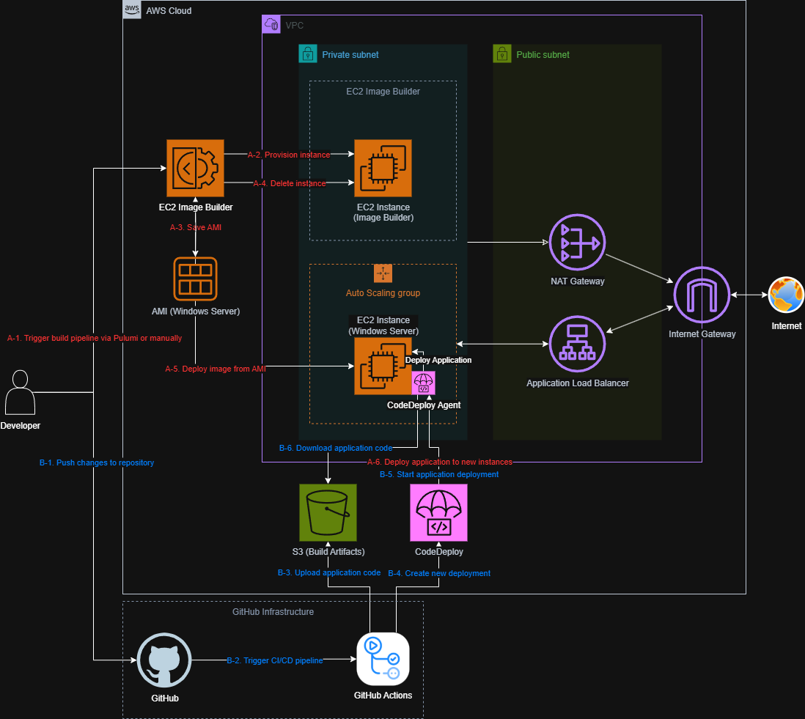

- EC2

    유연한 배포 환경을 위해 ASG (Auto Scaling Group) 및 ALB (Application Load Balancer)를 활용합니다.

    ASG는 Launch Template과 ABS (Attribute-based Instance Type Selection)을 활용하여 요구 사항(vCPU / RAM 등)에 따라 비용 효율적인 인스턴스를 알아서 선택하게 합니다.

- EC2 Image Builder

    User Data는 사용하기 편하지만 설치가 오래 걸리는 의존성을 매번 설치하면 인스턴스가 시작하고 실제로 애플리케이션이 배포 가능하기까지 오랜 시간이 걸립니다.
    - 필요한 도구 / 패키지 등 설치 (Chocolatey, NSSM, 보안 프로그램 등)
    - AutoLogon 설정 후 인스턴스 재부팅

        인스턴스 시작 속도를 높이고자 기반 AMI를 만들어 활용하기로 했습니다. Packer를 활용할 수도 있지만 가능한 구성을 단순화하고자 했습니다. 또한 AWS에서 제공하는 미리 정의된 컴포넌트(Chocolatey, Python 설치 등)를 활용할 수 있습니다.

        Image Builder를 통해 자동 로그온 설정을 하고자 했지만 Sysprep에 의해 관련 레지스트리 설정이 날아가는 문제가 있었습니다. 추후 개선의 여지를 모색하도록 하고, 당장은 User Data를 활용하기로 했습니다.
        SSM Association 또한 시도해봤지만 스케일 아웃 후 인스턴스가 준비되기까지 오랜 시간이 걸리고, 재부팅을 요하는 복잡한 초기화를 구성하기가 어려웠습니다.

- CodeDeploy
  애플리케이션 배포를 위해 이용합니다. ASG 스케일 아웃 또한 처리할 수 있으며, ALB와의 연계도 좋습니다. GitHub을 이용하고 있으니 배포는 GitHub Actions를 통해 자동화합니다.
  Elastic Beanstalk를 활용할 수도 있겠지만 Windows 기반 Python 런타임은 없었고, .NET 런타임에 Beanstalk 설정을 변경하여 Python 애플리케이션을 실행하도록 할 수도 있겠지만 구성 요소 전체를 직접 관리하고 싶었기에 Beanstalk는 제외했습니다.
  애플리케이션은 [NSSM](https://nssm.cc/)을 이용해 서비스로 등록하여 관리합니다.
- 그 외
  VPC, NAT, CloudWatch, IAM 등 많은 요소가 직간접적으로 연관되어 있습니다. 당장은 동작하는 구성을 실험하기 위해 HTTPS (Route 53 / ACM)는 구성하지 않았습니다.

인프라 구성은 [Pulumi](https://www.pulumi.com/) IaC를 이용했습니다. 개인 프로젝트에서는 Terraform보다 Pulumi를 선호하는 편입니다. 현재 프로젝트의 언어를 그대로 사용할 수 있으니 프로젝트 구성이 편해집니다. 아직 Terraform에 비해 생태계가 미숙하다는 단점이 있지만 인프라 구성에 범용 프로그래밍 언어를 활용할 수 있다는 것은 큰 장점입니다.

## 🧗 난관

Pulumi AWS Provider의 기능 한계로 일부 기능은 다른 방법을 찾거나 직접 구현해야 했습니다.

- 최초 구성 후 이미지 빌드 시작하기
  최초 구성 시 이미지 빌드 파이프라인이 자동으로 시작되게끔 자동화하고 싶었습니다. 이를 지원하는 연관 설정이나 리소스가 없었기에 Pulumi의 [Dynamic Provider](https://www.pulumi.com/docs/iac/concepts/resources/dynamic-providers/) 기능을 이용해 사용자 정의 리소스를 구현하여 자동화했습니다.

    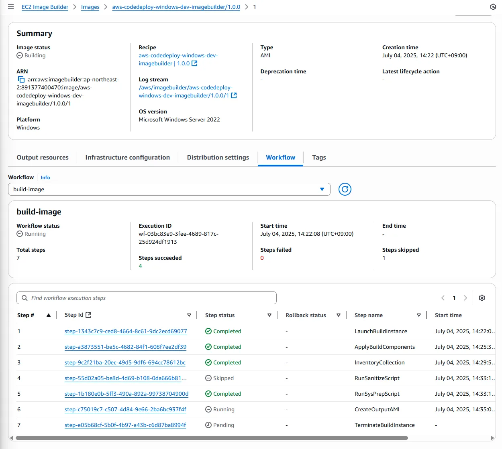

- 관리되지 않는 리소스 추적하기
  Image Builder는 이미지 빌드 시 CloudWatch 로그 그룹으로 빌드 로그를 전달합니다. 다만 문제는 현재 연관된 리소스 그 어디에서도 로그 그룹을 사용자가 지정할 수 있는 선택지가 없다는 문제가 있습니다. IaC를 다루다 보면 인기가 없는 제품은 문서나 설정이 많이 부족한 경우를 쉽게 찾아볼 수 있습니다.
  명명 규칙(`/aws/imagebuilder/<이미지 이름>`)을 따라 미리 로그 그룹을 생성해두면 이 리소스를 직접 관리할 수 있습니다. Image Builder는 이미 존재한다면 그 로그 그룹을 사용합니다.
- 깨끗하게 뒤처리하기
  실험이 끝난 뒤 리소스를 삭제하여도 Image Builder에 의해 생성된 일부 리소스(Image Builder Images, EC2 AMI, EC2 EBS Snapshot)는 알아서 삭제되지 않기에 추가 비용이 청구되지 않도록 직접 처리해주어야 합니다.
  가능한 반복적인 작업을 자동화하고 싶었기에 [Dynamic Provider](https://www.pulumi.com/docs/iac/concepts/resources/dynamic-providers/)를 활용하여 해결했습니다. 반복적인 작업은 실수할 여지가 많기 때문에 가능하면 자동화하는 것이 좋다고 생각합니다.

## ✅ 결과 및 검토

- 보안 프로그램 동작 확인

    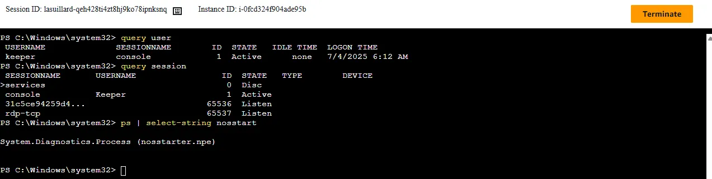

    Session Manager는 Systems Manager를 통해 별도 초기 설정이 필요할 수 있습니다. 저는 사전에 미리 구성된 전역 구성을 이용하고 있습니다.

- RDP 세션 연결 및 종료 후, 콘솔 세션 자동 시작 확인

    Fleet Manager를 이용하여 RDP로 접속해보겠습니다.
    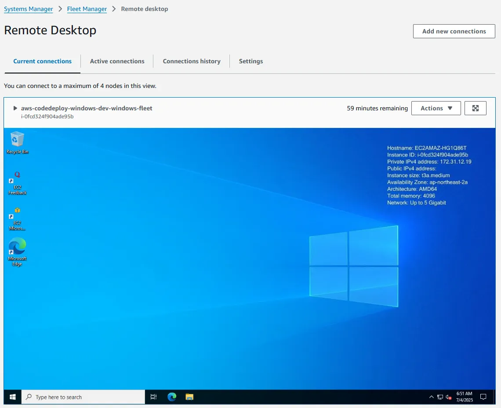
    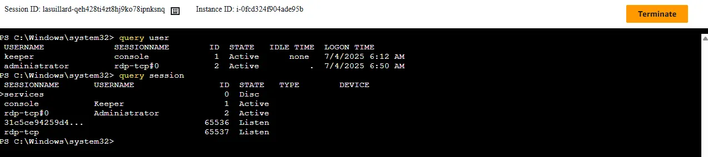
    RDP 세션이 정상적으로 생성되며, 기존 콘솔 세션이 방해받지 않습니다. 세션을 끊은 뒤, 잠시 후 다시 확인해보겠습니다.
    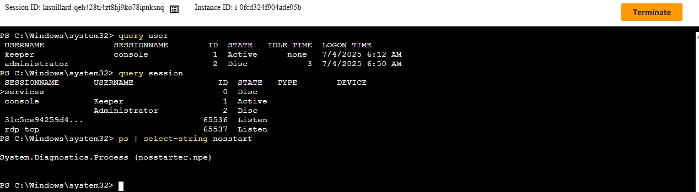
    잘 동작하고 있네요.

- GitHub Actions 배포
  간단한 GitHub Actions Workflow를 작성했습니다. `git archive`를 이용하여 압축 파일을 만들고 S3에 업로드한 뒤,
  CodeDeploy 배포를 트리거합니다.
  AWS CLI의 `aws deploy create-deployment` 명령어를 이용하는데, 기본적으로 배포를 생성한 뒤 완료를 기다리지 않으므로 `aws deploy wait deployment-successful` 명령어를 이용하여 배포를 기다려줘야 합니다.
  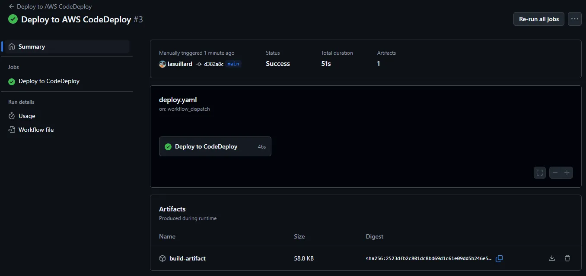
  CodeDeploy 콘솔을 확인해봅니다. 잘 배포되었네요.
  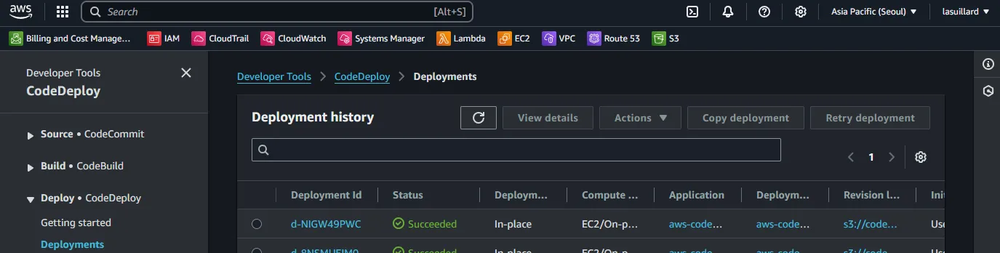

- 애플리케이션 동작 확인

    이제 애플리케이션이 잘 동작하는지 확인해보겠습니다. `curl`을 이용해 간단히 동작을 점검합니다.
    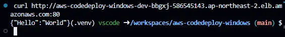
    배포된 FastAPI 애플리케이션의 OpenAPI 문서도 확인해봅니다.
    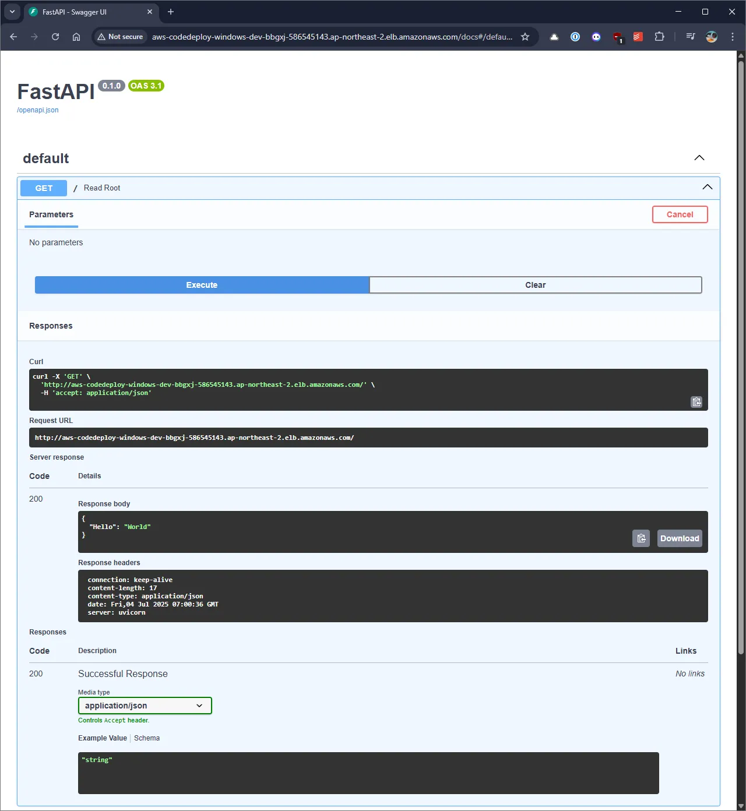

### ⌛ 시나리오에 따른 배포 소요 시간

실험을 통해 경험적으로 파악한 여러 시나리오 별 소요 시간은 대략적으로 다음과 같았습니다.

| 시나리오                             | AMI 빌드 (Image Builder) | EC2 인스턴스 초기화 (User Data) | 애플리케이션 배포 (CodeDeploy) | 총 소요 시간 |
| ------------------------------------ | ------------------------ | ------------------------------- | ------------------------------ | ------------ |
| 최초 구성 및 배포 / 기반 이미지 변경 | 20 ~ 30분                | 5 ~ 10분                        | 5 ~ 10분                       | 30 ~ 50분    |
| 스케일 아웃 (ASG)                    | X                        | 5 ~ 10분                        | 5 ~ 10분                       | 10 ~ 20분    |
| 애플리케이션 업데이트                | X                        | X                               | 약 3분                         | 약 3분       |

애플리케이션 배포 시간은 당연히 구성에 크게 의존합니다. 무거운 의존성이 많을 수록 당연히 오래 걸리게 됩니다. 실험을 위해 사용한 애플리케이션은 튜토리얼 수준의 굉장히 단순한 FastAPI 애플리케이션으로, 1분도 채 걸리지 않을 정도였습니다.

일반적인 수준의 크롤러 애플리케이션이라면 다양한 라이브러리, Selenium 웹 드라이버 등 많은 의존성을 가지므로 최초 배포 시 적어도 5분은 걸릴 것이라고 예상하고 있습니다. 필요하다면 이러한 내부 의존성 설치 속도를 올리기 위한 내부 미러링(pip / Selenium 웹 드라이버 등) 또한 고려할 수 있을 것 같네요. 또한 VM 인스턴스 유형을 적절히 선택하면 초기화 및 의존성 설치 속도를 개선할 수 있으므로 배포 속도를 더 올릴 수 있을 것입니다.

### 💸 실험 비용

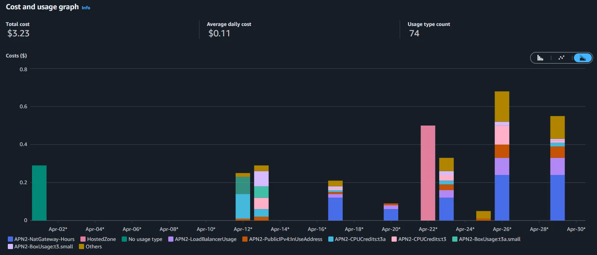

하루 약 3~6시간의 작업에 대해 청구된 비용은 보통 $0.5 ~ $1.5 수준입니다. 생각보다 거의 안 나와서 놀랐습니다. IaC 도구 활용의 이점 중 하나는 이런 실험 인프라를 필요할 때 쉽게 만들고 삭제할 수 있다는 것입니다.

## 🤔 개선할 점

이 실험에 예상보다 훨씬 많은 시간을 투자해야 했기에 한 번 일단락을 짓기로 했습니다. 추후 개선 사항과 함께 글을 보완하고자 합니다.

- PowerShell 스크립트 개선

    `python -m pipx run uv run ...`과 같이 장황한 PowerShell 스크립트를 작성하게 되었습니다. 도구를 설치한 후에도 세션이 제대로 명령어를 찾지 못했고 Scoop, pipx 등 여러 도구를 활용해봤지만 잘 되지 않았습니다. Chocolatey의 `Update-SessionEnvironment` 또한 활용해봤지만 해결할 수 없었습니다.

- AMI 빌드 개선

    AMI 빌드 후 Launch Template이 변경된 뒤 자동으로 Instance Refresh가 수행되지 않는 문제가 있습니다. EventBridge 및 Lambda를 이용하여 이를 자동화할 예정입니다.

    또한 느린 인스턴스 스케일 아웃 속도를 개선하려고 합니다.
    - AutoLogon 설정 개선 또는 대안 모색

        Sysprep 과정에서 자동 로그온을 설정할 수 있다면 인스턴스가 자동 로그온 설정 후 재부팅할 필요가 없으며, 준비까지 필요한 시간을 유의미하게 단축할 수 있으리라 생각합니다. 혹은 AutoLogon을 사용하지 않고도 콘솔 세션을 유지할 수 있는 대안을 찾으면 좋겠습니다.

    - [EC2 Fast Launch](https://docs.aws.amazon.com/AWSEC2/latest/UserGuide/win-ami-config-fast-launch.html) 기능 실험

        AWS에서 제공하는 EC2 Fast Launch를 이용하면 Windows 인스턴스의 스케일 아웃 속도를 크게 개선할 수 있을 것 같습니다.

- 로컬 VM 개발 환경 구성

    IaC를 통해 대부분의 작업을 자동화할 수 있었지만, 애플리케이션을 개발하고 Windows Server 내에서 실험하는 데에 모든 AWS 인프라 자원이 필요하지는 않으며, 여전히 상당한 초기 설정 시간이 필요합니다.

    로컬 환경에서 Windows Server에 대한 배포 및 애플리케이션 구성을 실험할 수 있으면 큰 도움이 될 것이며, Vagrant를 활용하려고 합니다.

- 실제 동작하는 스크래핑 애플리케이션 예제 추가

    인프라 구성에 집중하기 위해 이번에는 애플리케이션을 굉장히 단순하게 구성했습니다. OpenCV를 활용하여 보안 키보드와 상호작용하는 실제 동작하는 예제를 추가할 생각입니다.

- HTTPS 구성

    Route 53 도메인 및 ACM 구성과 관련된 내용은 이번에 다루지 않았습니다. 추후 HTTPS 구성을 추가하려고 합니다.

- 기타 개선 사항
    - 인프라 리소스 삭제(`pulumi destroy`) 중 일부 리소스 삭제 중 오류가 발생하여 수동 개입을 필요로 하고 있습니다.
    - EC2 Image Builder로 인한 외부 변경 사항(Launch Template)으로 인해 IaC 상태와 실제 상태 사이에 불일치가 발생합니다.

## ☕ 마치며

Elastic Beanstalk와 Lambda, ECS를 이용해 애플리케이션을 배포한 적이 있었지만 EC2 + CodeDeploy 조합은 처음이었습니다. 단일 EC2 인스턴스에 SSH(Session Manager 경유)를 이용해 배포한 적이 있으니 EC2 배포 경험이 없는 건 아니지만 이번 경우는 Windows Server였다는 점에서 더욱 특별합니다.

Windows 환경이 가지는 특성과 고유한 문제들이 있어서 쉽지 않았지만 신선한 경험이었고, PowerShell은 생각보다 좋은 스크립트 도구라는 것도 알게 되었습니다.

하지만 꼭 필요한 경우가 아니라면 Windows Server 활용을 권하고 싶지 않습니다. Linux 서버 대비 알아야 할 것도, 필요한 자원도 상당합니다. Windows의 복잡한 생태계, 특히 콘솔 세션은 스크래핑 기능 구현 후에도 한동안 저를 괴롭혔던 주범이었습니다.

이 실험을 위해 사용된 코드는 GitHub([lasuillard/aws-codedeploy-windows](https://github.com/lasuillard/aws-codedeploy-windows))에 공개되어 있으니, 필요한 분은 참고하시면 좋겠습니다.
