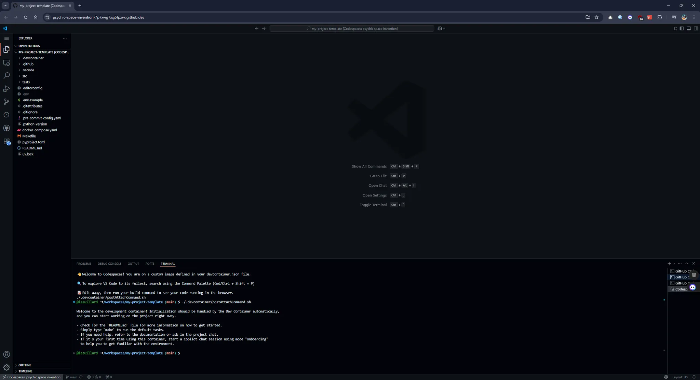
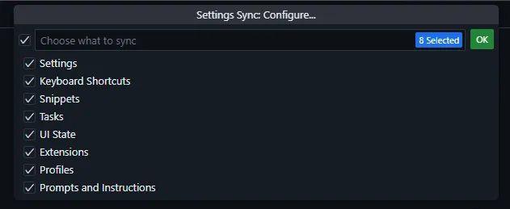

다들 개발 환경은 어떻게 구성하고 관리하고 계신가요? 아마도 Python 가상 환경(venv), pyenv, nodenv, poetry 등 여러 패키지 매니저나 환경 관리 도구를 활용하고 계실 것 같습니다. 저 역시 다양한 도구를 사용해봤지만, 최근에는 새 프로젝트를 시작할 때 개발 컨테이너 구성을 가장 우선하고 있습니다.

여러 간단한 토이 프로젝트를 시작하기 전에 매번 개발 환경에 많은 시간을 쏟았던 기억이 납니다. 하지만 개발 환경 구성에 너무 집중한 나머지, 정작 프로젝트 개발은 소홀해지곤 했습니다. 그리고 오래된 프로젝트를 다시 찾았을 때는 언어나 라이브러리 버전이 노후되어 개발 환경을 다시 갱신해야 했죠. 그런 저에게 개발 컨테이너는 여러 프로젝트를 오가며 다시 온보딩하는 시간을 크게 줄여줬습니다. 추가로 Dependabot 등 의존성 관리 자동화 도구도 큰 도움이 되었고요.

이 글에서는 많은 시행착오를 통해 습득한 개발 컨테이너 활용 방법과 경험을 공유하고자 합니다.

## 🐳 Dev Container(개발 컨테이너)란 무엇인가?

Dev Container(이하 개발 컨테이너)는 Docker와 같은 컨테이너 기술을 활용하여 개발 환경을 구성 및 관리하는 기술입니다. 컨테이너는 애플리케이션과 그 의존성을 격리된 환경에 패키징하는 기술로, 개발 컨테이너는 이를 개발 환경에 적용한 것입니다. 개발 컨테이너는 애플리케이션 실행, 개발에 필요한 도구 및 라이브러리, 런타임 관리, CI 등 다양한 목적으로 이용할 수 있습니다.


개발 컨테이너는 로컬, 원격 및 클라우드 환경에서 다양한 도구를 통해 실행될 수 있습니다. 잘 알려진 도구로는 Visual Studio Code, GitHub Codespaces, GitPod, JetBrains IDE 등이 있습니다.

또한 개발 컨테이너는 Docker 외에도 다양한 호환 도구(OrbStack, Podman 등)를 지원합니다. 다양한 템플릿([Dev Container Templates](https://containers.dev/templates))을 이용하거나 직접 설정 파일(`devcontainer.json`)을 추가하여 컨테이너화된 개발 환경을 시작할 수 있습니다. 또한 [Dev Container Features](https://containers.dev/features)를 활용하여 특정 도구의 설치 및 설정을 재사용할 수도 있습니다.

## 🎣 언제 개발 컨테이너를 활용하면 좋을까?

개발 컨테이너가 언뜻 보기에는 만능처럼 보이지만, 여느 기술이 그렇듯 모든 것에 활용할 수 있는 만능 도구는 아닙니다. 제가 생각하는 사용 사례는 다음과 같습니다.

### 👍 권장 사용 사례

- **팀 개발 환경 통일**

    공동 작업자(동료)와 공통 개발 환경을 공유하고 관리할 수 있으며 **"Works on my machine"** 문제에 대한 해결책이 될 수 있습니다.

- **복잡한 환경 구성 자동화**

    Docker Compose를 활용하여 여러 의존 서비스(데이터베이스, 캐시 등)를 가진 복잡한 환경 구성을 보다 효과적으로 관리할 수 있습니다.

- **일회용(Disposable) 개발 환경**

    쉽게 쓰고 버릴 수 있는 개발 환경을 구축하여 필요에 따라 쉽게 재구성할 수 있습니다. 개발 환경에 문제가 생기면 다시 만들면 됩니다. 또한 개발 환경을 반복적으로 재구성하면서 개발 환경의 개선 기회를 모색할 수 있습니다.

- **환경 격리**

    호스트 환경으로부터의 격리 이점(도구 및 설정, 네트워크 충돌 방지 등)을 누릴 수 있습니다.

### 👎 권장하지 않는 사용 사례

- **컨테이너 기술에 익숙하지 않은 경우**

    컨테이너 기술이 굉장히 보편화되었지만 구성 및 디버깅에 대한 러닝 커브가 분명히 존재합니다. 익숙하지 않다면 구성 및 관리에 많은 노력을 필요로 합니다.

    컨테이너는 어떤 환경에서건 잘 동작할 것처럼 보이지만 실제로는 OS / CPU 아키텍처 등 하드웨어에 대한 고려가 필요합니다. 필수 패키지 설치가 실패하거나 정상적으로 동작하지 않는 문제가 생길 수 있습니다.

- **도구 호환성 문제**

    [개발 컨테이너 표준](https://containers.dev/)이 존재하지만, 이에 대한 IDE / 코드 편집기 등 도구의 수용 수준은 차이가 있습니다.

    모든 IDE / 코드 편집기가 개발 컨테이너를 수용하는 것은 아니며, 환경에 따른 실제 동작 차이가 있을 수 있습니다.

- **호스트 의존성이 높은 경우**

    호스트로부터 파일 시스템, 네트워크 등 많은 부분이 분리되므로 호스트의 자원을 이용해야 하는 경우 볼륨 설정 등을 통해 다시 명시적으로 연결해야 할 필요가 있습니다.

- **높은 자원 요구 사항**

    디스플레이 및 상호작용이 중요한 GUI / 모바일 애플리케이션 개발을 위한 환경을 구성하고자 하는 경우 높은 자원 요구 사항으로 인해 성능 저하, 필요 이상으로 복잡한 환경 구성 및 호환성 문제 등이 발생할 수 있습니다.

    VM을 다뤄야 하는 경우 호스트 자원 공유, 권한 관리, 네트워크 구성 등 환경 구성이 크게 복잡해집니다. 이 경우 VM과 원격 SSH 연결([VS Code: Remote - SSH](https://code.visualstudio.com/docs/remote/ssh))을 활용하는 방안을 검토해보시기 바랍니다.

## 🚀 개발 컨테이너 시작하기

개발 컨테이너를 시작하는 방법은 많습니다. 로컬 환경에서는 VS Code와 Docker를 설치하여 시작할 수 있지만, 이 글에서는 어떤 도구도 설치할 필요가 없고 GitHub 계정만 있으면 바로 시작할 수 있는 [GitHub Codespaces](https://github.com/features/codespaces)를 이용하겠습니다.

로컬 환경에서 시작하고 싶다면 [VS Code 개발 컨테이너 공식 문서](https://code.visualstudio.com/docs/devcontainers/containers)를 참고하세요.

1. 예제 코드 저장소([lasuillard/my-project-template](https://github.com/lasuillard/my-project-template))를 엽니다.
   이 저장소는 개발 컨테이너가 미리 구성된 개인 프로젝트 템플릿입니다. 공식 Dev Container Template 기능과는 차이가 있습니다.

2. **Code - Codespaces - Create codespace on main**을 눌러 새 Codespaces를 시작합니다.

    

3. 개발 컨테이너 빌드가 시작됩니다. 대략 5~10분 정도 소요되며, 이 시간은 구성에 따라 차이가 있습니다. 빌드 후에는 Codespaces를 삭제하지 않는 한 기존 작업 환경을 재사용하게 됩니다.

    

4. 기다리면 빌드가 완료되고 개발 환경을 바로 시작할 수 있습니다.

    

5. 개발 컨테이너 환경을 둘러봅니다.

    

6. 사용이 끝났다면 Codespaces를 삭제합니다.

    

좀 더 완전한 구성을 위해서는 해야 할 일이 더 있습니다. 개발 컨테이너의 이점과 함께 따라오는 복잡성도 있습니다. 그리고 호스트로부터 분리된 환경이라는 특성도 함께 고려해야 합니다. 호스트에 있던 다양한 설정 파일들을 컨테이너 내에서는 사용할 수 없게 되었기 때문입니다.

## 🛠️ 개발 컨테이너 사용자화하기

이제 개인 설정을 개발 컨테이너에 주입하는 방법을 알아보겠습니다.

### 🔑 Git Credentials

Git 서명 기능을 이용한다면 GPG 또는 SSH를 활용하게 됩니다. 하지만 개인적으로 GPG는 관련 생태계와 복잡한 설정으로 좋은 경험을 하지 못했는지라 SSH를 활용하고 있습니다.

개발 컨테이너는 [Git 설정, SSH 및 GPG 공유 기능](https://code.visualstudio.com/remote/advancedcontainers/sharing-git-credentials)을 지원하므로 별도 설정 없이 이러한 설정을 개발 컨테이너에도 사용할 수 있습니다.

저는 Git 설정은 후술할 Dotfiles를 통해 관리하고, SSH는 1Password SSH 에이전트 기능을 활용하고 있습니다. 개발용 Linux 서버를 통해 개발 컨테이너를 시작하거나 개발 컨테이너 내에서 SSH를 이용해야 할 경우 다음과 같은 GUI를 통해 인증 후 SSH 키를 이용할 수 있게 됩니다.


1Password 외에도 Bitwarden과 같은 대안도 있으며, SSH 에이전트 기능도 제공합니다. Windows Hello와 같은 OS 인증 체계 통합도 지원하니 개발을 편리하게 만들어주는 요소 중 하나입니다.

### 🫥 Dotfiles

Dotfiles는 보통 사용자 홈(`$HOME`) 디렉터리에 저장되는 사용자 설정 파일(`.bashrc`, `.zshrc`, …)을 통칭하는 용어입니다. 그리고 이런 Dotfiles를 관리하기 위해 특별한 코드 저장소를 구축하여 관리하는 패턴이 널리 사용되고 있습니다.

VS Code 개발 컨테이너 확장 프로그램 및 GitHub Codespaces는 이러한 Dotfiles 저장소를 명시하고 설치 스크립트를 활용할 수 있도록 지원합니다.

- VS Code는 `dotfiles.*` 설정을 이용합니다.

    ```json
    {
    	"dotfiles.installCommand": "install.sh",
    	"dotfiles.repository": "lasuillard/dotfiles",
    	"dotfiles.targetPath": "~/dotfiles"
    }
    ```

- GitHub Codespaces의 경우, GitHub 개인 설정의 **Codespaces - Dotfiles** 설정을 이용해야 합니다. Codespaces를 활용하는 경우, GPG 키 주입이 GitHub에 의해 자동으로 이루어지므로 SSH보다 관리하기 편합니다.

    

흥미가 있다면 제 [Dotfiles 저장소](https://github.com/lasuillard/dotfiles)도 둘러보세요.

## 💡 팁

다음은 개발 컨테이너 및 원격 개발 환경에서 활용할 수 있는 팁 및 기능에 대한 설명입니다.

### ⚙️ 개발 컨테이너 설정 관리

프로젝트 개발 컨테이너 설정을 가능한 한 최소로, 가볍게 유지하세요. 꼭 필요한(MUST) 설정만 유지하고, 그 외의 개인적인 설정은 다른 설정 주입 방법을 활용하세요.

- 개인 에디터 설정은 User Settings를 활용하세요.

    `dev.containers.*`, `remote.*` 설정을 활용하세요. 생각보다 유용한 설정이 많습니다. 개인화된 설정을 위해 활용하기 좋은 설정은 다음과 같은 것들이 있습니다.
    - `dev.containers.copyGitConfig`

        개발 컨테이너 시작 시 호스트의 Git 설정을 개발 컨테이너로 복사하는 기능입니다. Git 설정을 Dotfiles로 관리한다면 이 설정을 끄는 편이 좋습니다.

    - `dev.containers.defaultExtensions`

        모든 개발 컨테이너에 공통적으로 설치할 확장 프로그램의 목록입니다.

    - `dev.containers.defaultFeatures`

        모든 개발 컨테이너에 공통적으로 설치할 Dev Container Feature 목록입니다.

- 개인 설정 파일(`.gitconfig`, `.vimrc` 등)은 Dotfiles를 활용하세요.
- 작업 공간에서 **강제되어야** 하는 설정은 VS Code 워크스페이스 설정(`.vscode/settings.json`)을 활용할 수 있지만, 꼭 필요한 최소한의 설정만을 공유하세요.
- 필요하다면 [Multi-root Workspaces](https://code.visualstudio.com/docs/editing/workspaces/multi-root-workspaces) 기능을 활용하여 워크스페이스 설정 또한 오버라이드할 수 있습니다.
- `*.example` 패턴을 활용하세요.

    `.env.example`, `.vscode.example` 등 비침습적이고 공유할 수 있는 예시를 제공하는 좋은 방법입니다.
    최대한의 유연성을 제공하고 싶다면 `.devcontainer` 디렉터리 또한 `.devcontainer.example`로 바꾸어 개발자가 직접 설정할 수 있도록 하는 것도 좋은 방법입니다.

### 🔄 Settings Sync

[Settings Sync](https://code.visualstudio.com/docs/configure/settings-sync)는 VS Code의 여러 설정 — 키보드 단축키, 코드 스니펫 / 사용자 정의 작업, 프로필 등을 여러 기기에 동기화할 수 있도록 도와주는 기능입니다.



동기화는 GitHub 계정 또는 Microsoft 계정을 통해 이루어집니다. 그러므로 여러 기기에서 연관 계정에 로그인하여 쉽게 VS Code 설정을 동기화할 수 있습니다.

이 기능은 사실 개발 컨테이너를 위해 필요한 설정은 아닙니다. 개발 컨테이너가 다른 기기에서 동작하더라도 에디터는 보통 사용자의 기기에서 동작하므로 사용자 설정은 개발 컨테이너에서도 유효합니다. 하지만 겸사겸사 알아두면 좋은 기능입니다.

### ☁️ Cloud Changes

Cloud Changes 또한 GitHub 또는 Microsoft 계정을 활용하여 현재 작업 공간의 변경 사항을 저장하고 여러 기기에서 불러와 작업을 재개할 수 있도록 도와주는 도구입니다.


Settings Sync와는 다르게 작업 상황은 자동 저장되지 않으므로 직접 관련 명령을 실행해야 합니다.

- Resume Latest Changes from Cloud
- Show Cloud Changes
- Store Working Changes in Cloud

저는 주로 **Store Working Changes in Cloud**로 변경 사항을 저장하고, **Show Cloud Changes**로 내역을 확인한 뒤 이어서 작업할 변경 사항을 직접 선택합니다.


저는 Git Stash 대신 또는 로컬 작업 사항을 백업하기 위해 사용하고 있습니다. 이 기능은 개발 컨테이너에 국한되지 않고, 로컬 개발 환경에서도 유용하게 활용할 수 있습니다. 또한 GitHub Codespaces와 같은 클라우드 개발 환경에서도 동일하게 사용할 수 있습니다.

## 💬 마치며

제 주 코드 편집기는 VS Code이어서 VS Code를 중점적으로 설명했습니다. 하지만 개발 컨테이너는 VS Code에 국한되지 않고, JetBrains IDE, GitPod 등 다양한 도구에서 활용할 수 있습니다. 따라서 이 글에서 설명한 내용은 다른 도구에서도 유사하게 적용될 수 있습니다.

개발 컨테이너는 편리한 기술이고, 활용 여지는 무궁무진합니다. 하지만 여느 도구나 그렇듯 모든 곳에 활용할 수 있는 만능 도구는 아닙니다. 프로젝트 성격과 요구 사항에 맞추어 적절히 조정한다면 분명 강력한 도구가 될 수 있을 것입니다.

## 📚 참고 자료

- [Development Containers](https://containers.dev/)
- [Available Dev Container Templates](https://containers.dev/templates)
- [Available Dev Container Features](https://containers.dev/features)
- [VS Code - Developing inside a Container](https://code.visualstudio.com/docs/devcontainers/containers)
- [VS Code - Remote Development using SSH](https://code.visualstudio.com/docs/remote/ssh)
- [VS Code - Sharing Git credentials with your container](https://code.visualstudio.com/remote/advancedcontainers/sharing-git-credentials)
- [VS Code - Settings Sync](https://code.visualstudio.com/docs/configure/settings-sync)
- [VS Code - Multi-root Workspaces](https://code.visualstudio.com/docs/editing/workspaces/multi-root-workspaces)
