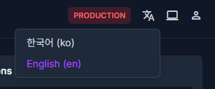
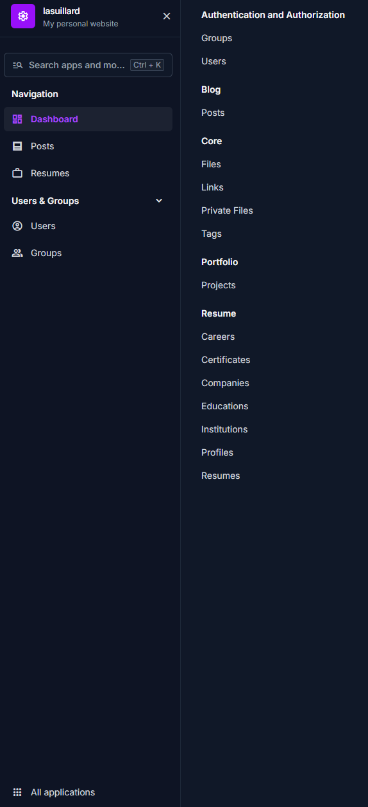
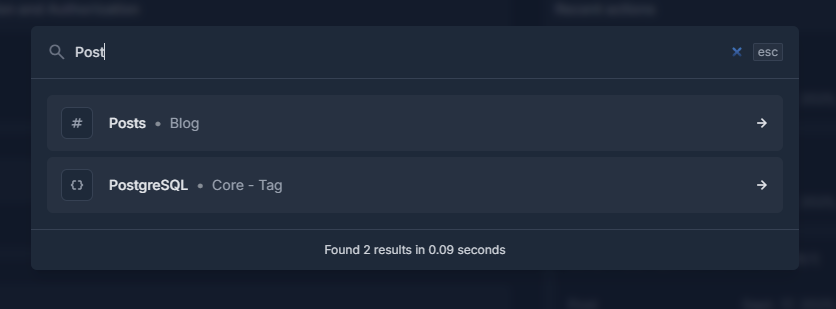
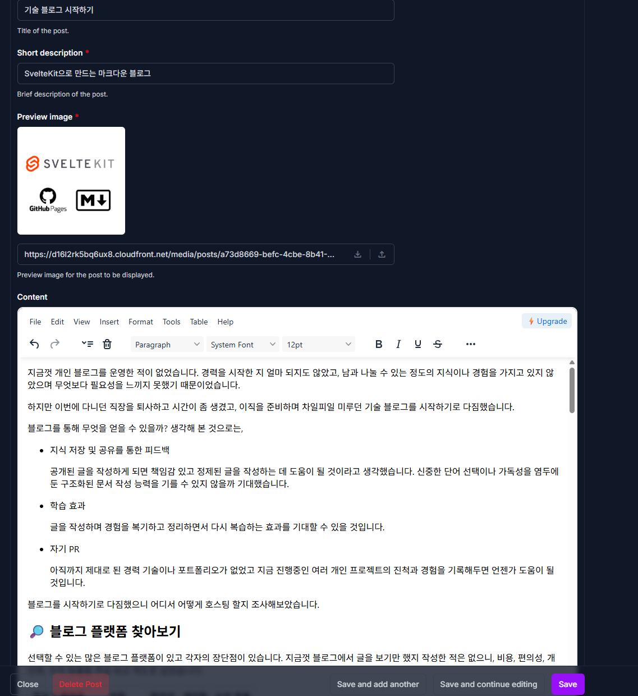
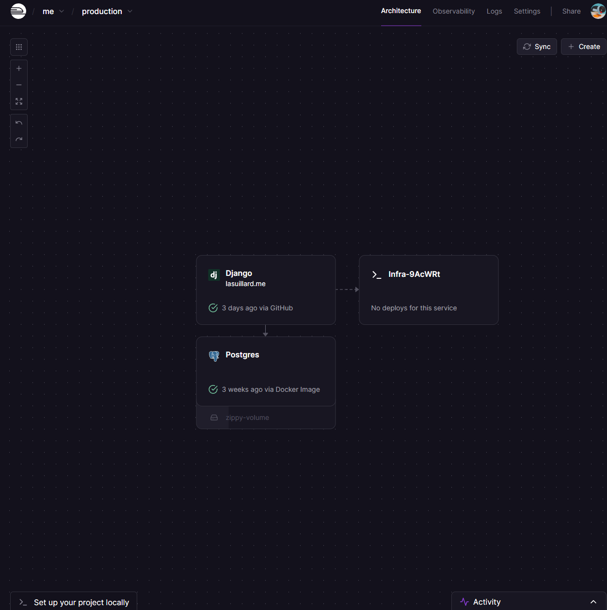
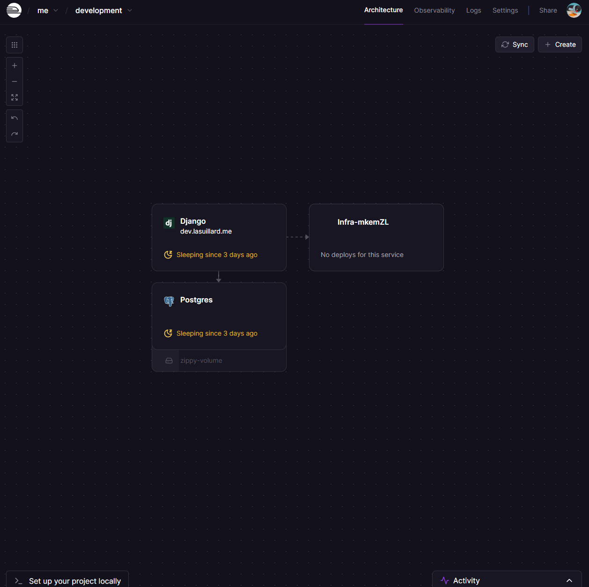
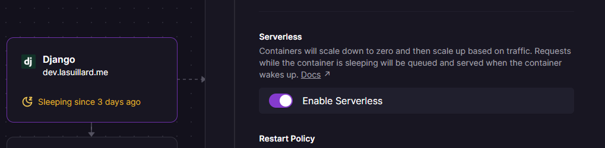
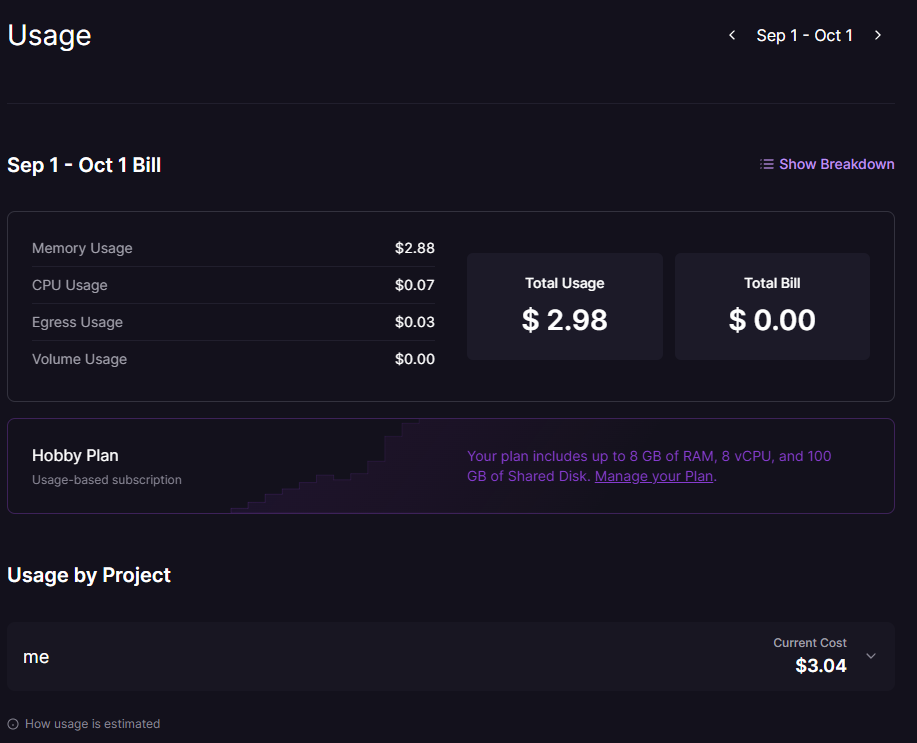

이전에 블로그를 만든 적이 있습니다. SvelteKit으로 작성한 마크다운 기반 블로그로, 처음에는 GitHub Pages에 배포하여 운영했었죠. 나중에는 Cloudflare Workers로 옮겨가며 이런저런 실험도 하고 추가 기능도 구현해 나갔었지만, 점차 정적 웹 페이지의 한계 및 불편함으로 전환을 계속 고려하고 있었습니다.

그리고 이번에 블로그를 Django로 완전히 다시 작성하게 되어 그 경험을 공유하려고 합니다.

## 🤔 문제점들

제게 전문적인 프론트엔드 개발 경험은 없습니다. 개인 프로젝트를 조금씩 해온 게 다였고 여태껏 일정 규모 이상을 넘어가지 않았습니다. 매번 프론트엔드 개발은 제게 여러모로 곤혹스러웠는데,

- **익숙하지 않은 생태계**

  대부분의 시간을 저는 Python 관련 사이드 프로젝트에 할애했고, 간간이 Rust를 배워나가려고 하는 입장이었습니다. 처음에는 TypeScript를 배우고 싶어서 시작했지만 제가 프론트엔드 개발 그 자체에 별다른 흥미를 느끼지 못한다는 걸 알게 된 이후로는 순전히 부담으로 다가왔습니다.

- **너무도 잦은 변화**

  의존성 패키지의 변경 주기가 굉장히 짧았습니다. 매달 Dependabot은 한 프로젝트에서만 10개 남짓한 패키지 업데이트 PR을 뿜어냈는데, 취약점 패치부터 메이저 버전 업그레이드(Svelte, SvelteKit, ESLint, Tailwind, &hellip;)까지 다양했습니다.

  제게는 이것이 생태계의 역동성이라기보다는 불안정성으로 느껴졌고, 정작 글을 쓰기보다 패키지 업데이트와 충돌을 해결하느라 시간을 더 쓰는 주객전도의 상황이 반복되기도 했습니다.

- **불편한 컨텐츠 에디터**

  정적 웹 페이지로 마크다운 블로그를 만드는 건 꽤 재밌는 일이었지만, 실제로 글을 VS Code에서 작성하고 관리하는 건 굉장히 불편했습니다. 매번 로컬 서버를 열어서 실제 렌더링 결과를 확인해야 했습니다.

- **정적 호스팅 및 컴퓨팅 리소스의 제약**

  정적 웹 사이트 이상의 무언가를 하려면 결국 비용이 발생하게 됩니다. Cloudflare Workers는 무료 사용자에게 10ms로 제한된 CPU 시간을 제공합니다. 간단한 작업에는 괜찮겠지만, 머잖아 걸림돌이 될 것이 뻔했습니다.

결국 비용을 지출해야 한다면 서버가 있는 편이 훨씬 낫겠다는 결론에 도달했습니다. 하지만 Node.js 환경을 그대로 이용하기보단 제게 가장 익숙한 Python 환경을 원했고, 서비스 규모가 굉장히 작으니 비용 또한 최소화하길 바랐습니다.

## 🧰 테크 스택

다음과 같은 스택을 구상했습니다.

| 항목                              | 선택 기술              |
| --------------------------------- | ---------------------- |
| 프로그래밍 언어                   | Python 3               |
| 프레임워크                        | Django                 |
| 데이터베이스                      | PostgreSQL             |
| 프론트엔드                        | Tailwind CSS + DaisyUI |
| 배포 환경                         | Railway                |
| 정적 / 미디어 파일 관리 및 호스팅 | S3 + CloudFront        |
| CI/CD                             | GitHub Actions         |
| 인프라 관리 (IaC)                 | Pulumi                 |

단순한 Django 기반 웹 프로젝트지만, 각 기술의 선택에는 나름의 고민과 이유가 있었습니다.

- **SQLite 대신 PostgreSQL**: 작은 블로그인 만큼, Railway 볼륨에 SQLite를 얹는 것으로 충분했을 수도 있습니다. 하지만 개인 프로젝트에서도 실무 수준의 프로덕션 기술 스택을 직접 구축하고 다루며 Postgres에 익숙해지고 싶어 선택했습니다.

- **S3 + CloudFront**: Railway의 과금 모델이 실제 사용량/트래픽 기반인 만큼, 서버의 불필요한 네트워크 부하와 전송 비용을 줄이기 위해 정적/미디어 리소스는 저렴한 AWS S3 + CloudFront로 제공했습니다. 아울러 최근 이슈가 되는 DoW(Denial of Wallet)[^1] 공격에 대한 최소한의 보호 계층 역할도 겸합니다.

- **Pulumi 기반 인프라 관리**: 별도의 IaC 코드 저장소에서 개인 프로젝트 전반의 인프라를 Pulumi로 통합 관리하고 있었기에, 블로그에 필요한 리소스도 가장 빠르고 일관되게 프로비저닝할 수 있었습니다.

- **Node.js 환경 일시 유지**: FE 의존성을 줄이고자 시작한 작업이지만, 기존 블로그의 Tailwind CSS와 DaisyUI, Playwright 설정을 재사용하여 마이그레이션 공수를 줄이고자 초기에는 Node 프로젝트를 내부에 유지했습니다. 추후 불필요한 Node 생태계를 완전히 걷어내고 Bulma CSS와 Python Playwright로 전면 교체하게 되었습니다.

[^1]: [Denial of Wallet - DoS](https://www.linkedin.com/pulse/denial-wallet-dos-christian-b-ellsworth-7cxde/)

## 🏗️ 컨텐츠 에디터

이번 전환에서 가장 중요한 건 블로그 글 작성과 관리가 용이해야 한다는 것이었습니다. 작성과 수정, 게시 / 비공개 전환 등 필요한 기능을 쉽게 만들고 필요하다면 추가할 수 있어야 했습니다. 그리고 Django 어드민을 최대한 활용하여 불필요한 코드 작성을 최소화해야 했습니다.

어드민 기능 확장과 커스터마이징에는 [django-unfold](https://github.com/unfoldadmin/django-unfold)를 적극적으로 활용했습니다. Unfold는 Django 어드민을 사용하면서 한 번쯤 필요했던 기능들이 대거 포함되어 있습니다.

- **동작 환경, 언어 및 테마 선택**

  

- **쉽게 커스터마이징 가능한 사이드바**

  

- **커맨드 기능**

  

이 외에도 `ImageField` 미리보기, 탭, 색상 선택 및 WYSIWYG 위젯 등, 기능이 너무도 많아 모두 열거할 수는 없지만 작은 Django 어드민 라이브러리 10 ~ 20개 분량의 기능은 포함하고 있습니다. 또한 유명한 여러 라이브러리([django-import-export](https://github.com/django-import-export/django-import-export), [django-constance](https://github.com/jazzband/django-constance), [django-celery-beat](https://github.com/celery/django-celery-beat) 등)에 대한 지원도 포함합니다.

### ✏️ 블로그 글 작성 및 관리

블로그 글 작성과 관리를 위해 WYSIWYG 에디터로 [TinyMCE](https://www.tiny.cloud/) ([django-tinymce](https://github.com/jazzband/django-tinymce))를 선택했습니다. 정적 및 미디어(첨부 파일, 이미지 등) 파일은 S3에 저장하고, CloudFront를 통해 제공합니다.



포스트의 첨부 파일 관리를 위해서 TinyMCE의 `images_upload_url` 콜백을 이용하여 글 작성 중 업로드된 이미지를 Django 모델로 관리하게끔 했습니다.

```python
# https://github.com/jazzband/django-tinymce/issues/356#issuecomment-2423819791
@staff_member_required
def tinymce_upload(request: HttpRequest) -> JsonResponse:
   """TinyMCE editor file uploads handler.
   This view is restricted to staff members, as this project uses TinyMCE internally
   for writing blog posts.
   """
   if request.method != "POST" or not request.FILES.get("file"):
       return JsonResponse({"error": "Invalid request"}, status=400)
   uuid = request.POST.get("uuid")
   logger.debug("Uploading file for association UUID: %s", uuid)
   file = request.FILES["file"]
   file_instance = File.objects.create(file=file, association_uuid=uuid)  # ty: ignore[unresolved-attribute]
   return JsonResponse({"location": file_instance.file.url})
```

## 🌐 Django SSR을 활용한 UI 구현

그리고 웹 페이지들은 Django View와 HTML 템플릿으로 구현했습니다. 분리된 FE/BE 개발 환경에서는 API를 정의, 구현 그리고 다시 연동하는 과정이 꽤 수고로웠는데 SSR에서는 그러한 소요가 많이 줄어들어 굉장히 편했습니다.

Django SSR만을 이용하여 웹 프로젝트를 진행한 것은 처음이었습니다. 하지만 직관적이고 명료한 문법, 다양한 템플릿 태그 및 필터 지원 등과 유용한 디버깅 도구([django-debug-toolbar](https://github.com/django-commons/django-debug-toolbar))의 도움으로 구현 및 테스트 작성이 편리해 많은 도움이 되었습니다.

일단 대부분의 기능은 구현했지만, 당장 필요하지 않은 기능은 잠시 제쳐두었습니다. 초기에는 비동기 상호작용을 위해 HTMX 도입을 고려했으나, 실제 구현해 보니 가벼운 바닐라 JavaScript만으로도 충분하여 당장은 불필요한 의존성을 늘리지 않기로 했습니다. 댓글이나 사이트 테마 같은 기능들도 추후에 점진적으로 추가할 생각입니다.

## 🛤️ Railway에 Django 애플리케이션 배포하기

애플리케이션 및 데이터베이스는 [Railway](https://railway.com/)에 배포했습니다. Railway는 직관적이고 사용성 좋은 웹 기반 UI를 제공하여 여러 서비스를 손쉽게 배포하고 서로 연계할 수 있습니다.



> ❓ `Infra-*` 서비스는 Pulumi IaC로 관리하는 인프라 설정값(S3 버킷 이름, IAM 인증 정보 등)을 중앙에서 주입받아 공유하기 위한 빈(Empty) 중간 서비스로, [Railway 변수 참조 기능](https://docs.railway.com/reference/variables#reference-variables)으로 설정값을 참조하여 이용합니다. Pulumi를 통해 관리되는 인프라 리소스임을 명확히 하고 애플리케이션에서 분리함으로써 상호 영향 범위를 최소화하기 위함입니다.

처음 AWS EC2를 이용할 때 사용량 기반 과금이라는 말에 CPU / 메모리 실제 사용량 기반으로 오해했던 적이 있습니다. 흥미롭게도 Railway의 과금은 **실제** CPU, 메모리, 스토리지 및 네트워크 사용량에 기반합니다. 또한 서버리스 실행 옵션도 있어 자주 사용하지 않는 (예: 개발 환경) 서비스는 요금을 최소화할 수도 있습니다.



### ⚡ 서버리스 및 비용 구조

서버리스 구성에는 별도로 애플리케이션에서 처리해야 할 일이 없습니다. Railway에서 알아서 처리해줍니다. 해야 할 일은 **Enable Serverless** 설정을 건드는 것 뿐입니다.



서버리스 모드는 요청이 없을 때 컨테이너를 유휴 상태로 만들어 비용을 절약하는 데 도움을 줍니다. 다만 웹 서버와 데이터베이스가 모두 잠든 상태에서 첫 요청이 들어오면 깨어나는 데(Cold Start) 약 5 \~ 10초 정도의 딜레이가 발생했습니다. 개발이나 테스트 환경에서는 매우 유용하지만, 블로그 방문자에게는 꽤 답답한 지연일 수 있어 실제 프로덕션 환경에서는 서버리스 모드를 비활성화해 두었습니다.

실제 서비스 재작성 중 발생한 비용은 0.5 USD에 불과했고, Celery를 추가로 구성한 지금은 월 4 \~ 5 USD정도 크레딧(Hobby 플랜에는 매달 $5의 크레딧 포함)을 사용하고 있습니다. 이에 더해 사용량 한도(Hard Limit)를 설정할 수도 있어서 과도한 비용 발생을 막을 수 있습니다.



### ⚠️ Railway의 단점

Railway의 사소한(?) 단점들은 다음과 같습니다.

- **공식 IaC Provider 부재**

  공식 Terraform 및 Pulumi Provider가 없기에 커뮤니티에서 제공하는 [railway-community-provider](https://registry.terraform.io/providers/terraform-community-providers/railway/latest/docs/resources/service)를 이용해야 합니다. 특히 Pulumi의 경우 공식 및 커뮤니티 프로바이더 구현이 없어 [Terraform Providers](https://www.pulumi.com/docs/iac/get-started/terraform/terraform-providers/) 브릿지를 거쳐 연동해야 합니다.

- **무료 사용자 플랜이 없음**

  30일의 체험 기간 동안 $5의 크레딧을 제공하며 이는 테스트에 충분한 양이지만 이후에는 최소 $5/월(Hobby Plan) 비용을 지불해야 합니다. 굉장히 작은 프로젝트를 무료로 배포하고자 한다면 다른 호스팅 서비스를 고려하는 편이 좋습니다.

- **빌드 및 배포 전/후 제한적 커스텀**

  제 간단한 블로그 서비스를 배포하는 데에는 큰 문제는 없었지만, 복잡한 배포 라이프사이클을 요구하는 경우 설정에 좀 더 공을 들이거나 빌드 및 배포를 직접 구현해야 할 수도 있습니다.

## 💭 마치며

사이트를 재작성하는 데에는 1달 정도 걸렸습니다. 생각해보면 Django SSR만으로 웹 사이트를 구현한 적이 없었습니다. 학부생 시절에는 SPA 열풍이 불고 있었고, 저 또한 그 흐름에 휩쓸려 Django REST Framework와 Vue.js 2로 처음 웹 개발을 시작했던 기억이 납니다. 그 이후로 SSR을 쓸 일이 거의 없었습니다. SPA가 표준 웹 개발 방식처럼 여겨졌고, SSR은 구식이라는 인식이 강했기 때문입니다.

또한 Django는 충분히 좋은 프레임워크라는 사실을 재차 확인하게 되었습니다. SSR은 직관적이고 단순했고 REST API의 정의 및 연동이 필요하지 않아 작업량이 크게 줄었습니다. 문제 해결을 위해 찾아볼 수 있는 참고 자료도 굉장히 많아 큰 도움이 되었습니다. 어드민을 통해 필요한 관리 기능을 쉽고 빠르게 구현할 수 있었고, Unfold를 통해 어드민의 아쉬운 부분들을 보완할 수 있었습니다.

앞으로는 블로그 뿐만 아니라 개인적으로 이용하기 위한 여러 기능들을 구현하여 이용하려고 합니다.
