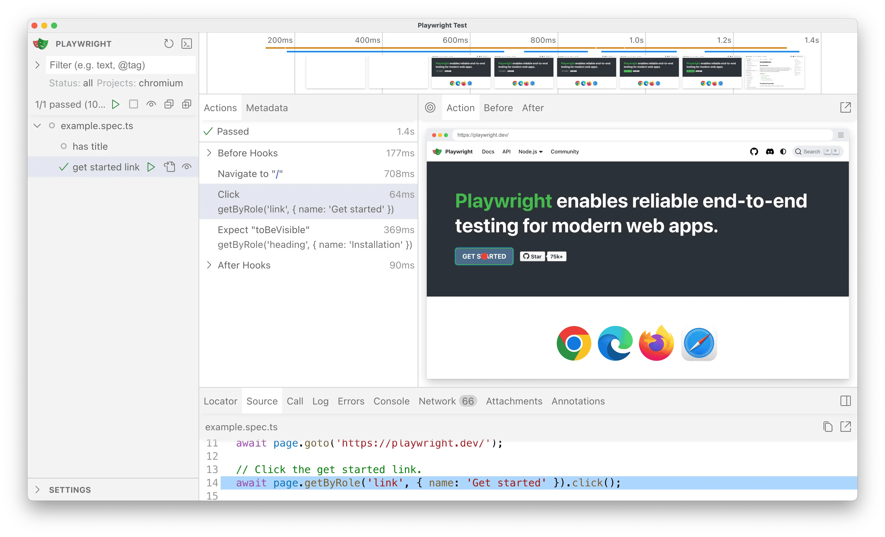
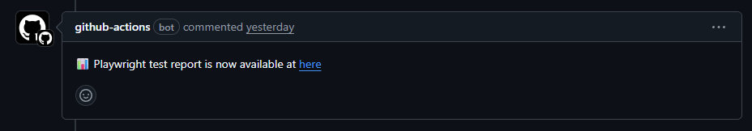
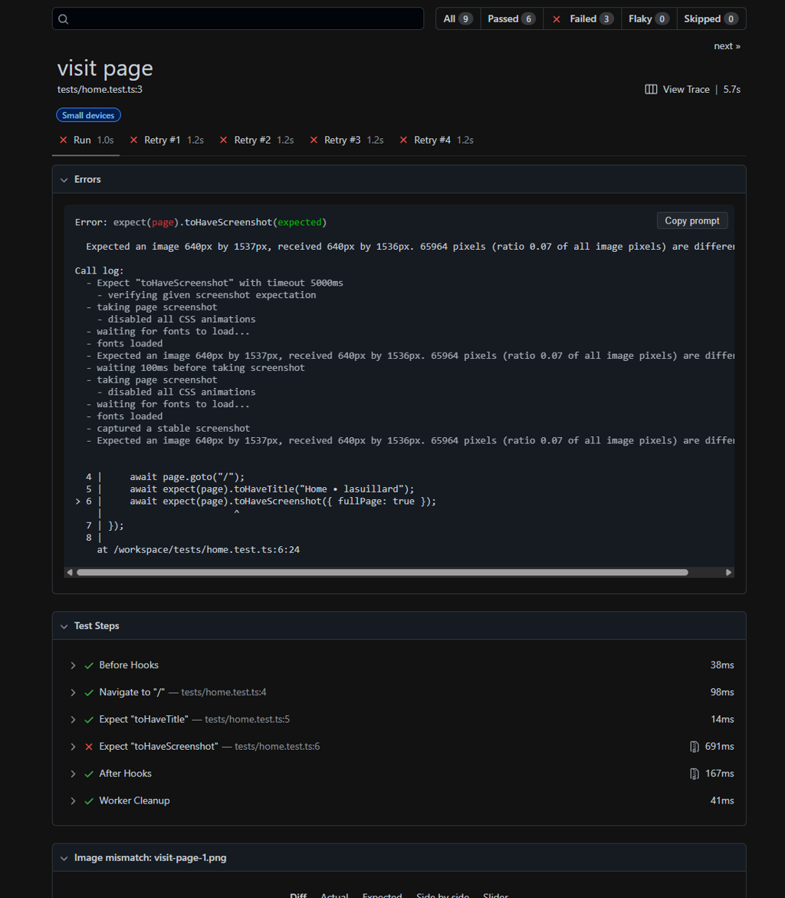
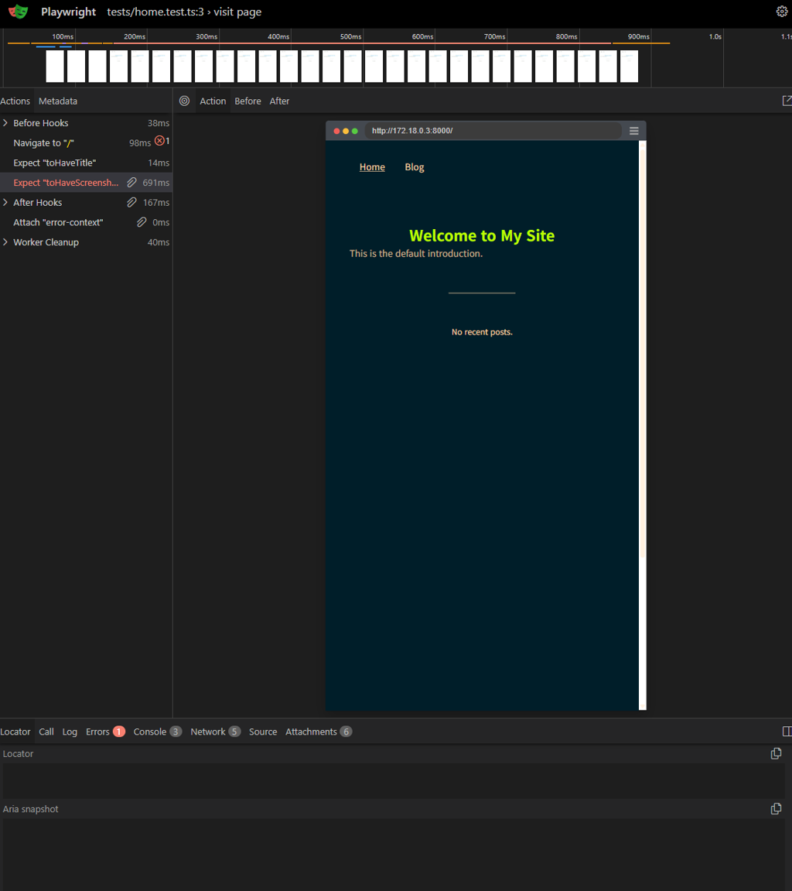

여러 작은 사이드 프로젝트를 하다 보면 테스트 환경 구성에 많은 시간을 투자하곤 합니다. Test-first TDD를 엄격히 따르는 편은 아닙니다. 하지만 산만한 저는 자잘한 프로젝트를 많이 해보는 편이라, 언제 손을 놓아도 언제든 다시 작업할 수 있는 개발 환경을 갖추는 것이 특히 중요합니다.

기능에 UI가 포함되는 경우에는 종단 간 테스트를 위해 Playwright를 이용하고 있습니다. 하지만 매번 GitHub에서 테스트 결과를 직접 확인하는 것은 꽤 불편하게 느껴졌습니다.

워크플로 아티팩트를 다운로드하는 대신, PR에서 링크를 열고 바로 HTML 테스트 보고서를 확인할 수 있으면 좋겠다고 생각했습니다.

이번에는 AWS S3와 CloudFront를 활용하여 Playwright 테스트 리포트를 브라우저에서 쉽고 빠르게 확인하는 간단한 워크플로에 대해 이야기하려고 합니다.

## 🎭 Playwright

[Playwright](https://playwright.dev/)는 Microsoft에서 관리하는 오픈소스 E2E 테스트 프레임워크입니다. 다양한 브라우저 및 플랫폼, 프로그래밍 언어 지원 등으로 많은 인기를 끌고 있습니다. 또한 웹 스크래핑에 사용하는 사례도 쉽게 확인할 수 있습니다.



Playwright를 선택하게 된 데에는 다음과 같은 이유가 있습니다:

- Cypress나 Puppeteer, Selenium과 비교했을 때 가장 구성 및 실행이 편리했습니다. 브라우저 및 시스템 의존성 설치를 알아서 합니다.

- 브라우저 UI 및 다양한 확장(VS Code Extension, MCP)을 지원하며 좋은 사용 경험을 제공합니다.

- 공식 문서가 잘 관리되어 있으며 생태계가 활발합니다. 참고할 수 있는 글과 문서가 굉장히 풍부하며 Microsoft에서 관리하므로 짧은 시일 내에 문제가 발생할 가능성이 적습니다.

## 🪣 임시 웹 호스팅

Playwright HTML 보고서를 브라우저에서 다운로드 과정 없이 쉽고 빠르게 확인하려면 간단한 정적 호스팅이 필요합니다. 임시 웹 페이지 호스팅이 간단해야 하고, 여러 PR에서 생성된 보고서를 쉽게 확인할 수 있어야 합니다.

또한 오래된 웹 페이지를 자동 만료시킬 수 있다면 더욱 편리하겠죠. 

이 모두를 만족하는 가장 가성비 좋은 솔루션은 AWS S3와 CloudFront입니다.

- S3 라이프사이클 규칙을 통해 오래된 보고서는 자동으로 삭제할 수 있어 비용 발생을 최소화할 수 있습니다.

- S3를 외부에 노출하지 않고 CloudFront를 통해 접근하기 때문에 S3에 대한 공격을 대거 미연에 방지할 수 있습니다.

- CloudFront 정액 요금제(Flat Rate Pricing, [2025년 11월에 출시](https://aws.amazon.com/ko/blogs/korea/introducing-flat-rate-pricing-plans-with-no-overages/))를 이용하면 과도한 요금 발생을 막을 수 있습니다. 주의해야 할 점은, 정액 요금제로 전환한 CloudFront 인스턴스는 기존 종량 요금제로 전환해야 삭제할 수 있다는 점입니다.

### 📜 Pulumi 인프라 정의

다른 프로젝트에서도 Playwright를 사용하고 있거나 앞으로도 사용할 계획이 있기 때문에 Pulumi로 그 구성을 정의해두고 다른 프로젝트에서도 재사용하기로 했습니다.

```python
import pulumi_aws as aws
from pulumi import Output

bucket = aws.s3.Bucket(
   "playwright-reports",
   bucket_prefix="playwright-reports-",
   force_destroy=True,
)
public_access_block = aws.s3.BucketPublicAccessBlock(
   "playwright-reports",
   bucket=bucket.id,
   block_public_acls=True,
   block_public_policy=True,
   ignore_public_acls=True,
   restrict_public_buckets=True,
)
ownership_control = aws.s3.BucketOwnershipControls(
   "playwright-reports",
   bucket=bucket.id,
   rule={
       "object_ownership": "BucketOwnerEnforced",
   },
)
aws.s3.BucketLifecycleConfiguration(
   "playwright-reports",
   bucket=bucket.id,
   rules=[
       {
           "id": "Expire reports older than 7 days",
           "status": "Enabled",
           "expiration": {
               "days": 7,
           },
       },
   ],
)

_oac = aws.cloudfront.OriginAccessControl(
   "playwright-reports",
   description="OAC for public assets",
   origin_access_control_origin_type="s3",
   signing_behavior="always",
   signing_protocol="sigv4",
)
_target_origin_id = Output.format("s3-{bucket}", bucket=bucket.bucket)
# TODO: CloudFront flat-rate plans: https://github.com/hashicorp/terraform-provider-aws/issues/45450
cdn = aws.cloudfront.Distribution(
   "playwright-reports",
   enabled=True,
   comment=bucket.id,
   origins=[
       {
           "domain_name": bucket.bucket_regional_domain_name,
           "origin_id": _target_origin_id,
           "origin_access_control_id": _oac.id,
       },
   ],
   default_cache_behavior={
       "target_origin_id": _target_origin_id,
       "allowed_methods": ["GET", "HEAD", "OPTIONS"],
       "cached_methods": ["GET", "HEAD"],
       "cache_policy_id": "658327ea-f89d-4fab-a63d-7e88639e58f6",  # CachingOptimized
       "origin_request_policy_id": "88a5eaf4-2fd4-4709-b370-b4c650ea3fcf",  # CORS-S3Origin
       "response_headers_policy_id": "60669652-455b-4ae9-85a4-c4c02393f86c",  # SimpleCORS
       "viewer_protocol_policy": "redirect-to-https",
   },
   restrictions={
       "geo_restriction": {
           "restriction_type": "none",
       },
   },
   viewer_certificate={
       "cloudfront_default_certificate": True,
   },
   wait_for_deployment=False,
   tags={
       "Name": bucket.id,
   },
)
aws.s3.BucketPolicy(
   "playwright-reports",
   bucket=bucket.id,
   policy=aws.iam.get_policy_document(
       statements=[
           {
               "sid": "AllowCloudFrontServicePrincipalReadOnly",
               "actions": ["s3:GetObject"],
               "resources": [Output.concat(bucket.arn, "/*")],
               "principals": [
                   {
                       "type": "Service",
                       "identifiers": ["cloudfront.amazonaws.com"],
                   },
               ],
               "conditions": [
                   {
                       "test": "StringEquals",
                       "variable": "AWS:SourceArn",
                       "values": [cdn.arn],
                   },
               ],
           },
       ],
   ).json,
)
aws.s3.BucketCorsConfiguration(
   "playwright-reports",
   bucket=bucket.id,
   cors_rules=[
       {
           "id": "AllowAll",
           "allowed_methods": ["GET"],
           "allowed_headers": ["*"],
           "allowed_origins": ["*"],
           "expose_headers": [],
           "max_age_seconds": 3_000,
       },
   ],
)
```

이 외에도 GitHub Actions 변수 자원을 관리하는 코드가 있어 GitHub Actions 환경으로 변수 및 비밀값 삽입 또한 Pulumi에서 처리하고 있습니다. AWS 인프라에 인증하기 위한 OIDC 구성 등도 Pulumi에서 관리하고 있습니다.

## ⚙️ Playwright HTML 리포트 생성하기

테스트 후 HTML 리포트를 생성하도록 Playwright 설정을 갱신해야 할 필요가 있습니다. `$.reporter` 설정을 변경하여 HTML 리포트를 생성하도록 해줍니다.

```javascript
{
  // ...
  reporter: [
    ['list'],
    [
      'html',
      {
        open: process.env.CI ? 'never' : 'on-failure',
        host: process.env.CONTAINER ? '0.0.0.0' : '127.0.0.1'
      }
    ],
    ['junit', { outputFile: 'junit.xml' }]
  ],
  // ...
}
```

생성된 리포트는 `playwright-report/` 디렉토리에 저장됩니다. 남은 것은 이 파일을 S3에 업로드하는 것 뿐입니다.

## 📰 테스트 리포트 업로드하기

이제 CI 워크플로 내용을 갱신하여 HTML 리포트를 S3에 업로드하고 [thollander/actions-comment-pull-request](https://github.com/thollander/actions-comment-pull-request)를 이용하여 PR에 댓글을 남깁니다. [AWS OIDC](https://docs.github.com/en/actions/how-tos/secure-your-work/security-harden-deployments/oidc-in-aws)를 이용하여 임시 인증 정보를 발급받은 뒤 S3에 업로드하며, 업로드를 위한 IAM 정책은 연관된 IAM 역할에 극히 제한적으로 부여되어 있습니다.

```yaml
steps:
  # ...

  - name: Configure AWS credentials
    uses: aws-actions/configure-aws-credentials@ec61189d14ec14c8efccab744f656cffd0e33f37 # v6
    with:
      aws-region: ${{ vars.AWS_REGION }}
      role-to-assume: ${{ secrets.AWS_ROLE_TO_ASSUME }}

  # ... Set up and run Playwright tests

  - name: Upload Playwright report to GitHub
    uses: actions/upload-artifact@bbbca2ddaa5d8feaa63e36b76fdaad77386f024f # v7
    if: always()
    with:
      name: playwright-artifacts
      path: |
        e2e/playwright-report/
        e2e/test-results/
        e2e/run-*.log
      retention-days: 7

  - name: Upload Playwright report to S3
    id: upload-playwright-report-s3
    if: always()
    env:
      PLAYWRIGHT_REPORT_S3_PREFIX: playwright-report-${{ github.run_id }}
    run: |
      aws s3 cp --recursive \
        e2e/playwright-report/ \
        "s3://${{ vars.PLAYWRIGHT_REPORTS_BUCKET }}/${{ env.PLAYWRIGHT_REPORT_S3_PREFIX }}/"

      report_index_url="https://${{ vars.PLAYWRIGHT_REPORTS_CDN }}/${{ env.PLAYWRIGHT_REPORT_S3_PREFIX }}/index.html"
      cat <<EOF | tee ./playwright-report.md $GITHUB_STEP_SUMMARY
      📊 Playwright test report is now available at [here](${report_index_url})
      EOF

  - name: Comment on PR
    uses: thollander/actions-comment-pull-request@24bffb9b452ba05a4f3f77933840a6a841d1b32b # v3
    if: always() && steps.upload-playwright-report-s3.outcome == 'success' && github.event_name == 'pull_request'
    with:
      comment-tag: playwright-report
      file-path: ./playwright-report.md
```

테스트가 완료되면 PR에 댓글이 달립니다.



링크를 클릭하면 보고서를 바로 확인할 수 있습니다. 테스트 케이스의 상세 내용 또한 확인할 수 있습니다.



실패한 테스트 케이스의 경우 Playwright 설정에 따라 트레이스, 스크린샷 스냅샷의 변경 상세 등이 테스트 결과 상세에 포함되어 자세한 내용을 확인할 수 있습니다.



## 🤔 아쉬운 점

- Playwright를 필요로 하는 프로젝트마다 워크플로를 각자 구성해야 하고, 워크플로에 AWS 접근 권한을 부여해야 하며, 프로젝트별로 인프라 리소스를 각각 관리해야 합니다.

  그래서 GitHub App이나 커스텀 GitHub Action을 만들어서 여러 프로젝트에서 재사용하는 방식을 고려하고 있습니다.

- PR에서 스냅샷을 업데이트할 수 있다면 좀 더 편리할 것 같습니다. 이번에는 다루지 않았지만 앞으로 필요해질 것 같습니다.

- 개발 환경과 CI 환경 사이의 불일치를 해소해야 합니다. 저는 Docker를 이용해 Playwright 테스트를 실행하고 있지만, 이 방법은 Docker 빌드로 인해 테스트 실행 시간이 길어지는 단점이 있습니다.

## 💭 마치며

간단한 자동화지만 Playwright 테스트 리포트를 브라우저에서 쉽고 빠르게 확인할 수 있어 편리해졌습니다. 또한 오래된 보고서는 자동으로 삭제되므로 비용 발생을 최소화할 수 있습니다. 하지만 제한된 확장성은 여전히 발목을 잡고 있습니다. 다음에는 여러 프로젝트에 쉽게 재사용할 수 있는 GitHub App이나 커스텀 GitHub Action을 만들어 글로 정리해보려고 합니다.

## 🔗 참고한 글

- [https://afsalbacker.medium.com/access-playwright-trace-viewer-reports-online-via-amazon-s3-51fd365d80f6](https://afsalbacker.medium.com/access-playwright-trace-viewer-reports-online-via-amazon-s3-51fd365d80f6)
- [https://medium.com/@haleywardo/streamlining-playwright-visual-regression-testing-with-github-actions-e077fd33c27c](https://medium.com/@haleywardo/streamlining-playwright-visual-regression-testing-with-github-actions-e077fd33c27c)
