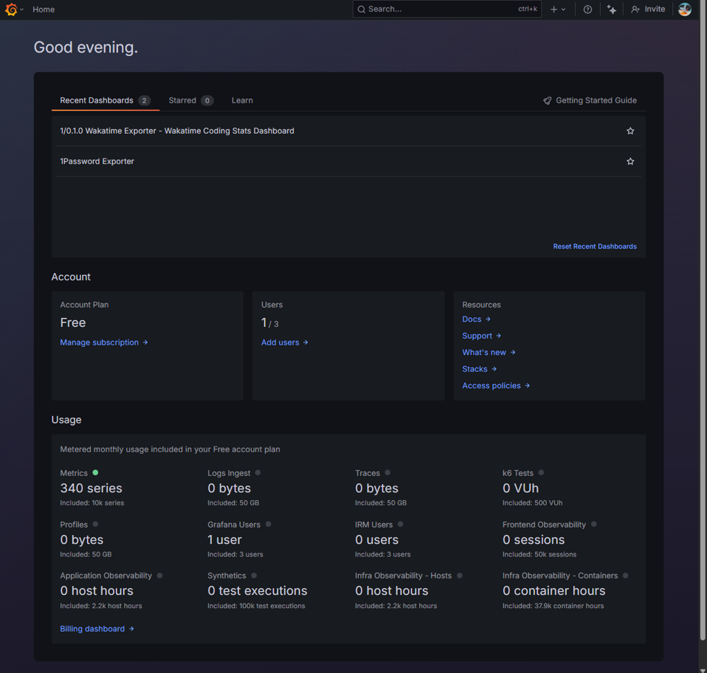
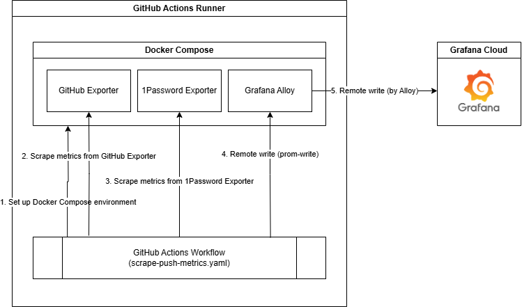
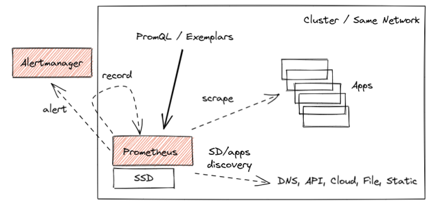
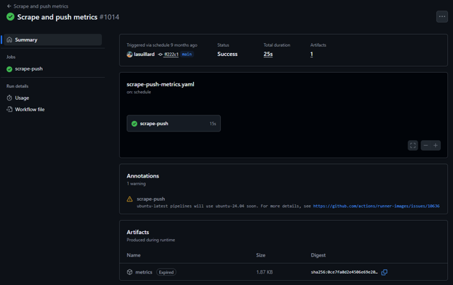
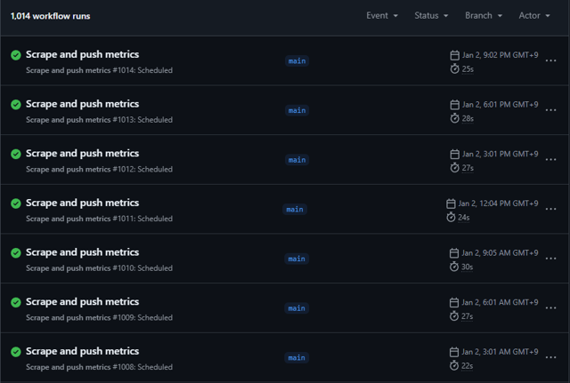
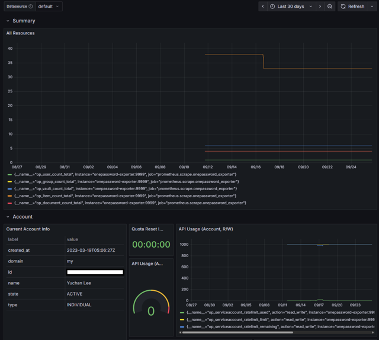

Rust 기초를 배워볼 생각으로 간단한 애플리케이션([1password-exporter](https://github.com/lasuillard-s/1password-exporter))을 만든 적이 있었습니다. 1Password 사용량 메트릭을 수집하는 Prometheus Exporter입니다.

수집한 메트릭을 저장 및 시각화하기 위해 Grafana Cloud Free를 활용했지만, Exporter와 에이전트(Grafana Alloy)가 수시로 동작할 서버가 필요했습니다. 로컬 서버에 켜두거나 클라우드에 호스팅하는 대신, GitHub Actions를 활용한다면 월간 무료 제공 사용량 내에서 비용 발생 없이 메트릭을 수집할 수 있을 것 같다는 생각이 들었습니다.

이번에는 GitHub Actions를 활용하여 메트릭을 수집해 본 경험을 나누려고 합니다.

## ☁️ Grafana Cloud

[Grafana Cloud](https://grafana.com/products/cloud/)의 Free 플랜을 활용하면 메트릭(및 로그, 트레이스 등)을 저장하고 시각화할 수 있는 인프라를 무료로 이용할 수 있습니다.



Grafana Cloud Free는 조건 없는 무료 사용량을 제공합니다. Cloud Free 플랜 사용자는 데이터 저장 상한도 적고(10K 메트릭, 50GB 로그/트레이스 등&hellip;) 보존 기간도 14일로 매우 짧아 실 운영 서비스에는 적합하지 않지만, 간단한 개인 프로젝트를 운영하며 모니터링 시스템 연동 및 사용 경험을 쌓기에는 적당한 양이라 생각합니다.

나중에는 더 오랜 기간 메트릭을 보존했으면 하는 생각은 있지만, 지금 당장은 이 정도로도 만족스러웠습니다.

## 🔀 GitHub Actions로 메트릭 수집 및 전달하기

이제 Exporter를 실행하고 이 메트릭을 수집, 전달하기 위해 GitHub Actions 인프라를 활용했습니다. 1Password 개인 계정의 사용량은 변화가 매우 더디기 때문에 수집 빈도가 뜸해도 상관없었습니다. 1 ~ 2시간에 한 번만 수집해도 적당했습니다.

GitHub는 무료 사용자의 비공개 저장소에도 월 2,000분(공개 저장소는 무제한)의 실행 시간을 제공합니다. 1시간에 1번, 약 1 ~ 2분 소모한다고 가정했을 때 월 1,000분 정도면 여유가 있습니다.



GitHub Actions 러너 위에서 필요한 컨테이너들을 일괄 관리하기 위해 Docker Compose를 활용했습니다. 1Password Exporter 말고도 관심 있는 다른 메트릭을 수집하기 위해 GitHub Exporter도 추가해보았습니다.

### 🐳 Docker Compose 및 Alloy 구성

```yaml
services:
  alloy:
    image: grafana/alloy:v1.3.1
    ports:
      - ${ALLOY_HOST:-127.0.0.1}:${ALLOY_PORT:-8080}:8080
    volumes:
      - ./config.alloy:/etc/alloy/config.alloy
    environment:
      PROMETHEUS_REMOTE_WRITE_URL: ${PROMETHEUS_REMOTE_WRITE_URL:?}
      PROMETHEUS_REMOTE_WRITE_USERNAME: ${PROMETHEUS_REMOTE_WRITE_USERNAME:?}
      PROMETHEUS_REMOTE_WRITE_PASSWORD: ${PROMETHEUS_REMOTE_WRITE_PASSWORD:?}
    command: run /etc/alloy/config.alloy

  github-exporter:
    image: githubexporter/github-exporter:1.2.0
    ports:
      - ${GITHUB_EXPORTER_HOST:-127.0.0.1}:${GITHUB_EXPORTER_PORT:-9171}:9171
    environment:
      GITHUB_TOKEN: ${GITHUB_TOKEN:?}
      USERS: lasuillard

  onepassword-exporter:
    image: lasuillard/1password-exporter:0
    ports:
      - ${OP_EXPORTER_HOST:-127.0.0.1}:${OP_EXPORTER_PORT:-9999}:9999
    environment:
      OP_SERVICE_ACCOUNT_TOKEN: ${OP_SERVICE_ACCOUNT_TOKEN:?}
    init: true
    command: --log-level DEBUG --host 0.0.0.0 --metrics account build-info document group item service-account user vault
```

Grafana Alloy(Grafana 생태계의 통합 텔레메트리 에이전트)는 여기서 메트릭을 직접 수집하지 않고, Remote Write API로 전달받은 메트릭을 Grafana Cloud로 전달하는 프록시 역할을 담당합니다. 추후 여러 Exporter가 추가되더라도 Alloy가 단일 수집·전송 허브 역할을 맡게 하여 관리를 단순화하고, 파이프라인 확장을 유연하게 만들기 위함입니다.

<!-- NOTE: Strictly, .alloy file is not HCL. But its syntax is similar enough for syntax highlighting -->

```hcl
prometheus.receive_http "default" {
	http {
		listen_address = "0.0.0.0"
		listen_port    = 8080
	}
	forward_to = [prometheus.remote_write.grafana_cloud.receiver]
}

prometheus.remote_write "grafana_cloud" {
	endpoint {
		url = env("PROMETHEUS_REMOTE_WRITE_URL")

		basic_auth {
			username = env("PROMETHEUS_REMOTE_WRITE_USERNAME")
			password = env("PROMETHEUS_REMOTE_WRITE_PASSWORD")
		}
	}
}
```

일반적으로 Prometheus 모니터링 환경에서는 수집 에이전트가 대상 애플리케이션으로부터 메트릭을 주기적으로 긁어오는(Pull) 구조를 사용합니다.

<figure>
  
  <figcaption>https://prometheus.io/blog/2021/11/16/agent/</figcaption>
</figure>

하지만 GitHub Actions와 같은 단발성(Ephemeral) 실행 환경에서는 워크플로가 끝나면 러너가 즉시 종료되므로, 에이전트의 정기 수집 주기를 마냥 기다리기 어렵습니다. `sleep`으로 기다린 뒤 종료해도 Graceful Shutdown 과정에서 버퍼를 비우겠지만, 정확히 한 번만 즉시 메트릭을 전송하기 위해 [prom-write](https://github.com/theduke/prom-write)[^1]를 활용했습니다.

[^1]: `prom-write`는 텍스트 형태의 Prometheus 메트릭을 Remote Write 엔드포인트로 즉시 푸시해주는 경량 CLI 도구입니다.

```yaml
# ...
jobs:
  scrape-push:
    # ...
    steps:
      # ...

      - name: Scrape metrics from 1Password Exporter
        run: |
          curl -s http://localhost:9999/metrics \
            | tee metrics/onepassword-exporter.txt \
            | prom-write --url http://localhost:8080/api/v1/metrics/write -f -

      # ...
```

### 📝 실행 결과 확인하기

GitHub Actions 워크플로를 작성하고 `on.schedule.cron` 설정으로 워크플로를 자동 실행하게 합니다. 제 경우에는 3시간에 한 번 실행하게 했습니다.




Grafana에서 시각화된 결과를 확인합니다.



## 💭 마치며

지금은 GitHub Actions를 이용하고 있지 않습니다. 스케줄러 실행 지연이나 듬성듬성한 수집 간격은 개인적인 실험과 토이 프로젝트 환경에서는 충분히 감수할 수 있었지만, 신뢰성이 필수인 프로덕션 환경에는 결코 적합하지 않은 구조입니다. 게다가 1시간에 1번, 1분씩만 소모한다고 해도 월 720분을 사용하게 되며, 앞으로 여러 Exporter를 추가할수록 CI 쿼터가 부족해질 것은 분명했습니다.

또 이러한 사용 방식은 해석의 여지는 있으나 CI/CD 목적 외의 일반 컴퓨팅 작업을 제한하는 [GitHub 약관](https://docs.github.com/en/site-policy/github-terms/github-terms-for-additional-products-and-features)에 위배될 가능성도 있습니다.

> If using GitHub-hosted runners, any other activity unrelated to the production, testing, deployment, or publication of the software project associated with the repository where GitHub Actions are used.

지금은 Google Cloud Platform의 무료 e2-micro 인스턴스를 이용해서 메트릭을 수집하고 있습니다. 대부분의 Exporter와 Alloy 에이전트는 리소스 사용량이 크지 않기 때문에 아직까지 인스턴스 크기로 문제가 된 적은 없습니다.

연관된 코드는 [lasuillard/my-stats](https://github.com/lasuillard/my-stats)에서 확인하실 수 있습니다.
