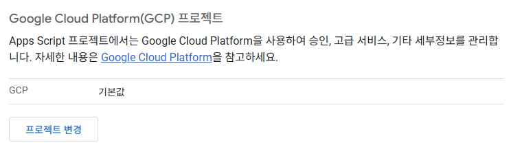

반복되는 귀찮은 일에 지쳤던 적 있으신가요? 캘린더에서 지원되지 않는 음력 생일을 등록하느라 귀찮았던 일, 다시는 보지 않을 오래된 캘린더 일정을 삭제하는 일, 매일같이 어떤 웹 사이트에 로그인해서 알림을 확인하는 일... 누구나 매일, 매주, 매달 혹은 매년 반복하는 작업이 있을 겁니다. 필요하지만 간단한 작업일수록 귀찮은 법이죠. 저도 오랫동안 시달리던 귀찮은 작업들이 있었고, 벼르고 벼르다 이 귀찮은 일들을 자동화하고자 결심했습니다.

그리고 작업 자동화에는 Google Apps Script 만한 게 없었습니다. 저는 이메일(Gmail)부터 일정 관리(Google Calendar / Tasks), 문서 작업(Google Sheets / Docs), 파일 관리(Google Drive) 등 다양한 Google Workspace 제품을 이용하고 있는데, 대부분의 반복 작업도 이 위에서 이루어지기 때문입니다.

## 🤖 Google Apps Script

[Apps Script](https://developers.google.com/apps-script) (이하 GAS)는 Google Drive에 의해 제공되는 클라우드 기반 자바스크립트 플랫폼입니다. Google 제품 전반에 걸쳐 손쉽게 연동되고 다양한 자동화 작업을 수행할 수 있습니다.

### 👍 장점

- [넉넉한 무료 사용량](https://developers.google.com/apps-script/guides/services/quotas?hl=ko)

  개인 사용 목적으로는 충분한 무료 사용량을 포함합니다. 캘린더 일정을 관리하거나, 이메일을 보내거나, 스프레드시트를 작은 데이터베이스처럼 활용하는 데에는 문제가 없습니다.

- JavaScript로 쉽고 빠른 개발 가능

  [V8](https://v8.dev/) 엔진을 지원합니다. V8은 Google의 오픈소스 고성능 자바스크립트 / 웹어셈블리 엔진으로, 크롬 브라우저에도 탑재되어 있습니다.

- 쉽고 빠른 Google Workspace 연동

  Google Workspace 연동이 쉽고 빠릅니다. 복잡한 연동 과정이나 서비스 계정, API 키에 대한 고민이 줄어듭니다.

- 시간 기반 트리거

  시간 기반 트리거를 이용하면 원하는 시간대에 스크립트를 자동 실행할 수 있습니다. 트리거는 자동화에 빠질 수 없는 필수 요소입니다.

- [clasp CLI](https://github.com/google/CLASP)를 통해 스크립트 개발 및 배포 자동화 가능

  clasp를 이용하여 프로젝트 생성, 관리 및 배포 작업을 터미널에서 수행할 수 있으며, GitHub Actions와 같은 CI 도구에 통합하여 개발부터 배포까지 프로세스 전반을 자동화할 수 있습니다.

### 👎 단점

- JavaScript**만** 지원

  JavaScript 외 다른 언어에 대한 직접적인 지원은 포함되지 않습니다.

- 일부 Google Workspace 제품은 지원되지 않음

  대표적으로 Google Photos, Keep 서비스가 있습니다. 이에 대한 제 3자 라이브러리(예: [GPhotoApp](https://github.com/tanaikech/GPhotoApp))를 이용해야 합니다.

- 일부 기능 제한

  보통 Apps Script 프로젝트는 Google Cloud에서 관리하는 기본 프로젝트에 연결되어 있습니다.

  

  하지만 Apps Script 함수를 스크립트 에디터 밖에서 호출하는 등 일부 고급 기능을 이용하려면 사용자의 Google Cloud 프로젝트를 연결해야 합니다. 구성과 관리가 조금 번거로워질 뿐, 연결 자체로 별도 요금이 발생하지는 않습니다.

## ☄️ 개발 환경 구성하기

여러 작은 프로젝트에 적당한 크기의 기능을 구현하고 관리하기 위해 [PNPM](https://pnpm.io/)을 패키지 매니저로 선택했습니다. PNPM 워크스페이스는 빠르게 사용할 수 있는 모노레포 도구로서 안성맞춤입니다.

글을 쓰는 지금, 프로젝트 디렉토리 구조는 다음과 같이 되어 있습니다.

```bash
$ tree -a --gitignore -I .git --sort name --dirsfirst
.
├── .devcontainer.example
│   └── ...
├── .github
│   └── workflows
│       ├── ci.yaml
│       └── deploy.yaml
├── .vscode.example
│   └── ...
├── packages
│   ├── config
│   │   ├── src
│   │   │   └── ...
│   │   ├── test
│   │   │   └── ...
│   │   ├── README.md
│   │   ├── package.json
│   │   ├── tsconfig.json
│   │   ├── tsconfig.node.json
│   │   ├── tsup.config.ts
│   │   └── vitest.config.ts
│   ├── esbuild-plugins
│   │   ├── src
│   │   │   └── ...
│   │   ├── README.md
│   │   ├── package.json
│   │   ├── tsconfig.json
│   │   ├── tsconfig.node.json
│   │   └── tsup.config.ts
│   ├── gas-mock
│   │   ├── src
│   │   │   ├── ...
│   │   ├── test
│   │   │   └── ...
│   │   ├── README.md
│   │   ├── package.json
│   │   ├── tsconfig.json
│   │   ├── tsconfig.node.json
│   │   ├── tsup.config.ts
│   │   └── vitest.config.ts
│   ├── ssdb
│   │   ├── src
│   │   │   └── ...
│   │   ├── test
│   │   │   └── ...
│   │   ├── README.md
│   │   ├── package.json
│   │   ├── tsconfig.json
│   │   ├── tsconfig.node.json
│   │   ├── tsup.config.ts
│   │   └── vitest.config.ts
│   └── util
│       ├── src
│       │   └── ...
│       ├── test
│       │   └── ...
│       ├── README.md
│       ├── package.json
│       ├── tsconfig.json
│       ├── tsconfig.node.json
│       ├── tsup.config.ts
│       └── vitest.config.ts
├── projects
│   └── ...
├── .editorconfig
├── .env.example
├── .gitattributes
├── .gitignore
├── .node-version
├── .pre-commit-config.yaml
├── .prettierignore
├── .prettierrc
├── AGENTS.md
├── Makefile
├── README.md
├── docker-compose.yaml
├── eslint.config.mjs
├── package.json
├── pnpm-lock.yaml
├── pnpm-workspace.yaml
├── renovate.json
├── tsconfig.base.json
└── tsconfig.json
```

- `.devcontainer.example`, `.vscode.example`, `.env.example`, `docker-compose.yaml`

  개발 컨테이너를 비롯한 개발 환경 관련 구성 파일들입니다.

- `packages/`

  프로젝트에서 공통적으로 사용하는 라이브러리들입니다.
  - `config`: GAS 설정 관리 방식을 통일하기 위한 도구
  - `gas-mock`: GAS Mocking을 위한 테스트 헬퍼
  - `ssdb`: 스프레드시트를 데이터베이스처럼 사용하기 위한 도구
  - `util`: 공통 유틸리티

- `projects/`

  GAS 스크립트 프로젝트들입니다.

- `pnpm-lock.yaml`, `pnpm-workspace.yaml`

PNPM 연관 파일로 모노레포 패키지와 프로젝트 전역 의존 패키지 카탈로그를 관리합니다.

개발에 TypeScript를 사용하고 변경 사항은 굉장히 사소한 것을 제외하고 모두 PR을 거칩니다. GitHub Actions 파이프라인을 거쳐 Prettier, ESLint로 코드 품질을 검사하고 Vitest로 자동화 테스트를 실행합니다. PR이 병합되면 [ESBuild](https://esbuild.github.io/)와 [tsup](https://github.com/egoist/tsup)로 빌드한 뒤 [clasp](https://github.com/google/CLASP) CLI로 Apps Script에 배포됩니다.

## ⚙️ 설정 관리

프로젝트 설정은 속성 서비스 ([Properties Service](https://developers.google.com/apps-script/guides/properties))를 이용합니다. 내부용 / 개인용 스크립트 프로젝트에서 쉽고 빠르게 사용할 수 있어 좋은 선택입니다.

하지만 매번 스크립트 설정에 가서 설정을 바꾸는 것은 귀찮기에 애드온으로 관리하기로 했습니다. 설정을 저장하기 전에 검증할 수도 있고, 작업 수동 실행 등 여러 편의 기능을 구현해서 쓸 수 있습니다. 다만 개인용 / 내부용 프로젝트가 아닌 대중에 공개될 프로젝트라면 스크립트 속성(`ScriptProperties`)을 불특정 다수에게 노출하고 수정 가능하게 하는 건 부적합합니다. `UserProperties`를 사용하세요.


모든 Google Workspace 제품이 애드온 UI (`CardService`)를 지원하는 것은 아니므로 주의해야 합니다. 대표적인 제품은 Contacts (People)인데, 저는 대신 Google Calendar에 애드온을 만들어 관리하기로 했습니다.

## 🚀 변경된 프로젝트만 배포하기

초기 배포 구성은 `pnpm run --recursive`로 모든 프로젝트를 변경 사항이 없어도 배포하고 있었습니다. 하지만 사소한 변경 사항, 심지어는 전혀 관련이 없는 변경 사항에도 모든 프로젝트를 배포하는 것은 낭비였고 변경된 프로젝트만 배포하길 원했습니다.

PNPM의 필터(`--filter`) 기능을 활용해 GitHub Actions 매트릭스로 변경된 프로젝트만 배포 작업을 동적으로 생성하기로 했습니다.

```yaml
name: Deploy

on:
  push:
    branches: [main]
  workflow_dispatch:

# ...

jobs:
  prepare:
    name: Prepare deployment matrix
    # ...
    outputs:
      matrix: ${{ steps.build_matrix.outputs.matrix }}
    steps:
      # ...
      - name: Build deployment matrix
        id: build_matrix
        run: |
          if [ "${{ github.event_name }}" = "workflow_dispatch" ]; then
            # Manual dispatch: deploy all projects unconditionally
            packages=$(pnpm list --filter "./projects/**" --json --depth -1)
          else
            # Push to main: compare against the previous commit
            packages=$(pnpm list --filter "...[HEAD^1]" --json --depth -1)
          fi
          echo "$packages"
          # Filter to only packages under projects/ and strip the absolute workspace prefix from paths
          matrix=$(echo "$packages" | jq -c --arg ws "${{ github.workspace }}/" '[.[] | select(.path | contains("/projects/")) | {name: .name, path: (.path | ltrimstr($ws))}]')
          echo "matrix=$matrix"
          echo "matrix=$matrix" >> "$GITHUB_OUTPUT"
```

- `pnpm list --filter "...[HEAD^1]" --json --depth -1`

  직전 커밋과 비교하여 변경된 패키지 목록을 반환합니다.

  ```json
  [
    ...
  {
    "name": "@packages/config",
    "path": "/home/dev/Projects/google-apps-script/packages/config",
    "private": false
  },
  {
    "name": "cleanup-old-calendar-events",
    "path": "/home/dev/Projects/google-apps-script/projects/cleanup-old-calendar-events",
    "private": true
  },
  ...
  ]
  ```

- `jq -c --arg ws "${{ github.workspace }}/" '[.[] | select(.path | contains("/projects/")) | {name: .name, path: (.path | ltrimstr($ws))}]'`

  앞서 명령어는 모든 변경된 패키지 목록을 출력하므로 `jq`를 사용해서 변경된 패키지 중 `projects` 디렉토리에 있는 패키지만 집어냅니다.

이후 배포 매트릭스는 각 프로젝트를 빌드하여 배포하게 됩니다.

```yaml
# ...
jobs:
  deploy:
    name: Deploy (${{ matrix.name }})
    needs: prepare
    if: needs.prepare.outputs.matrix != '[]'
    strategy:
      fail-fast: false
      matrix:
        include: ${{ fromJson(needs.prepare.outputs.matrix) }}
    environment:
      name: 'projects/${{ matrix.name }}'
      url: <https://script.google.com/home/projects/$>{{ steps.read_clasp.outputs.script_id }}/edit
    # ...
    steps:
      # ...
      - name: Read script ID from .clasp.json
        id: read_clasp
        run: |
          script_id=$(jq -r '.scriptId' '${{ matrix.path }}/.clasp.json')
          echo "script_id=$script_id" >> "$GITHUB_OUTPUT"

      - name: Authenticate with clasp
        run: |
          echo '${{ secrets.CLASPRC_JSON }}' > ~/.clasprc.json
          chmod 600 ~/.clasprc.json

      - name: Deploy to Google Apps Script
        run: pnpm --filter '${{ matrix.name }}' run deploy
```

간간이 스크립트를 웹 에디터에서 볼 필요가 있기 때문에 배포 URL을 설정해주었습니다.

## 🪝 배포 후 초기화 자동 실행하기

`clasp run-function` 도구를 이용하여 배포 후 초기화(주로 트리거)를 자동 실행하고자 했으나 새 스크립트 프로젝트는 기본적으로 `scripts.run` API를 사용할 수 없다는 문제가 있었습니다. `scripts.run` API를 사용하고자 할 경우 사용자는 본인의 Google Cloud 프로젝트를 연결하고 여러 설정을 끝마쳐야 합니다.

1.  Google Cloud 프로젝트를 만들고 Apps Script API를 사용 설정합니다.

    

    스크립트 프로젝트가 사용하는 서비스에 해당하는 API(People, Calendar, Sheets, Gmail API 등) 또한 사용 설정해야 합니다.

2.  Apps Script API의 **관리** 버튼을 누르고 **OAuth 동의 화면** 구성을 끝마칩니다. 데스크톱 앱 유형의 클라이언트를 생성하고 클라이언트 비밀 정보를 JSON 파일로 다운로드하여 보관(e.g. `creds.json`)해둡니다.

    

3.  다운로드한 JSON 파일을 이용하여 clasp 로그인을 다시 진행합니다. 이미 로그인 한 적이 있다면 먼저 `clasp logout`으로 로그아웃한 뒤 진행합니다.

    ```bash
    $ clasp login \
      --creds ./creds.json \
      --extra-scopes <https://www.googleapis.com/auth/script.scriptapp>
    ```

4.  Apps Script 설정에서 **Google Apps Script API**를 사용 설정합니다.

    

5.  GAS 프로젝트를 API 실행 파일로 배포해야 합니다. Apps Script 웹 UI에서 새 배포를 만들어도 되고, `appsscript.json` 매니페스트에 다음 내용을 추가한 뒤 배포해도 됩니다.

    ```json
    {
    	// ...
    	"executionApi": {
    		"access": "MYSELF"
    	}
    }
    ```

이후 프로젝트를 다시 배포한 뒤, `clasp run-function <초기화 함수 이름>`으로 배포 후 초기화 작업을 실행합니다. 저는 `post*` 라이프사이클 스크립트로 정의해서 배포 후 자동 실행되게끔 했습니다.

추가로, 게시 상태가 **테스트 중**인 앱의 OAuth2.0 인증 정보는 7일마다 만료([참고 문서](https://developers.google.com/identity/protocols/oauth2?hl=ko))되어 도중에 `invalid_grant` 오류를 맞닥뜨릴 수 있습니다. 이 경우 게시 상태를 **프로덕션 단계**로 변경해야 만료되는 것을 막을 수 있습니다.

## 🐞 문제 해결

### 🚫 `clasp login` 후 `run-function`을 사용할 수 없음

도중에 크게 헤맨 것은 **데이터 액세스** 페이지에서 추가한 스코프가 `clasp login` 에 사용되지 않는다는 것이었습니다. `run-function`을 사용해서 배포 후 초기화 작업을 자동화하기 위해 `https://www.googleapis.com/auth/script.scriptapp` 스코프가 필요했지만 데이터 액세스를 통해 요청할 수 없었고, `clasp login`의 `--extra-scopes` 매개변수를 통해 명시적으로 요청하여 해결할 수 있었습니다.

문서([https://developers.google.com/workspace/marketplace/configure-oauth-consent-screen](https://developers.google.com/workspace/marketplace/configure-oauth-consent-screen))에 따르면 데이터 액세스 페이지에 정의된 스코프는 퍼블릭으로 공개된 프로젝트에 대해서만 활용되는 것 같습니다.


단일 프로젝트 구성이라면 `--use-project-scopes`와 `--include-clasp-scopes`를 사용해서 `appsscript.json`의 `oauthScopes`를 포함하도록 할 수 있지만 제 경우는 여러 프로젝트가 포함된 모노레포 구성이라 바로 사용할 수는 없었습니다.

### 🛂 스크립트 권한 누락

애드온을 통해 작업을 수동 실행할 때 실패하는 문제가 있었습니다. 디버깅 결과 필요한 권한이 누락되었기 때문이었습니다. 더 자세히 파고 들어보니,

1.  애드온을 처음 사용할 때 다음과 같은 각 제품(Google Calendar, Gmail)마다 한 번씩 표시됩니다.

    

2.  계속 진행하여 권한을 부여할 수 있는데,

    

    문제는 처음 권한을 부여한 프로젝트가 요청한 권한만 요청하기 때문에 다른 프로젝트가 원하는 권한을 포함하지 않는다는 것이었습니다. 권한을 한 번 부여하고 나면 위의 요청 화면은 다른 애드온에서는 나타나지 않습니다.

3.  [`ScriptApp.getAuthorizationInfo`](https://developers.google.com/apps-script/reference/script/script-app?hl=ko#getauthorizationinfoauthmode,-oauthscopes) 함수를 이용해서 명시적으로 필요한 권한이 있는지, 없다면 요청하게끔 애드온 UI를 개선해주면 필요한 권한이 누락되었을 경우 요청 페이지를 통해 권한을 부여하도록 요청할 수 있습니다.

    

    다른 애드온이 필요한 모든 권한을 요청할 수도 있겠지만 각 스크립트 프로젝트가 독립된 경계를 유지하도록 남겨두면 언젠가 필요할 때 쉽게 프로젝트를 분리할 수도 있고, 디버깅도 용이할 것이라 생각되어 지금 구현을 유지하기로 했습니다.

## 🖼️ 만들어 본 것들

여러 간단한 GAS 프로젝트를 만들어보았습니다.

- **cleanup-old-calendar-events**

  오래된 Google Calendar 이벤트를 자동으로 삭제해줍니다.

- **lunar-birthday**

  Google Calendar에서 지원되지 않는 음력 생일을 관리하기 위해 만들었습니다. 음력 생일을 양력으로 변환하여 캘린더에서 쉽게 확인할 수 있게 합니다.

  가령 음력 1970년 8월 1일 출생자의 2026년 생일은 6월 19일입니다. 작업이 완료되면 Google Calendar에서는 그 사람의 생일을 1970년 6월 19일로 바꿔 달력에서 그 해의 생일을 쉽게 확인할 수 있게 합니다. 과거 생일 이력은 남지 않지만 아직까지 필요한 적이 없었고, 필요하다면 생년월일을 고치는 대신 새로운 일정을 만들게 할 수도 있습니다.

- **naver-notifications**

  네이버 알림을 매번 들어가서 보기 너무 귀찮아서 만들었습니다. 네이버 알림을 스크래핑해서 매일 특정 시간에 Gmail로 요약을 보내줍니다.

  

- **theclimb-routesetting-schedule**

  취미로 클라이밍을 하러 가기 전에 루트 세팅 일정을 확인하곤 하는데, SNS(인스타그램)나 네이버 블로그 등에 아래와 같은 루트 세팅 스케줄 이미지를 공지하곤 합니다.

  

  하지만 매번 여러 지점의 스케줄을 확인하는 게 번거로웠고 Google Calendar에서 한 눈에 여러 지점의 루트 세팅 일정을 확인하고 싶었습니다. 그래서 루트 세팅 스케줄 이미지를 스크래핑하고 Google AI Studio API로 이미지 이해가 가능한 Gemini 모델(gemini-3-flash-preview)을 호출하여 이미지에서 스케줄 목록을 추출한 뒤 Google Calendar 이벤트로 저장하는 프로젝트를 만들었습니다.

  

각 GAS 스크립트 개발에는 GitHub Copilot을 적극적으로 활용하며 AI 활용 감각을 잡아가고자 했습니다. GitHub 웹 UI에서 이슈 할당과 PR 코멘트로 에이전트에게 작업을 맡기고 PR 리뷰로 피드백 루프를 거치며 기능을 개선해나갔습니다. GitHub의 에이전트 협업 흐름은 꽤 부드럽고 자연스러워서 마치 정말 동료 개발자와 원격으로 소통하며 작업한다는 느낌이 들었습니다. 어느 정도 아귀가 맞으면 마지막으로 코드를 직접 다듬으며 각 프로젝트를 마무리했습니다.

## 🏁 마치며

PNPM을 단순 패키지 매니저로 활용한 적은 있지만 모노레포를 관리하기 위해 활용한 건 이번이 처음입니다. 의존성 변경을 감지하는 기본 기능이 훌륭해서 많은 툴링 없이 원하는 자동화 구성을 만들기 편리했습니다.

앞으로도 필요한 여러 자동화를 추가해나가며 계속 구성을 개선해나갈 생각입니다.
